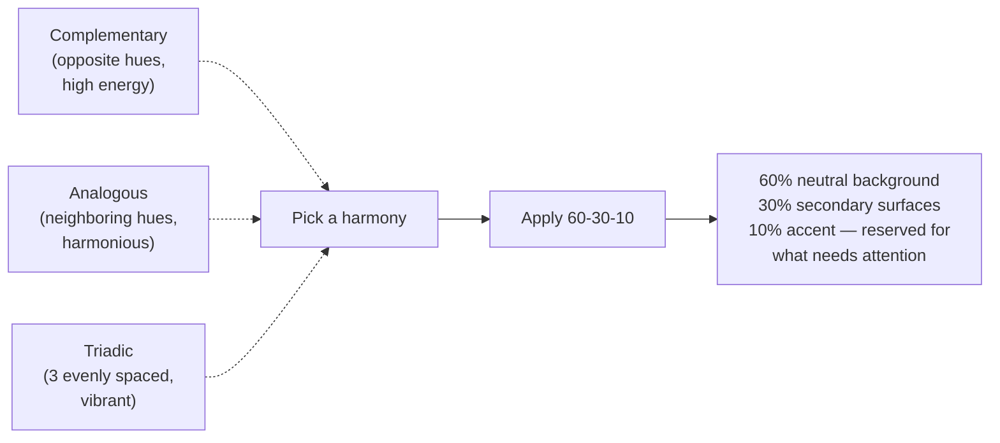

> **TL;DR:** The professional skill isn't picking a nicer blue — it's building a small, consistent, accessible *system* of colors so individual color decisions mostly stop needing to be made.

## HSL matches how people actually think

| | What it is |
|---|---|
| **Hue** | Base color, position on the wheel (0-360°) |
| **Saturation** | Intensity: 0% gray → 100% vivid |
| **Lightness** | 0% black → 100% white |

"Make this blue more muted and slightly darker" = lower saturation, lower lightness — precise in HSL, vague staring at a hex code. This is also how a tint/shade ramp (a palette's 50-900 scale) gets generated: fix the hue, step lightness.

## Building a palette

⚠️ **Most common mistake:** inverting the ratio — using the "brand color" liberally because it's the brand color, drowning out the one thing accent color is good for.

## Semantic color: name by role, not hue

`color-danger`, `color-primary-action`, `color-text-muted` — never a raw hex or `blue-600` referenced directly in a component. Same reasoning as named constants over magic numbers: change one mapping, every consumer updates.

## Contrast — the part that isn't taste

| Content | WCAG AA min | WCAG AAA min |
|---|---|---|
| Normal text | 4.5:1 | 7:1 |
| Large text (18pt+/bold 14pt+) | 3:1 | 4.5:1 |
| UI components & graphics | 3:1 | — |

A contrast checker gives an exact pass/fail — "looks fine to me" isn't a substitute, because designers/engineers reviewing their own work on a bright monitor systematically under-estimate real-world conditions (low vision, older eyes, a phone in direct sunlight).

## Never let color alone carry meaning

~8% of men, ~0.5% of women have color vision deficiency (usually red-green). "Red = error, green = success" with no icon/label/shape backing it up is ambiguous for a meaningful chunk of real users. **Fix:** pair color with a second signal, always.

## Dark mode ≠ invert the colors

| Problem with naive inversion | Fix |
|---|---|
| Saturated colors vibrate on dark backgrounds | Desaturate + lighten accents vs. light mode |
| Shadows are invisible on dark backgrounds | Signal elevation with *lighter surface color* instead |
| True black (`#000`) causes halation for many readers | Use dark gray (`#121212`-`#1a1a1a`) instead |
| Pure white text is too intense | Slightly off-white text |

A dark theme needs its **own deliberately designed values** mapped to the same semantic names — not a CSS filter over the light palette.

## Bringing it to the browser

`color-mix()` blends colors directly in CSS (a hover state = accent mixed 15% toward white, no hand-picked hex). `oklch()` is perceptually uniform — equal lightness steps look more genuinely equal than in HSL. `prefers-color-scheme` respects OS preference, paired with a manual override (like this app's own theme toggle) for both a sane default and explicit control.
