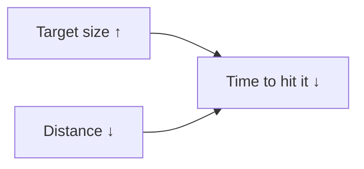

> **TL;DR:** Chapters 2-4 gave you the tools. This chapter explains *why they work* — the psychology underneath, which lets you extend the reasoning to cases the checklists didn't cover.

## Gestalt: the mind groups before it interprets

People perceive organized wholes before individual parts — automatically, before any conscious interpretation.

| Principle | What it does | Interface example |
|---|---|---|
| **Proximity** | Close = related | A form with no gap between logical groups forces users to read labels to find structure spacing could've shown for free |
| **Similarity** | Shared traits = related | Inconsistent "primary" buttons break the learned "this shape = main action" signal |
| **Closure** | Mind completes incomplete shapes | A partially-visible card at a row's edge signals "scroll for more" with no arrow needed |
| **Continuity** | Eye follows a line/sequence | Aligned elements feel connected without a drawn line |
| **Figure/ground** | Foreground vs. background | A modal with weak separation from the page leaves users unsure what's interactive |
| **Common region** | Shared enclosed area = group | A bordered card reads as more connected than the same content just spaced closely |

**The unifying lesson:** structure and relationships communicate through layout alone, before a user reads a word.

## Fitts's Law — bigger and closer is provably faster

- **Real minimum tap target: ~44×44pt (iOS) / 48×48dp (Android).** A 16px icon with no padding added to the actual hit area is a measurable, cheap-to-fix violation.
- Screen **edges and corners** are fast to acquire — the edge stops the cursor's motion for you (why macOS pins the menu bar to the top edge).

## Hick's Law — more choices, slower decisions

More options = more decision time, closer to logarithmic than linear, never zero-cost. **20 flat options is measurably slower than the same 20 grouped into 4 categories of 5** — even though the total count is identical.

- This is the mechanism behind **progressive disclosure** (show only what's needed now).
- Choice paralysis isn't the user being indecisive — it's a predictable consequence of structure, and it's fixable by whoever structured the choices.

## Working memory and chunking

- Classic figure: **Miller's "7 ± 2"**; modern estimates land closer to **4** independent items, especially for unfamiliar info.
- **Chunking** — group items into fewer meaningful units. A 16-digit card number is hard to hold; the same number in 4 groups of 4 is easy — that's why card numbers display that way.
- Same mechanism as Gestalt proximity, seen through the cognitive-load lens.

## The aesthetic-usability effect

> Users perceive attractive interfaces as more usable — independent of whether they actually are — and are measurably more tolerant of real usability problems in something they find attractive.

⚠️ Real, but not a substitute for fixing usability problems — an attractive-but-broken interface burns through that goodwill, usually at the worst possible moment.

## Diagnosing a vague complaint

| Feeling | Usually the real mechanism |
|---|---|
| "Cluttered" | Proximity / common-region problem, not too much content |
| "Confusing" | Hick's Law — flat, ungrouped choices |
| "Fiddly" (mobile) | Fitts's Law — visual size and hit-target size diverged |
