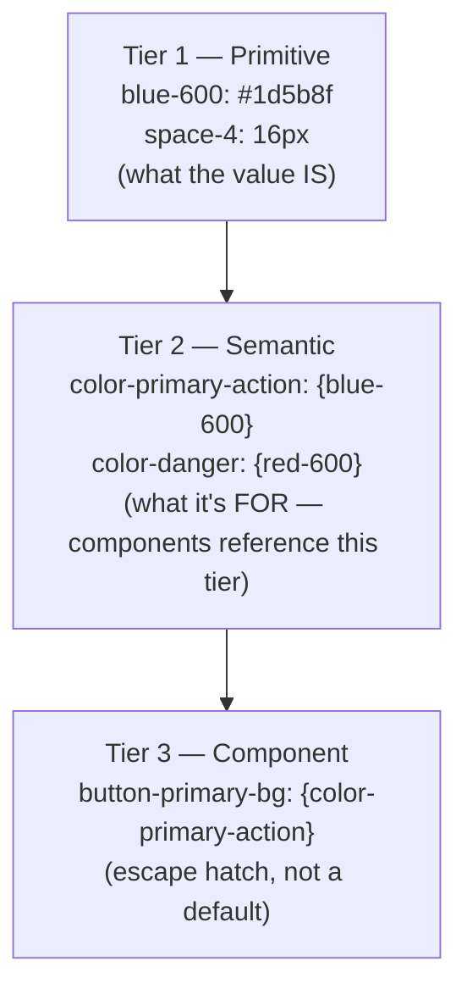

> **TL;DR:** If you understood why `space-4` beats a hardcoded `17px`, you already understand design tokens. This chapter formalizes that instinct into a real system.

## What a token is

The smallest named unit of a design decision — a color, spacing value, font size, shadow, radius, duration, z-index — stored once, referenced everywhere. `--color-primary-action: #1d5b8f;` is a token. A `<Button>` is not a token — it *consumes* several.

## The three tiers

Change the primary color from blue to teal → one line changes at Tier 2 → every component referencing the semantic name updates, zero component code touched.

## Naming — token names are an API

| Failure mode | Example | Problem |
|---|---|---|
| **Over-literal** | `blue-button-text` | Lies the day the button becomes teal |
| **Over-generic** | `color-1`, `color-2` | Nobody can tell what it's for — pushes people back to hardcoding |

**Pattern:** `category-concept-property-variant-state` (e.g. `color-background-surface-raised`). Semantic tier is named by **role**, not appearance: `color-danger`, not `color-red`.

## Tokens are a build pipeline, not a design-tool concept

One source of truth, **transformed** into every platform's native format — CSS custom properties, Android XML, iOS Swift constants. **Style Dictionary** (Amazon, open-source) is the canonical tool: author once as JSON/YAML, generate everywhere from it. Same coupling-vs-duplication tradeoff as the backend course — duplication drifts, and drift ships silently.

## Governance: defending against drift

**Drift** = hardcoded values that match a token *today* but were never wired to it, diverging silently the next time the token changes.

| Defense | Catches |
|---|---|
| **Linting** | Hardcoded color/spacing at PR time — cheapest, catches it before merge |
| **Code review culture** | The near-miss a lint rule can't ("suspiciously close but not exact") |
| **Clear ownership** | Prevents design and engineering each assuming the other is the source of truth |

## Bringing it forward

Every later chapter assumes tokens exist underneath: a component's states (ch. 7) are styled with token references; a design system's library (ch. 13) is components built *on* the token layer. When a later chapter says "this should be consistent," it means *token*, not *convention* — a convention is remembered, a token is enforced.
