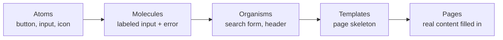

> **TL;DR:** A component's design is a function's signature — an interface with real decisions about what's exposed, hidden, and handled at the edges. Design it deliberately, not by accident the first time an edge case shows up.

## Anatomy of a component

- **Parts** — a button might have leading icon / label / trailing icon and nothing else. Knowing the exhaustive list tells you if a new request is a variant or a different component.
- **Variants** — deliberate alternative treatments, chosen by whoever *places* it: primary, secondary, danger, ghost.
- **States** — driven by what's happening at runtime, not chosen: default, hover, focus, active, disabled, loading, error.
- **Sizes** — small/medium/large, not continuously adjustable.

## The variant × state matrix

> ⚠️ **The mistake that causes the most late-stage scrambling:** designing every variant's default, and hover/focus/disabled for *one* variant only — assuming the rest generalize. A danger button's disabled state isn't automatically "disabled primary, but red."

| | Default | Hover | Focus | Disabled | Loading |
|---|---|---|---|---|---|
| **Primary** | ✅ | ✅ | ✅ | ✅ | ✅ |
| **Secondary** | ✅ | ✅ | ✅ | ✅ | ✅ |
| **Danger** | ✅ | ✅ | ✅ | ❓ | ❓ |
| **Ghost** | ✅ | ✅ | ✅ | ❓ | ❓ |

Every cell should be deliberately designed or explicitly declared "same as X" — not silently left for whoever implements it to guess.

> **Ask this, before implementation starts:** "Can I get the disabled and loading states for the danger variant specifically, not just the default?"

## Composability vs. configurability

The same tension as a code API's design.

| | Configurable | Composable |
|---|---|---|
| Shape | `<Card showIcon showBorder compact elevated>` | `<Card><Card.Header/><Card.Body/></Card>` |
| Fails how | Combinatorial explosion of untested prop combos | More upfront verbosity |
| Right for | Small, closed, well-understood variation | Space too open-ended to enumerate |

Neither is universally right — a 3-variant badge doesn't need compound-component overhead.

## Atomic design — shared vocabulary for "how big is this, really"

"This should be a molecule, not its own organism" is as useful a critique as "this should be a hook, not a new component."

## Variant vs. new component

**Heuristic:** share most states/structure, differ mainly in appearance → **variant**. Differ in behavior/structure/interaction model → **different component**. A button and a link styled like a button are different components — different keyboard behavior, different semantics.

## Design-code parity

Component-level version of token drift (ch. 6) — same root cause, no enforced single source of truth. **Storybook** (or equivalent) as the shared live reference beats a static Figma file on one side and a codebase on the other. Minimum documentation: full prop list, the variant × state matrix rendered visually, explicit do/don't usage guidance.
