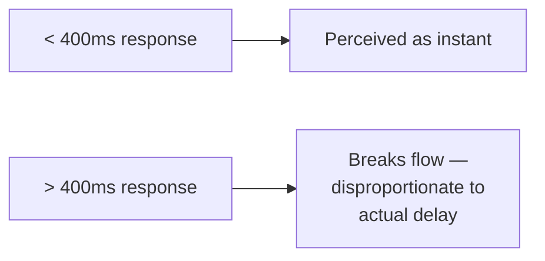
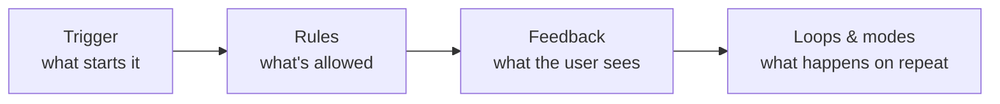

> **TL;DR:** A "confusing" interactive element almost always affords the right action fine — the defect is a missing or ambiguous signifier.

## Affordances and signifiers (Don Norman)

- **Affordance** — what an object actually lets you do (a button affords clicking).
- **Signifier** — the perceivable cue communicating that affordance exists (a drop shadow that makes a button *look* clickable).

> **The Norman door:** a flat push-plate affords pushing perfectly — but if it looks like a pull handle, people pull, fail, feel foolish. The door was never broken; the signifier was missing. Fixable at zero cost.

A card that's fully clickable with zero visual differentiation from a static card is a Norman door.

## The full state model

| State | The real design question |
|---|---|
| **Default** | Gets the most attention, needs the least |
| **Hover** | Meaningless on touch — a hover-only delete button is a silent desktop-only feature |
| **Focus** | Keyboard focus indicator. Conflating with hover is one of the most common accessibility failures — see chapter 11 |
| **Active/pressed** | Instant confirmation the interaction registered |
| **Disabled** | Not "what does it look like" — *why should the user understand it's disabled, and what fixes it* |
| **Loading** | See Doherty threshold below |
| **Error** | Names what happened + what to do next, not just "turns red" |
| **Empty** | Most under-designed state despite often being a new user's first impression |
| **Success** | Silence after an action is ambiguous — did it work? |

## The Doherty threshold — ~400ms

This is why **optimistic UI** (update immediately, assuming success, reconcile/rollback if not) works so well — a "like" button that toggles instantly and syncs in the background feels fast regardless of real network latency.

## Motion: purposeful, not decorative

| Easing | Feels like | Use for |
|---|---|---|
| Ease-out (fast→slow) | Natural entrance | Elements arriving |
| Ease-in (slow→fast) | Natural exit | Elements leaving |
| Linear | Mechanical | Continuous loaders only |

**Duration:** 100-200ms for micro-interactions, 200-400ms for panels/modals, 400ms+ starts feeling like wasted time unless it's deliberately conveying something big.

**`prefers-reduced-motion`** — respect it. For users who've opted in (often vestibular disorders), ignoring it is closer to an accessibility failure than a missed nice-to-have.

## Microinteractions (Dan Saffer's framework)

Most broken-feeling microinteractions are missing **Rules** specifically — double-triggering, rapid repetition, an already-in-progress state triggered again.

## Perceived performance

| Indicator | Communicates | Use when |
|---|---|---|
| **Spinner** | "Something's happening" — no detail | You genuinely know nothing else |
| **Skeleton screen** | Roughly what's coming, roughly where | You know the shape of incoming content |
| **Progress bar** | Real, bounded progress | Progress is genuinely knowable |

⚠️ A fake/indeterminate progress bar is a dishonest signifier — users learn to distrust it once they notice it doesn't track reality.
