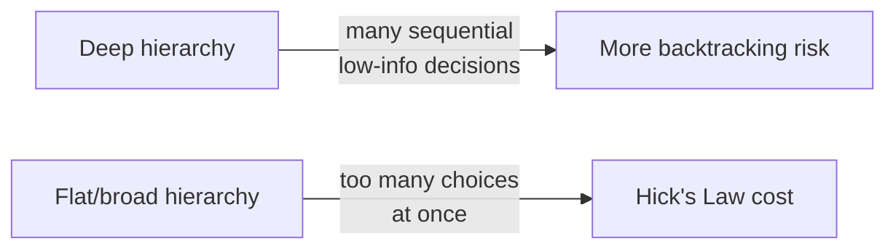

> **TL;DR:** IA is the structure of content — how things are grouped, labeled, connected — independent of how it looks. Get visual design wrong and it looks unpolished. Get IA wrong and it's *actually* hard to use.

## Match the user's mental model, not your org chart

The most avoidable IA mistake: navigation that mirrors internal team boundaries ("Billing," "Account," "Team" = three engineering teams) instead of how a user thinks about their task. Forces users to learn your org chart first.

- **Card sorting** — the research technique for discovering the real mental model.
  - **Open** — participants create their own categories (reveals what people naturally reach for).
  - **Closed** — participants sort into a fixed set (validates a structure already proposed).

## Navigation patterns

| Pattern | Best for | Degrades when |
|---|---|---|
| **Top nav** | 5-7 top-level destinations | Beyond that → cramped or overflow menu |
| **Sidebar** | Content-dense apps (this app's PM course) | Consumes horizontal space |
| **Tab bar** | Mobile, 4-5 items | More → needs overflow anyway |
| **Breadcrumbs** | Wayfinding in deep hierarchies | Not primarily navigation — communicates *where you are* |
| **Mega menu** | Genuinely broad catalogs | Overused on products with no real breadth |

None is "the modern one" — each fits a specific content shape.

## Depth vs. breadth — the "3 clicks" myth

The "3 clicks" rule is **not well-supported** by research. What actually matters: **each click's outcome must be predictable.** A 4-click path with honest labels beats a 2-click path with an ambiguous label users guess wrong on.

## Search vs. browse

| Mode | User state | Needs |
|---|---|---|
| **Search** | Knows what they want | Speed, precision — autocomplete, typo tolerance, relevance ranking |
| **Browse** | Exploring, doesn't know the exact name | A coherent, well-labeled hierarchy |

An internal power-user tool leans search-heavy; a first-time-exploration catalog leans browse-heavy. Most real products need both.

## Labeling: the words ARE the architecture

> **The test:** could someone unfamiliar with your internal terms predict what's behind this link before clicking?

"Solutions," "Resources," "Platform" are the classic offenders — clear internally (they map to a team or product line), meaningless to a user trying to predict what's there.

## Progressive disclosure as an IA tool

Drill-down layers — category → subcategory → item; an accordion; a "show more." The judgment call is **where to split**: too shallow → overwhelming flat list; too deep → several content-free clicks before reaching real content. Found by testing with real users and real content, not guessed once in a review.
