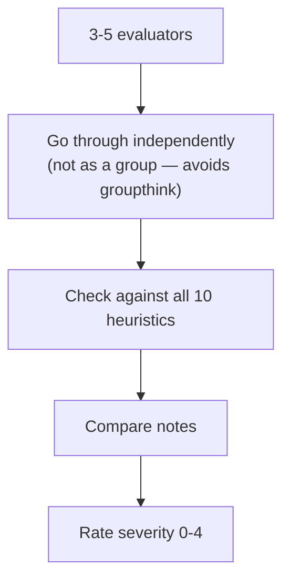

> **TL;DR:** Nielsen's ten heuristics (1994, still standard) let you review a screen in minutes and catch most of its real usability problems — no lab, no budget, no other person needed.

## The ten heuristics

| # | Heuristic | Violation example |
|---|---|---|
| 1 | **Visibility of system status** | A button click with no feedback at all |
| 2 | **Match with the real world** | A date format nobody in the region actually uses |
| 3 | **User control & freedom** | A multi-step wizard with no working "back" that preserves state |
| 4 | **Consistency & standards** | Inconsistent tokens/components — see ch. 6, 7 |
| 5 | **Error prevention** | Letting an error happen and reporting it, instead of preventing it |
| 6 | **Recognition over recall** | A form requiring a code shown on a now-scrolled-away screen |
| 7 | **Flexibility & efficiency** | No accelerators for power users (shortcuts, saved defaults, ⌘K) |
| 8 | **Aesthetic & minimalist design** | Irrelevant elements competing with what matters |
| 9 | **Help recognize/recover from errors** | "Error 4029" instead of "This email is already registered — log in instead?" |
| 10 | **Help & documentation** | Skipped under deadline pressure — and ranked last on purpose: heavy reliance on docs usually means 1-9 already failed |

## Running a heuristic evaluation

- A **single** evaluator alone catches only ~⅓ to ½ of real problems — different people notice different things.
- **3-5 independent evaluators** is the point of diminishing returns.

| Severity | Meaning |
|---|---|
| 0 | Not a problem |
| 1 | Cosmetic |
| 2 | Minor |
| 3 | Major — should be prioritized |
| 4 | Catastrophic — must fix before release |

## Heuristic evaluation vs. usability testing

| | Heuristic evaluation | Usability testing |
|---|---|---|
| Based on | Expert judgment | Real user behavior |
| Needs | No real users | Real (or representative) users |
| Catches | Inconsistency, missing error prevention — fast | What only shows up when a real person, with their own mental model, actually tries it |
| When | Early, on a rough prototype | Later, on something real enough to observe |

Neither replaces the other — a mature process uses both.

> **You don't need the title "UX researcher."** A heuristic evaluation needs the 10 heuristics (now covered), a spare hour, and the interface. Running one before a review and bringing a severity-rated list is a concrete, credible design contribution.
