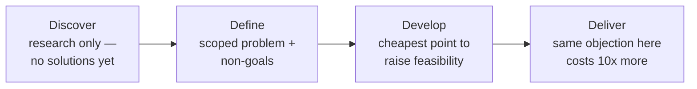

> **TL;DR:** Knowing which phase of the double diamond a project is actually in tells you what kind of contribution is useful right now vs. premature.

## The double diamond, with real stakes

- **Discover:** contributing an implementation idea is premature — name a constraint or usage data instead.
- **Define:** a clear non-goals list does as much work here as in an engineering spec.
- **Develop:** feasibility input is worth an order of magnitude more here than at Deliver.
- **Deliver:** the same objection, raised here, has a real social/schedule cost the earlier phase didn't.

## Design critique — structure beats a taste contest

| Weak feedback | Strong feedback |
|---|---|
| "I don't love this" | "This doesn't clearly communicate the primary action, and the goal was to drive signups" |
| "Can it be more colorful" | "What happens if this label is twice as long?" |
| "I'd make the button bigger" | *(skips past "why" to a prescribed fix for an undiagnosed problem)* |

State the goal and constraints **before** anyone reacts. The clearest sign a critique is working: people are asking questions before making pronouncements.

## Questions a frontend engineer is uniquely positioned to ask

- What does this look like with real, ugly production data instead of the example content?
- What's the loading state? The empty state?
- What happens on the smallest supported screen?
- What's the actual variant × state matrix (ch. 7) for every interactive element here?

A review that closes without these has specified a Photoshop-shaped preview, not a real feature.

## A complete design handoff includes

- Every state from the variant × state matrix (ch. 7)
- Explicit responsive behavior at each real breakpoint (ch. 2)
- Actual token references (ch. 6), not raw hex/pixel values to reverse-engineer
- Realistic content — long names, empty results, error text

Dev Mode-style tooling narrows the gap but doesn't replace the states/edge-cases conversation — it tells you the spacing value, not what the disabled-danger-with-icon button is supposed to look like if nobody designed that cell.

## Legitimate vs. illegitimate pushback

| Legitimate | Illegitimate |
|---|---|
| Real feasibility risk (assumes real-time data from a nightly batch system) | "I would have designed this differently" — no specific problem attached |
| Usability risk found via heuristic evaluation or keyboard test | A preference dressed up as a principle after the fact |
| Real accessibility failure | — |

**Disagree and commit** (same as the PM course): voice the objection clearly, early, while the decision is still open. Once genuinely decided, commit — don't relitigate every meeting after.

## Design QA — closing the loop

Compare shipped implementation against spec before calling it done. Catches drift (ch. 6, 7's failure mode again) while it's a single, easily-explained difference — not after months of individually-reasonable adjustments compound into a genuinely inconsistent product.

## Earning a seat at the trio

The PM course's **product trio** (PM, designer, lead engineer) extends here: sharp feasibility questions during Develop, goal-anchored feedback, a heuristic evaluation run without being asked, handoff gaps caught before they become guesses, design QA instead of silent drift. None of it requires the title "designer" — just the habits, applied consistently.
