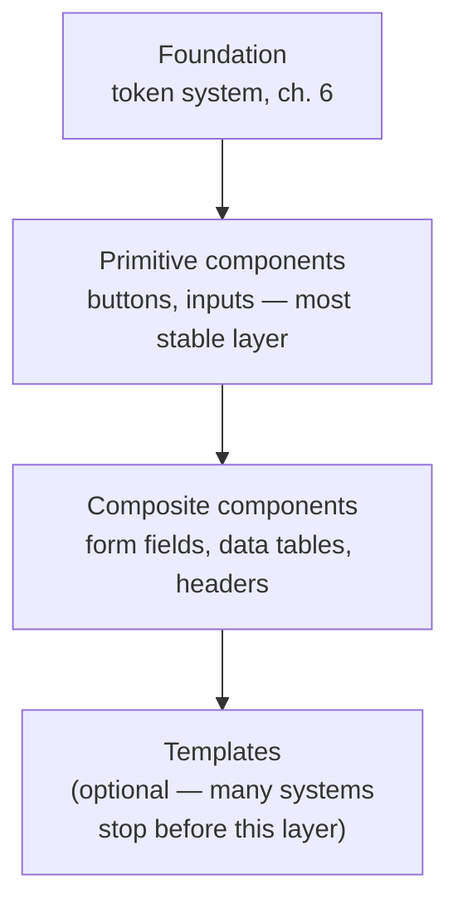

> **TL;DR:** A design system is a product whose users are your own colleagues, and whose real competition is every team's temptation to just build it themselves, slightly differently, faster. Brilliant components nobody uses = zero value delivered.

## Architecture

Shipped as an internally-published, versioned package, with **Storybook** (or equivalent) as the always-current browsable reference. A change to a primitive flows to everything built on top of it through normal dependency versioning.

## Versioning — semver, with real teeth

- **Patch** — bug fixes. **Minor** — backward-compatible additions. **Major** — breaking changes, reserved.
- ⚠️ A breaking change here doesn't cost one team a migration — it costs **every consuming team, simultaneously**.
- **Codemods** — automated scripts that mechanically rewrite consuming code — are the migration path that makes a major version survivable at scale.

## Contribution model

| Model | Tradeoff |
|---|---|
| **Centralized** | Consistency ↑, but risks becoming a bottleneck teams route around |
| **Federated / RFC-based** | Scales better, shaped by real needs — risks inconsistent quality if review isn't well-run |
| **Hybrid (most mature systems)** | Core team owns foundation + primitives tightly; composites accept real outside contribution |

## Adoption is the actual success metric

> Not component count. Not polish. **What fraction of real UI is built from the system vs. one-off code.** A 100-component system at 20% adoption has functionally failed; a rougher system at 80% adoption has functionally succeeded.

- **Strangler pattern** — replace legacy UI incrementally, one flow at a time. A big-bang rewrite routinely gets deprioritized halfway through.
- **The real adoption lever:** make using the system genuinely *faster* than not using it. Policy-enforced compliance is grudging; the fastest, best-documented path gets chosen out of self-interest.

## Drift detection at scale

| Technique | Catches |
|---|---|
| **Visual regression testing** | Unintended visual changes across releases |
| **Token-usage linting in CI** | Hardcoded values, continuously, across every consuming repo |
| **Periodic design QA audits** | Slow, cross-feature accumulation no single PR would catch alone |

## Team topology

| Staffed by | Tends to produce |
|---|---|
| Engineers only, designers "consulted" | Technically solid, real usability gaps |
| Design-owned, engineers execute | Beautifully considered, hard to implement/maintain |
| **Design + engineering as peers** | The actual working model |

A cross-product platform team makes the primitives layer's reusability real, not aspirational.

## What this whole course was building toward

A design system is not fundamentally a component library — it's the **enforced memory** of every decision this course covered: the spacing scale nobody would otherwise reinvent, the contrast ratios nobody would otherwise check, the variant × state matrices nobody would otherwise finish under deadline. The reframe: "everyone remembers to do this correctly" (reliably fails at scale) → "the system does this correctly by construction."
