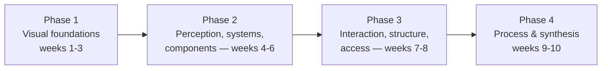

> **TL;DR:** Ten weeks, something looked at or built every week — not just read. Each week: **Read** (1-1.5h) → **Look/Build** (2-3h, on your own product) → **Reflect** (20-30min, in writing).

## Phase 1 — Visual foundations

| Week | Read | Look / Build |
|---|---|---|
| 1 | Ch. 1 Foundations + Ch. 2 Visual Design | 5 screens from your product: is there a real spacing scale, or ad hoc gaps? Run CRAP on one screen that looks "off." |
| 2 | Ch. 3 Typography | Audit 5 text elements' computed font sizes. Check one paragraph's measure against 45-75 chars. |
| 3 | Ch. 4 Color | Run a contrast checker on your 5 most common text/background pairs. Find one place color alone conveys meaning. |

## Phase 2 — Perception, systems, components

| Week | Read | Look / Build |
|---|---|---|
| 4 | Ch. 5 Perception | Find a form with no visual grouping between related fields. Measure a small tap target against 44×44pt. |
| 5 | Ch. 6 Design Tokens | Trace one color value from raw definition to component (try this app's own `src/index.css`). Find one hardcoded value that should be a token. |
| 6 | Ch. 7 Components | Write the full variant × state matrix for a real component. How many cells were actually designed vs. improvised? |

## Phase 3 — Interaction, structure, access

| Week | Read | Look / Build |
|---|---|---|
| 7 | Ch. 8 Interaction/Motion + Ch. 9 Info Architecture | Find one element with a weak signifier. Predict your nav's destinations from labels alone — check how many guesses were wrong. |
| 8 | Ch. 10 Usability Heuristics + Ch. 11 Accessibility | Run a real heuristic evaluation (severity-rated) on one flow. Run axe/Lighthouse on the same flow — compare what each catches. |

## Phase 4 — Process, systems, synthesis

| Week | Read | Look / Build |
|---|---|---|
| 9 | Ch. 12 Process/Collaboration + Ch. 13 Design Systems | Rewrite a piece of past feedback using this course's vocabulary. Does your team have a real design system, or a shared Figma file and good intentions? |
| 10 | Re-read Ch. 1 | **Capstone:** a 2-3 page design brief for a real feature — goal/constraints, token references, full variant × state matrix, accessibility requirements, one heuristic it satisfies. |

## After the ten weeks

You won't be a senior designer — that takes thousands of hours this course can't give you. You will have: the vocabulary to participate as a real contributor, the judgment to ask the right question at the right phase, and habits (heuristic evaluation, keyboard-only test, variant × state matrix, token-drift check) most engineers never run on their own initiative.

**Next step:** volunteer for the next design critique on your team, run a heuristic evaluation nobody asked for, or propose the first RFC for a shared component. One real contribution beats finishing any number of courses.
