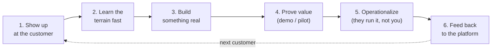

> **TL;DR:** An FDE is an engineer embedded with a customer, closing the gap between what a platform can theoretically do and what one specific team actually needs — through six repeatable steps, not one shipped feature.

## Where the title came from

- **Origin: Palantir.** "Forward deployed" is a military term — out on the terrain, adapting a general plan to specific, messy, on-the-ground conditions in real time.
- **Now widespread.** Logistics, defense, healthcare, fintech, and a wave of applied-AI startups selling "AI that works on *your* data" all converged on some version of the same role — different titles (FDE, Deployment Strategist, Applied Engineer), same shape.

## The six-step loop

Every chapter in this course is an elaboration of one of these steps. Skipping step 5 or 6 — because the demo already got applause — is the single most common way engagements fail.

## Why the role exists

| Reason | What it means in practice |
|---|---|
| **Enterprise data is never clean** | No generic demo survives contact with 20 years of inconsistent spreadsheets and three disagreeing systems of record. |
| **Platform ≠ what this team needs** | Closing that gap needs someone who understands the platform *and* has watched the real workflow — not just one side. |
| **Adoption is a trust problem first** | A perfect solution nobody trusts gets shelved. A rough, honest prototype from someone who showed up gets adopted. |

## FDE vs. the roles it looks like

| | Core deliverable | Optimizes for | Ends |
|---|---|---|---|
| **Traditional SWE** | Generalized product | Millions of unknown future users | Never — ongoing ownership |
| **Consultant** | A recommendation (deck, strategy) | Being *right* | Can fail even if right — nobody implements it |
| **Sales / Solutions Engineer** | A proof of concept | Winning the deal | At the signed contract |
| **FDE** | A working system | One (or a few) known, present customers | Where an SE's job ends |

## Why it's growing right now

- Enterprises are buying AI/data products faster than they can staff the integration expertise to use them.
- Applied-AI products are unusually sensitive to a customer's specific data shape — "works everywhere out of the box" breaks down more than it did for a CRM.
- The fastest path to real product-market fit is watching, in granular detail, what breaks at a real customer — not more market research.

## What this course covers

Mindset → discovery → prototyping → data → client environments → judgment → operationalization → communication → feedback loop → travel/burnout → career path. It does **not** cover core engineering skills (SQL, APIs, distributed systems) — see the Backend and Frontend System Design courses in this library for those. This course is everything *around* the engineering: judgment, speed, trust.
