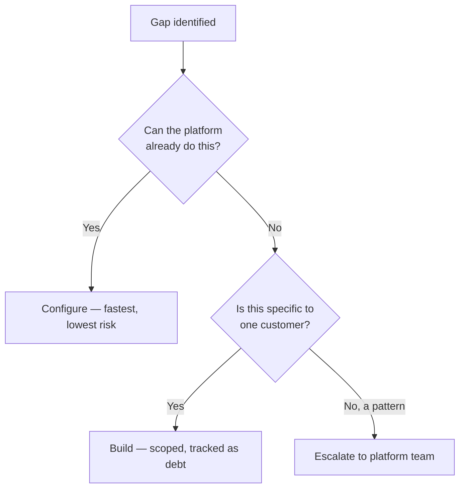

> **TL;DR:** Optimize for the customer's problem being solved, not for code you'd be proud to show in a portfolio review. Different target, different code.

## Outcomes over elegance

A traditional engineer asks *"what's the right way to build this?"* An FDE asks a different question first:

> **Ask this:** "What's the smallest thing that proves this works, this week — and is it built so I can extend it without regret if it needs to become real?"

Not permission to write bad code — a different optimization target. Knowing which question you're answering right now is the actual skill.

## The demo is the artifact

Early in an engagement, the demo often **is** the deliverable — not a step on the way to one.

- ✅ A working, honest demo of one real workflow can be worth more than a month of unseen backend hardening.
- ⚠️ Presenting demo-quality code *as if* production-ready sets an expectation you can't meet — and burns the trust chapter 4 is about building.
- **Say this out loud, every time:** *"This is a working prototype against a sample of your data — here's specifically what's left before your team runs it daily."*

## Build → configure → escalate, in that order

Reaching for "build" as a first move — every time — accumulates a portfolio of undocumented one-offs that eventually becomes unsupportable. Chapter 8 covers this decision in depth.

## Comfortable with ambiguity ≠ liking ambiguity

Good FDEs push to *reduce* ambiguity — sharp questions, concrete scopes, written agreement. What "comfortable with ambiguity" actually means:

- Making forward progress **before** every question is answered.
- Not freezing, and not silently building on an unvalidated assumption.
- **Cheap habit:** state the assumption out loud before building on it — *"I'm assuming 'active customer' = a transaction in the last 90 days. Flag me now if that's wrong."* One sentence now beats a week of rework later.

## Reacting vs. responding

| | Reacting | Responding |
|---|---|---|
| Speed | Fast, defensive | Measured |
| Motive | Protect yourself | Solve the actual problem |
| What the client hears | "This vendor panics" | "This vendor is calmly on it" |

A demo breaking live, in front of the client, is not rare. Calm — *"that's a real gap, here's what I think is happening, give me until tomorrow"* — followed by actually following through, is what gets remembered.
