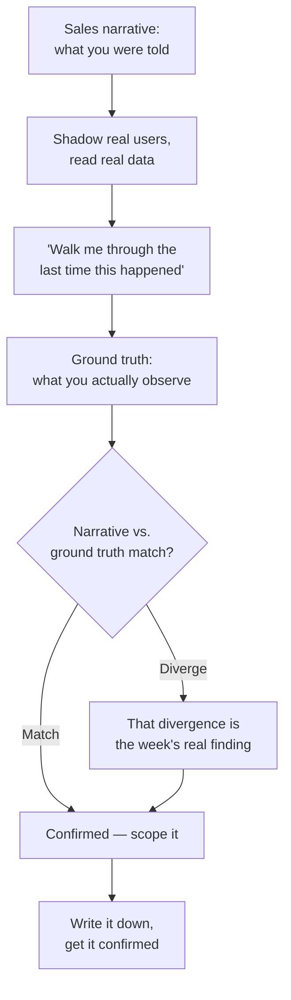

> **TL;DR:** The first week is not a build week. Almost every engagement that goes badly traces back to building something real against a requirement nobody actually confirmed.

## The discovery flow

## The narrative is a hypothesis, not a spec

The story you're told about the customer's problem was built during sales, under sales' constraints (limited time, incentive to find the version your product visibly solves). Track both, explicitly:

- **What I was told the problem is** — write it down.
- **What I'm actually observing** — write it down separately.
- Treat divergence between the two as the most valuable finding of the week.

## How to interview people who don't think in requirements

> **Don't ask:** "What would you want a tool to do here?"
> **Ask instead:** "Walk me through the last time this happened."

People are reliably bad at predicting their own hypothetical future workflow. A memory of something real beats speculation, every time. If someone starts describing a hypothetical, redirect: *"sure — and when did that last actually happen?"*

## Find the real metric

Every stakeholder is privately judged on a number that's rarely the one stated in the kickoff meeting.

- A VP says "better data visibility" — but they're accountable for churn down, cycle time down, an audit passed.
- **Use it as the tiebreaker:** when two directions both seem reasonable, the answer is whichever one moves the number the decision-maker is actually accountable for.

## Scoping: turn "everything is broken" into one shippable slice

- **The one-sentence test:** can you say what decision or action this makes possible that wasn't possible before?
  - ✅ *"Ops can see at-risk accounts before the renewal call, not after."*
  - ❌ *"A unified data platform for the whole org."* — that's a multi-quarter program wearing a first-slice costume.
- Name what's explicitly **out of scope** — the same non-goals discipline the PM course in this library applies to specs.

## Close the loop

Send a short, plain-language doc — problem understood, what ships first, what's explicitly not in scope yet, rough timing — and ask *"did I get that right?"* Cheap, and it starts the relationship with a visible habit of confirming before acting.
