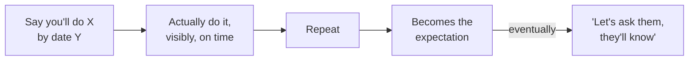

> **TL;DR:** Every engagement has three different audiences with three different goals. Optimizing for one while ignoring the others is the most common way a technically good engagement still fails.

## Three stakeholders, three languages

| Role | Cares about | Speaks in | Risk if ignored |
|---|---|---|---|
| **Economic buyer** | Was this money well spent | Business outcomes: cost, revenue, risk | Loses budget confidence |
| **Technical champion** | Their own credibility for backing you | Peer-level technical detail | Looks incompetent to their manager |
| **End users** | Does this make my actual job easier | Plain, honest, workflow terms | Quiet non-adoption |

⚠️ Optimizing entirely for the economic buyer's dashboard while making end users' daily workflow worse survives one glossy demo and dies at real adoption — and takes your champion down with it.

## How trust actually accumulates

- Trust is not won in one impressive moment — it's a repeated pattern.
- **When you can't hit a date:** say so early, with a real reason and a revised plan. *"Said Thursday; hit an unanticipated auth issue; here's the plan; realistic new date Monday."*
- Silence until the deadline — or a vague "we're working on it" — destroys trust faster than the miss itself.

## Becoming the person they call first

The clearest sign an engagement is working: problems get routed to you **before** anyone decides it's a technology problem.

- Earned by useful judgment delivered without an agenda — including telling a stakeholder their proposed fix won't work.
- A vendor who always agrees is easy to work with and quietly discounted. A vendor who pushes back well, respectfully, with reasons, is the one whose opinion gets sought out.

## Read the room

- After a significant meeting: two minutes, write down who seemed uncomfortable, who didn't speak, why.
- Patterns across meetings (same person quiet every time) are signal — catch it before it's a full blocker.

## One hard rule

> **Never let your champion get surprised in front of their boss.** Bad news goes to them privately, first — always. Blindsiding them, even accidentally, even with accurate info, damages the relationship out of proportion to the news itself.
