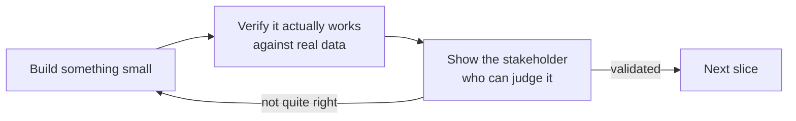

> **TL;DR:** Build small, verify against real data, show it fast — days, not months. The loop only works if it's genuinely short.

## Build → measure → show

A two-month version of this loop isn't a slower version of the same technique — it's two months spent on an unverified assumption.

## Throwaway ↔ load-bearing is a spectrum, not a switch

| Over-invest early | Under-invest late |
|---|---|
| Full generality before anyone confirmed the requirement | Still "just a demo" long after the customer depends on it daily |
| Wastes effort on a foundation that might get thrown away | Quietly becomes unmaintained infrastructure |

**The trigger to revisit:** the first time a customer says *"can we just use this for real starting Monday"* about something built as a demo. Stop. Have the explicit conversation about what needs to change first.

## What's safe to fake

| Safe to fake | Never safe to fake |
|---|---|
| Breadth of UI (stub non-demo screens, label clearly) | The data being real vs. dressed-up synthetic numbers |
| Edge cases you haven't hit yet in real data | Security/access boundaries around real sensitive data |
| Non-critical integrations (hardcoded sample response) | — even "it's just a demo" doesn't excuse this |
| Auth, if the demo env is genuinely isolated | |

The rule: fake what's cosmetic or explicitly out of scope, and say so. Never fake the substance of what you're claiming to prove.

## Timebox before you start, not when you run out of energy

- Decide the budget up front: *"Two days on this approach. Not working by Wednesday EOD → try something else or escalate."*
- Declaring an approach dead, on the schedule you set while thinking clearly, beats riding it out on sunk cost.

## Demo honestly

State caveats **out loud, as part of the demo** — don't let them go unstated:

- *"Works against the three account types I've tested; haven't handled the fourth yet — here's the plan."*
- *"Running against a 500-record sample; validating against the full dataset next."*

A sophisticated stakeholder is listening for what you're *not* saying. Volunteering the gaps yourself reads as more trustworthy than a flawless-looking demo that gets caught later.
