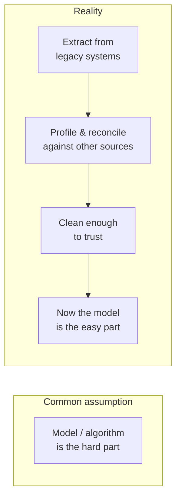

> **TL;DR:** The real bottleneck is almost never the model or the algorithm — it's getting messy enterprise data into a state clean enough to trust. Budget for this accordingly.

## Where the effort actually goes

Budget the majority of early technical effort for data, not the more interesting-sounding part of the build.

## Legacy systems rarely have clean APIs

That's not changing. Treat integration with imperfect sources as a real, first-class skill:

| Technique | When |
|---|---|
| Scheduled file ingestion (CSV/Excel drops) | No API, but a reliable export exists |
| Database-level read-only queries | No API at all, direct DB access is permitted |
| RPA / screen automation | Genuine last resort — no other integration path exists |

## Profile before you build — data lies in specific, recognizable ways

- Dates stored as text, three different formats in one column.
- `"Active" / "active" / "ACTIVE" / "A"` — same meaning to a human, not to a `WHERE` clause.
- Duplicate records that aren't *quite* identical — naive dedup misses them.
- Foreign keys pointing at a decommissioned system, silently orphaning data.
- Null that doesn't mean "no data" — it means "this field didn't exist yet."

**The habit:** count distinct values per categorical column and actually read the list. Check min/max/distribution against what a domain expert expects. Sample and read real rows by eye. Slow — and the highest-leverage hour before writing integration code.

## Find the real source of truth, per field

Enterprise data almost always has multiple systems each claiming authority — and they disagree more than anyone realizes.

- **Exercise:** trace 20 real entities across every system that claims to know about them. Where they disagree is usually the most valuable thing you'll learn all week.

## Build narrow, fail loud

- Build a pipeline scoped to *this* customer's actual data shape — not a generalized handler for every shape a platform might ever see.
- **Fail loudly** on an unexpected shape (a schema check that hard-fails), never silently (a `try/except` that quietly drops rows). Silent data loss discovered three weeks later is a trust failure that's entirely avoidable.
