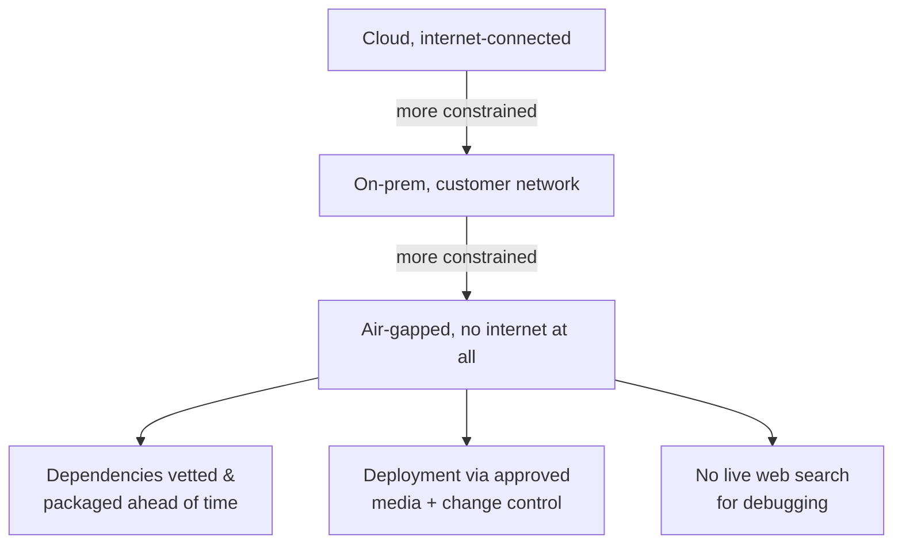

> **TL;DR:** You're a guest in someone else's house. Their security posture and risk tolerance govern — not yours, not your company's default.

## Least privilege, requested explicitly

| Default instinct (wrong) | FDE default (right) |
|---|---|
| "Give me admin so I can move faster" | Narrowest access for the task in front of you |
| Broad, standing credentials | Time-boxed, scoped, with a stated reason |
| Write access by default | Read-only first |

Non-obvious upside: asking for exactly what you need, with a reason, reads to a security team as *"this vendor understands our risk"* — which builds trust faster than asking broad "to be safe."

## Working environments, by constraint level

A meaningful share of FDE work — defense, healthcare, fintech, government — happens at the air-gapped end. Plan for it; don't discover it under deadline pressure.

## Compliance: ask, don't assume

This course won't teach HIPAA/SOC 2/data-residency specifics — that needs real domain expertise. The mindset generalizes:

- Know explicitly what regime you're operating under.
- **When in doubt, ask the customer's compliance/security contact directly, in writing.** Never proceed on an assumption in a regulated context you haven't confirmed.
- A blocked question costs hours or days. A real violation can end the engagement — and in some industries carries legal exposure for both companies.

## IT is a stakeholder, not an obstacle

| Framing | Result |
|---|---|
| "IT is blocking me" | Adversarial, slow approvals, maximum scrutiny |
| "IT owns a legitimate goal too — a stable, secure environment they're accountable for" | Early relationship investment → faster approvals later |

The FDEs who move fastest through client environments aren't fighting the process — they understand it well enough to work efficiently within it, and are trusted enough to get fast-tracked.
