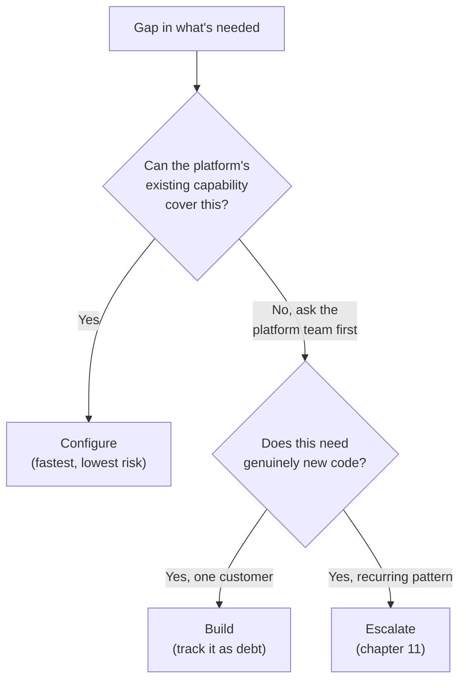

> **TL;DR:** Configure first, build second, escalate when it's a pattern — in that priority order, even under deadline pressure.

## The decision, as a flow

Configure is almost always fastest and lowest-risk — worth real effort to rule out, including asking someone on the platform team who may know an undocumented capability.

## Tech debt here has a different shape

In normal product work, the team that incurs debt usually pays it down. In FDE work, the person incurring it (you, under deadline) and the person dealing with the consequences (you again, three months later — or someone else entirely) are often disconnected in time.

- **The fix:** keep a running, visible list of every deliberate shortcut, one line each: what it is, what the "real" version would need.
- Not every shortcut needs fixing immediately. The point is making debt *visible and prioritizable*, not eliminating it.

## Red-flag requests — push back, with an alternative

| Request | Why it's a red flag | What to say |
|---|---|---|
| "Bypass the security control just this once" | Regardless of urgency | "Can't build that with the bypass — here's what I *can* do inside existing controls." |
| Build around one person's undocumented workaround | Encodes fragile tribal knowledge as a "requirement" | Ask for the documented process instead |
| Retain sensitive data longer/wider than the customer's own policy | Even if the requester has authority to ask | Surface it explicitly, don't quietly implement |

A clear no paired with a real alternative earns the standing to say no again later.

## Self-review checklist (run this before every demo or handoff)

- Would I be comfortable explaining this decision to a skeptical senior platform engineer?
- If usage triples next month unannounced — does this fail loud and safe, or silent and bad?
- If I'm out next week, could someone else understand this from what currently exists?

## When "no" is the right engineering answer

An FDE who never says no is, over time, less valuable than one who says no rarely and means it. Yeses from someone who pushes back when warranted actually signal something. Yeses from someone who always agrees don't.
