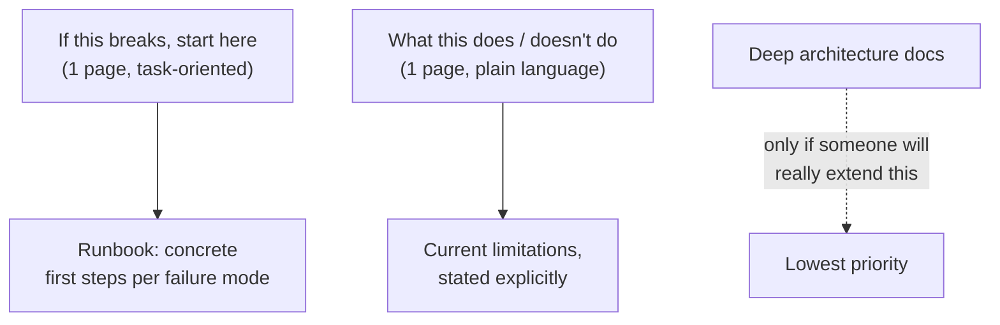

> **TL;DR:** A demo working live, with you driving, has cleared a real bar. It hasn't cleared the much higher one: running unattended, operated by people who didn't build it. Skipping this step is the #1 reason engagements quietly fail months later.

## The handoff checklist

Don't call it done until all four are true:

- [ ] Someone who **didn't build it** can operate it for a normal day without contacting you.
- [ ] Real failures (bad input row, unreachable upstream, expired credential) **fail loudly**, with a message a non-builder can act on.
- [ ] A findable runbook exists: what to check first, who to contact, current known limitations — stated plainly.
- [ ] A **specific named person** on the customer's side is trained as primary owner. Not "the team" — a name.

If any box is unchecked, it's a prototype in production clothes — the gap surfaces eventually, either as a planned handoff task now or an unplanned incident later.

## Documentation that actually gets read

Short, task-oriented docs get used under real pressure. Comprehensive, architecture-first docs go stale within a month and don't answer the question an operator actually has in the moment.

## Training progression

1. **Watch me do it.**
2. **You do it, I watch.**
3. **You do it alone, I'm quietly available.**

Deliberately let the operator make a mistake during step 2 or 3. If a foreseeable mistake produces a confusing or unrecoverable result, that's a real gap to fix *before* handoff — not an edge case for later.

## Don't become the permanent crutch

- Feels good in the moment: the customer keeps calling you for things training was supposed to cover, and you keep answering.
- **The actual fix:** if the same question keeps coming up, that's signal the documentation missed something — go fix the doc, not just answer again.
- Left unaddressed: fragile for the customer (what happens the day you're unavailable), unsustainable for you as your account count grows.

## Define "done" before you start

Write the checkable criteria for "the customer runs this independently" at the **start** of the engagement, not the end. Without that anchor, operationalization is the easiest phase to skip under deadline pressure — everyone, including you, will feel done well before the customer actually is.
