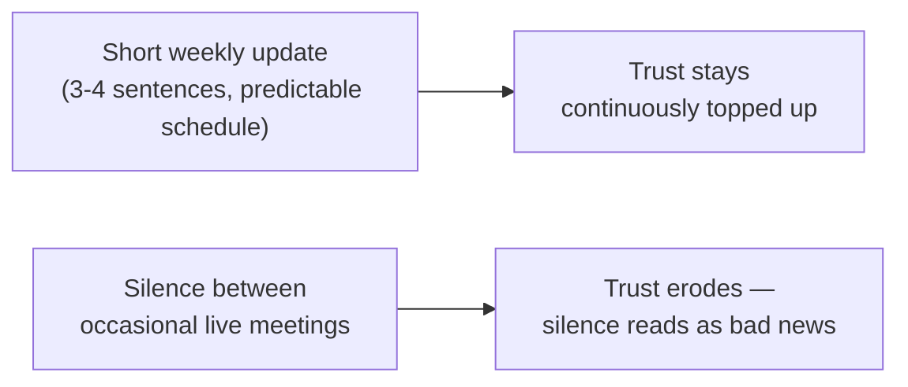

> **TL;DR:** In this role, communication isn't one skill among several — it's the interface every other skill gets delivered through. Great technical work, poorly communicated, produces the same outcome as work never done.

## Writing a non-engineer will actually read

**Lead with this order, every time:**

1. What changed
2. What it means for them
3. What (if anything) they need to do

Then, and only then, the technical detail — if asked.

| Weak | Strong |
|---|---|
| "Significantly improved performance" | "Processing time: 6 hours → 40 minutes" |
| Bad news buried at the bottom, after context | "We hit a real blocker on the auth integration — here's the plan" in sentence one |
| Undefined jargon | Define it in the same breath, or cut it |

## The standup with a client in the room

An internal standup assumes shared context. A client doesn't have it.

- Lead with the business outcome: *"the risk-scoring logic now catches the pattern you flagged last week"* — technical detail available if asked, not leading.
- Narrate what an internal teammate wouldn't need explained: *"this took longer than expected — the data had a quirk we didn't anticipate."*

## Translate tradeoffs, don't hide them

Smoothing over a real risk works exactly until it materializes — and then it's a bigger trust hit than the original tradeoff would have been.

> **Say this:** "Ready by Friday if we hardcode the three account types you use today, or by next Wednesday if we handle new types automatically — which matters more for your timeline?"

Hands the stakeholder a real decision they can actually make.

## The async update habit

*"Steady progress, on track, nothing blocking"* sent reliably every Friday builds more security than the same information delivered only at milestones.

## Escalating bad news

1. Deliver it as early as you're confident it's real.
2. State it plainly — not minimized, not catastrophized.
3. **Always pair it with a plan**, even provisional: *"here's what I'm doing, here's when you'll hear from me next."*

Stakeholders absorb bad news well. What they don't absorb well: news that arrives late, feels evasive, or comes with no plan attached.
