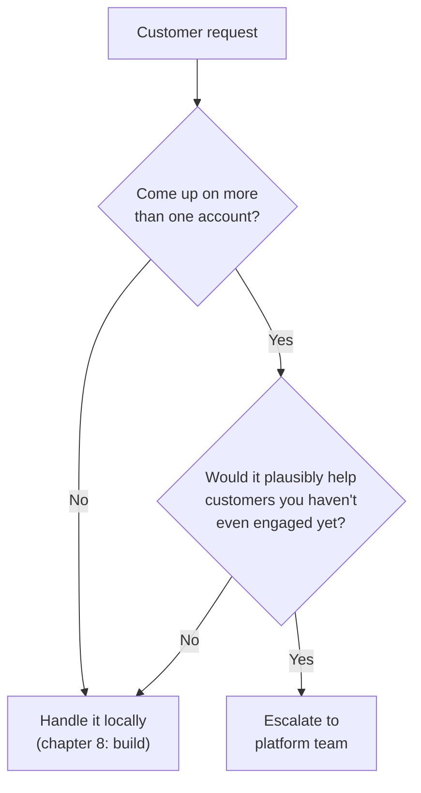

> **TL;DR:** An FDE watches the messiest, most honest usage of the product firsthand. That's genuinely valuable to the whole company — but only if it gets routed somewhere, not just remembered by one engineer.

## One-off or pattern? The escalation test

Escalating every one-off floods the platform team with noise and teaches them to tune out your reports. Escalating nothing means the company never learns from your vantage point at all.

## Making an escalation land

An escalation that lands as *"a random idea from the field"* loses to every other unranked idea in the backlog. Include all three:

| Ingredient | Example |
|---|---|
| **The pattern, with evidence** | "This exact gap has come up on 3 separate accounts this quarter" (not "customers seem to want this") |
| **Business impact of staying unsolved** | Deals at risk, repeated FDE hours solving the same problem per-account |
| **A concrete starting proposal** | Not the final design — just something a busy team can react to |

## Hacks vs. platform features — the real tension

| Lean too far toward... | Result |
|---|---|
| Always shipping the fast, customer-specific hack | Spreading swamp of bespoke, undocumented code — eventually costs more than building it properly once |
| Always waiting for the full platform roadmap process | Customers experience you as slow — undermines the reason the FDE function exists |
| **Healthy middle** | Ship the scoped fix now, track it explicitly as debt, escalate the moment it's a real pattern |

## FDEs as an early-warning system

Because you have the most direct, unfiltered visibility into real usage, you're often the earliest reliable signal of an at-risk account — before it ever shows up on a churn dashboard.

- A stakeholder gone quiet, usage visibly declining, a champion losing internal standing — notice and surface these early.
- By the time churn risk shows up in a formal report, it's frequently already too late to intervene.
