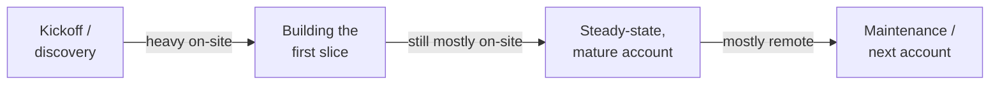

> **TL;DR:** Travel intensity tracks engagement phase, not a fixed company policy — heavy on-site early (trust builds faster in person), lighter once an account stabilizes.

## Travel intensity by phase

**Better interview question than "how much travel":** *"How does travel intensity typically shift across a single engagement's lifecycle, from kickoff to steady state?"*

## The real, under-discussed cost: being "the vendor"

You're structurally a guest in an organization you don't belong to, every engagement — reading a new team's unwritten norms fast, navigating politics you have limited visibility into, while also being fully "on" technically. This is a second, additive kind of tired on top of the technical hours.

## Burnout risk factors specific to this role

| Risk | Why it's easy to miss |
|---|---|
| Constant context-switching across accounts | Doesn't show up on any velocity metric |
| Travel fatigue compounding over months | Hard to appreciate before you've lived a few consecutive months of it |
| Always-on availability trains accounts to expect immediate response | Building trust (ch. 4) has a real unbounded downside |

**Defenses that actually work:**
- Explicit, held response-time boundaries: *"Generally available business hours; here's the real escalation path after that."*
- Real, scheduled, non-negotiable recovery time between demanding stretches.
- A manager tracking your travel/account load over time — not just each engagement's health in isolation.

## The real upside — why people stay

- Watching something you built get used by real people, on the problem you watched them struggle with, often within the same week.
- Continuous breadth: new domain, new data problem, new org dynamic — every engagement, rarely dull.
- Relationship-building compounds as a transferable skill across an entire career.

## Questions to ask before accepting an FDE role

- What does a typical week look like across a full quarter — not one representative "good" week?
- How many accounts does one FDE support at once, and how is that number kept in check?
- What actually happens when someone's stretched thin — a real rebalancing process, or does it just accumulate?
- How does the company manage burnout specific to this role — is there a real, specific answer?

A team with concrete, lived-in answers is a strong positive signal. A team without them isn't necessarily acting in bad faith — but it's useful information before you accept, not after.
