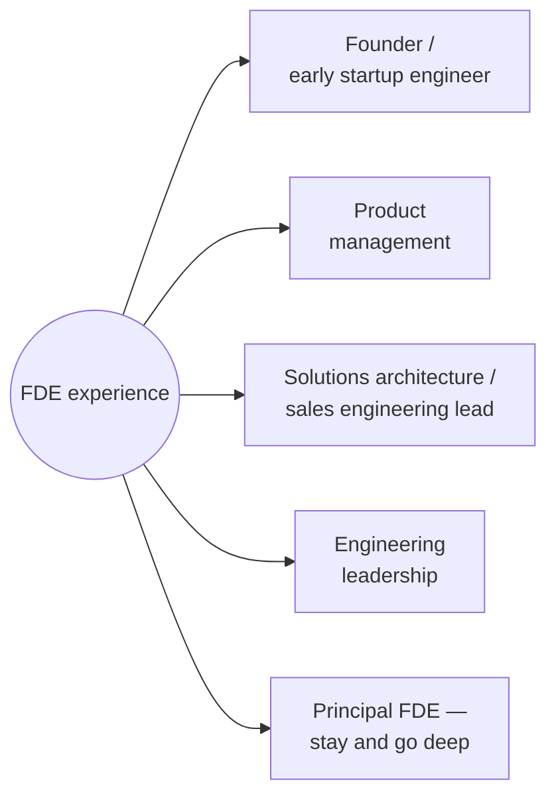

> **TL;DR:** FDE work builds a rare combination — deep technical breadth plus real product and people judgment, built through repeated high-stakes practice. That combination opens doors well past the title itself.

## Skills you actually accumulate

- Technical breadth across data integration, systems thinking, and enough of the core domain to be dangerous.
- Real discovery/requirements skill — practiced product sense most engineers never get.
- Comfort with end-to-end ownership under ambiguity, without a fully specified plan.
- Executive communication, built under real, unforgiving stakes.

## FDE track vs. traditional SWE track

| | Traditional SWE | FDE |
|---|---|---|
| Develops | Deep specialization in one system | Breadth + judgment across many |
| Shape of growth | Increasingly sophisticated mastery, over years | Fast competence in unfamiliar terrain, repeatedly |
| Neither is "better" | — | Different shapes of expertise |

Not a one-way door — engineers move between these tracks, more than once, across a career, and the skills transfer both ways.

## Common exit paths

- **Founder** — discovery, scoping, build-fast-under-ambiguity map almost directly onto early-stage startup work.
- **PM**, especially at technical/platform companies — firsthand customer context + technical fluency is rare.
- **Solutions architecture / SE leadership** — natural extension for people who liked the customer-facing half.
- **Engineering leadership** — judgment and stakeholder skills transfer directly.
- **Staying and going deep** — principal-level FDE owning the hardest accounts is a legitimate senior track, not just a stepping stone.

## Breaking in: what actually matters

1. **Demonstrated ambiguity comfort** — concrete past examples of scoping something underspecified yourself, not just executing a fully-written ticket.
2. **Real communication skill, shown, not claimed** — how clearly you explain a past decision to a non-technical interviewer, not a resume bullet.
3. **Any direct customer-facing experience** — support, TAM, freelance client work all count and are often underweighted.

> **Concrete way to build all three before applying:** find a real problem for an internal stakeholder at your current job, run the full loop from this course on it — discovery, a scoped first slice, an honestly-caveated prototype, real handoff. Described specifically in an interview, this beats any amount of "what I'd theoretically do."

## The honest tradeoff

Travel, context-switching, and constant representation under scrutiny are real costs (chapter 12), not exaggerated ones. Not a "better" path than deep specialization — a different one, trading depth for breadth and unusually direct impact. If the variety and immediate impact sound energizing, this is worth pursuing. If it sounds exhausting, that's valid, useful self-knowledge too.
