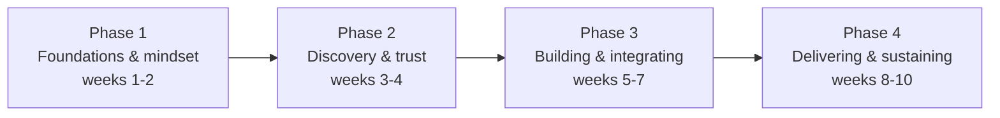

> **TL;DR:** Ten weeks, something practiced every week — not just read. Each week: **Read** (1-1.5h) → **Practice** (2-3h, on a real internal problem if you can find one) → **Reflect** (20-30min, in writing).

## Phase 1 — Foundations & mindset

| Week | Read | Practice |
|---|---|---|
| 1 | Ch. 1 Foundations | Write one real problem at your job that's FDE-shaped. Ask a colleague in another function what their most annoying recurring problem is. |
| 2 | Ch. 2 Mindset | Evaluate a recent piece of your own work against the build/configure/escalate order. Would it have changed what you built? |

## Phase 2 — Discovery & trust

| Week | Read | Practice |
|---|---|---|
| 3 | Ch. 3 Discovery | Run one real discovery conversation using "walk me through the last time this happened." Compare what you were told vs. what you observed. |
| 4 | Ch. 4 Stakeholders | Map stakeholders around your problem: economic buyer / technical champion / end user. If you can't name one, that's itself a finding. |

## Phase 3 — Building & integrating

| Week | Read | Practice |
|---|---|---|
| 5 | Ch. 5 Rapid Prototyping | Build the smallest working prototype, genuinely timeboxed to a few hours. Write down what you faked and what's real. |
| 6 | Ch. 6 Data Integration | Profile a real dataset you have access to: distinct values, min/max, 20 rows read by eye. Write down every surprise. |
| 7 | Ch. 7 Client Environments + Ch. 8 Technical Judgment | Re-evaluate a recent access request against least-privilege. Was it scoped as narrowly as it could've been? |

## Phase 4 — Delivering & sustaining

| Week | Read | Practice |
|---|---|---|
| 8 | Ch. 9 Operationalization + Ch. 10 Communication | Write a one-page runbook for your week-5 prototype. Send an honest status update using the headline-first structure. |
| 9 | Ch. 11 Feedback Loop + Ch. 12 Travel/Onsite | Draft a short escalation for a recurring pattern in your own work, using the three ingredients from ch. 11. |
| 10 | Ch. 13 Career Path + re-read Ch. 1 | **Capstone:** write a 1-2 page engagement retrospective for your practice work — as if it were real. |

## After the ten weeks

You won't be a seasoned FDE — that only comes from real accounts and real deadlines over time. You will have: the vocabulary to talk about this role accurately, a real firsthand sense of whether the day-to-day actually appeals to you, and one concrete example you can describe in detail in an interview instead of gesturing at.

**Next step:** find a real cross-team problem at your current job nobody owns, and run the full loop from this course on it — not as an exercise. One real engagement teaches more than any further reading.
