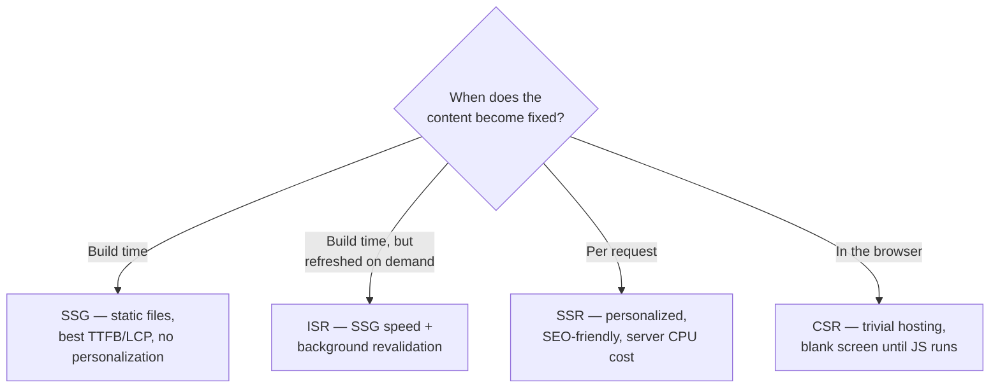

> **TL;DR:** Rendering strategy answers *where and when* HTML gets produced — build time, request time, edge, or in-browser. Picking wrong is structural and expensive to fix later.

## The metrics every strategy gets judged on

| Metric | Measures | Target |
|---|---|---|
| **TTFB** | Time to First Byte — network + server compute | < 100ms (static/CDN) |
| **FCP** | First Contentful Paint — first pixel on screen | Stops the blank-screen wait |
| **LCP** | Largest Contentful Paint — biggest element done | < 2.5s (Core Web Vital) |
| **TTI** | Time to Interactive — visual done + main thread free | Can lag behind FCP during hydration |
| **INP** | Interaction to Next Paint (replaced FID, March 2024) — worst-case tap-to-update delay | < 200ms |

**Hydration** — the process where server-rendered HTML gets "brought to life": React attaches listeners, rebuilds state, takes ownership of the DOM. This is where SSR pays its tax — JS still has to download, parse, execute, even though markup is already visible.

## The strategies

| Strategy | Strengths | Weaknesses | Use for |
|---|---|---|---|
| **CSR** | Trivial hosting, rich interactivity | Blank screen until bundle parses; weak SEO | Authenticated dashboards, internal tools |
| **SSR** | Fast FCP, per-request personalization, full SEO | Every request costs server CPU; hydration cost remains | Personalized feeds, SEO-critical pages |
| **SSG** | Best possible TTFB/LCP, zero per-request cost | Content needs a rebuild to change; no personalization | Marketing, docs, blogs |
| **ISR** | SSG speed + eventual freshness (`revalidate: 60`) | "Eventually consistent" content | Large catalogs, news sites |
| **Streaming SSR** | Ships HTML chunks as ready, works with `<Suspense>` | Harder to cache; trickier debugging | Pages with slow, non-critical data |
| **RSC** | Zero JS for data-only components, no prop drilling | New mental model, confusing caching | Content-heavy Next.js App Router apps |
| **Islands** | Ship JS only for the interactive widgets | Not a fit for interaction-heavy apps | Content-first sites, Astro's sweet spot |

**RSC (React Server Components):** every component is a server component by default; opt into client behavior with `"use client"`. Server components can import client components; client components can only receive server components as children — not import them. **Server Actions** are RSC's mutation half — functions marked `"use server"` the client calls as if local.

**Resumability (Qwik):** instead of replaying server work on hydration, serializes state + listener metadata into the HTML so the client resumes exactly where the server left off. Theoretically `O(1)` startup regardless of app complexity — React 19's compiler borrows ideas from this direction.

**Edge rendering** is a deployment topology, not a strategy: SSR code runs on distributed compute nodes (Cloudflare Workers, Vercel Edge) near the user, cutting TTFB. Catch: edge runtimes are a Node subset, and a centralized DB can be *slower* to reach from the edge — hence distributed-DB-first stacks (PlanetScale, Turso, Neon).

## Choosing — walk down, stop at the first match

1. Same content for everyone, changes less than every few minutes? → **SSG**
2. Same, but needs faster updates than a rebuild allows? → **ISR**
3. Personalized, and SEO matters? → **SSR** (streaming/RSC if available)
4. Personalized, SEO doesn't matter, interaction-heavy? → **CSR**
5. Mostly content, one or two interactive widgets? → **Islands**

> A marketing page is read once by a stranger evaluating you in 3 seconds — fast first paint matters most, content is identical for everyone → **SSG**. A dashboard is loaded once by a committed, authenticated user for an hour — first paint can be a skeleton, the real work is interactivity → **CSR/SSR**.

## Where it actually hurts

| Pitfall | Cause | Fix |
|---|---|---|
| **Hydration mismatch** | Server/client render different output — timezone code, `Math.random()`, `Date.now()` on the server | Keep non-deterministic values out of server render |
| **The waterfall** | Nested data deps (page → user → preferences → flags) serialize round-trips | Streaming SSR + parallel data loading |
| **All-or-nothing hydration** | Classic React hydration is atomic — uninteractive until the whole tree hydrates | React 18 selective hydration + Suspense; islands/RSC sidestep it entirely |
| **Bundle creep** | A CSR app's JS quietly grows to 2MB over years | Route-level code splitting, budget enforcement |
