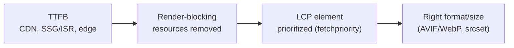
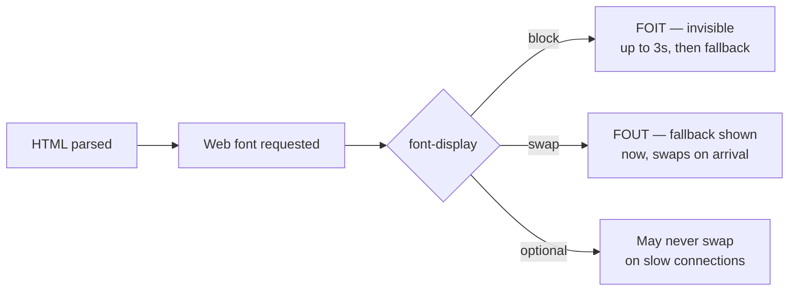

> **TL;DR:** Core Web Vitals split into loading (LCP), interactivity (INP), and visual stability (CLS) — measured on real users via CrUX, feeding Search rankings.

## The vitals to know cold

| Metric | Measures | Good | Needs work | Poor |
|---|---|---|---|---|
| **LCP** | Largest Contentful Paint | ≤ 2.5s | 2.5–4.0s | > 4.0s |
| **INP** | Interaction to Next Paint | ≤ 200ms | 200–500ms | > 500ms |
| **CLS** | Cumulative Layout Shift | ≤ 0.1 | 0.1–0.25 | > 0.25 |

Supporting (not official Vitals, still worth knowing): **FCP** (< 1.8s good), **TTFB** (< 800ms good), **TBT** (main-thread blocks > 50ms, lab-only INP proxy), **Speed Index**.

## LCP — what moves it

- **Render-blocking:** synchronous `<script>` in `<head>` stops parsing. Use `defer`/`async`, or move to end of `<body>`. Inline critical CSS, load the rest async.
- **The LCP image:** `fetchpriority="high"` on ``, or `<link rel="preload">` if it's a CSS background. Never `loading="lazy"` on an above-the-fold image — that *delays* LCP.
- **Format/size:** AVIF → WebP → JPEG fallback. `srcset`/`sizes` for responsive delivery. Resize server-side to actual rendered size, not source size.

## INP — what moves it

Dominated by **main-thread blocking**: while JS runs, the browser can't paint.

| Lever | How |
|---|---|
| **Break up long tasks** | Any task > 50ms blocks interaction. Yield with `scheduler.yield()`, `setTimeout(fn, 0)`, or `requestIdleCallback`. React 18 does some of this automatically. |
| **Move work off main thread** | Web Workers for CPU-bound work (JSON parsing, image processing, search). Comlink for ergonomic messaging. |
| **Memoize carefully** | `React.memo`/`useMemo`/`useCallback` — but over-memoizing costs its own comparison work. Profile first; React 19's compiler automates most of this. |
| **Debounce/throttle** | 200ms debounce on search-as-you-type; 16ms throttle on scroll handlers. |
| **Avoid layout thrashing** | Reading `offsetHeight`/`getBoundingClientRect` after writing styles forces synchronous layout. Batch reads/writes; prefer `IntersectionObserver`/`ResizeObserver`. |

## CLS — what moves it

- **Always set width/height** on images/video — browsers reserve space from the attributes even when rendered size differs.
- **Never insert content above existing content** (late banners, alerts) — reserve space with `min-height` instead.
- **Fonts:** a web-font swap repaints text with a different bounding box. Use `font-display: optional`, or `swap` + `size-adjust`/`ascent-override` so the fallback's metrics match.
- **Animate `transform`/`opacity`** (composited, free) — not `top`/`left` (triggers layout).

## The performance levers, end to end

| Lever | What it does |
|---|---|
| **Code splitting** | Split by route and by heavy component (`lazy(() => import(...))` + `<Suspense>`). LCP shrinks; first-use interaction cost moves later — prefetch during idle to hide it. |
| **Tree shaking** | Relies on ES Modules; `import debounce from "lodash/debounce"`, not the whole library. Library authors mark `"sideEffects": false`. |
| **Bundle analysis** | `vite-bundle-visualizer`, `webpack-bundle-analyzer`. Find surprisingly large chunks — moment.js, bulk icon imports, duplicate library versions. |
| **Resource hints** | `preconnect` (open connection early, worth 100-500ms), `preload` (critical resource now), `prefetch` (likely-next resource, low priority), `modulepreload` (preload a module + its deps). |
| **Critical CSS** | Inline above-the-fold CSS; load the rest async (`critters`, `critical`). Can save a full second on content sites. |
| **Compression** | Brotli over gzip (~20% smaller). Pre-compress at build time. |
| **HTTP/2 & /3** | HTTP/2 multiplexes many requests over one connection — less need to bundle aggressively. HTTP/3's QUIC survives network changes better (mobile). |
| **Caching headers** | `Cache-Control: public, max-age=31536000, immutable` for hashed assets. `no-cache` ≠ "don't cache" — it means "revalidate first." `stale-while-revalidate` is ISR's CDN equivalent. |
| **Virtualization** | Long lists (chat, big tables) render only visible rows + overscan. TanStack Virtual, react-window, react-virtuoso. `content-visibility: auto` is a native (less flexible) alternative. |
| **Performance budgets** | Commit to a number ("homepage JS stays under 170KB compressed"), enforce in CI with `bundlewatch`/`size-limit`. Without one, every PR adds "just a little" until you're at 2MB. |
| **React 19 compiler** | Auto-memoizes components/computations at build time — removes most manual `useMemo`/`useCallback` need. Check your React version's release notes for current stability/default-on status. |

## Font loading

**Modern playbook:** `font-display: swap` + preload the woff2 + `size-adjust`/`ascent-override`/`descent-override` so the fallback's metrics match the web font — zero CLS on swap. Variable fonts cut total weight; system font stacks cost nothing at all.

## Tools — measure first, optimize second

| Tool | Use |
|---|---|
| **Lighthouse** | Lab measurement, relative comparison across changes |
| **PageSpeed Insights** | Lighthouse + real CrUX field data |
| **WebPageTest** | Real devices, real geographies, throttled networks, waterfall view |
| **DevTools Performance panel** | Flame chart for main-thread blocking / INP diagnosis |
| **`web-vitals` library** | Emits LCP/INP/CLS/FCP/TTFB from real users, pipe to analytics (RUM) |
| **DevTools Coverage tab** | Shows unused CSS/JS bytes on a page |

## The 80/20, in order of impact

1. Get the LCP image right (preload, prioritize, right format/size)
2. Eliminate render-blocking resources in `<head>`
3. Split the JS bundle by route
4. Set explicit media dimensions to kill CLS
5. Lazy-load below-the-fold images/components
6. Move CPU-heavy work off the main thread
7. Virtualize lists over a few hundred rows
8. Enforce a performance budget in CI
