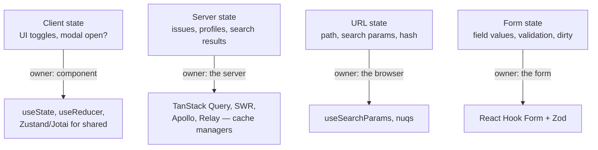

> **TL;DR:** "State" isn't one thing — there are four distinct kinds, each with its own lifecycle and owner. Mashing them into one store (mid-2010s Redux pattern) is the single biggest source of frontend complexity.

## The four kinds of state



| Kind | Source of truth | Lifecycle |
|---|---|---|
| **Client** | The client itself | Ephemeral, lost on reload unless persisted |
| **Server** | The server — client holds a *copy* | Populated on demand, invalidated on mutation/TTL |
| **URL** | The URL | Survives reload, bookmarkable, shareable |
| **Form** | The form component | Lives only while the form is open |

⚠️ **The most common architecture mistake of the last decade:** putting server state into Redux and hand-writing thunks/reducers to fetch and invalidate it. That's rebuilding a cache manager from scratch, badly — use a real one.

## Cache management (server state) — the hard part

**Cache keys** — React Query's `queryKey`, e.g. `["issues", { status: "open" }]`. Identical keys share a cache entry and re-render together. The key shape *is* your normalization strategy.

**Invalidation, the four flavors:**

| Flavor | Mechanism | Good for |
|---|---|---|
| **Time-based (TTL)** | `staleTime` — stale after N seconds | Predictably-changing data |
| **Event-based** | A mutation calls `invalidateQueries({ queryKey })` | The most common pattern |
| **Manual** | `setQueryData(key, newValue)` | Optimistic updates, post-mutation rewrites |
| **Stale-while-revalidate** | Serve stale immediately, refetch in background, swap on arrival | React Query/SWR's default — kills loading spinners on re-visits |

**Normalization — two approaches:**

| | Normalized cache | Document cache |
|---|---|---|
| Storage | Each entity by id, lists hold references | Each query result verbatim under its key |
| Update propagates | Everywhere, automatically | Only via invalidation by key prefix |
| Used by | Apollo, Relay | React Query, SWR |
| Cost | Powerful, high cognitive load, needs schema awareness | Simpler, sometimes slower for write-heavy, usually good enough |

**Optimistic vs. pessimistic updates:**

```ts
useMutation({
  mutationFn: likePost,
  onMutate: async (newLike) => {
    await queryClient.cancelQueries({ queryKey: ["post", id] });
    const previous = queryClient.getQueryData(["post", id]);
    queryClient.setQueryData(["post", id], (old) => ({ ...old, liked: true }));
    return { previous };
  },
  onError: (err, vars, ctx) => queryClient.setQueryData(["post", id], ctx.previous),
  onSettled: () => queryClient.invalidateQueries({ queryKey: ["post", id] }),
});
```

Optimistic = update the UI before the server confirms, roll back on error. Use for cheap, idempotent actions. **Pessimistic** (wait for the server first) is for anything with real consequences — payments, account deletion.

**Keeping data fresh:** polling (`refetchInterval`, simple but wasteful) · refetch-on-focus (React Query default, minimal cost, great UX) · subscriptions (WebSocket/SSE/GraphQL, best fidelity, most infra).

## Why Context is not state management

`React.Context` is dependency injection, not a state container. **Any change to a Context value re-renders every consumer** — fine for low-change values (theme, current user, locale), disastrous for high-change values (a 200-card board, a live chart). For high-change shared state, use a real store where consumers subscribe to slices.

## Picking a state library

| Library | Model | Use when |
|---|---|---|
| `useState`/`useReducer` | Local | The default — never reach further until you need to |
| Context | DI | Values that change rarely, read by many |
| **Zustand** | Hook-based store, no provider | The current pragmatic favorite |
| **Jotai** | Atomic graph | Excellent for derived state |
| **MobX** | Observable, mutate plain objects | Complex domain models (used by Linear) |
| **Redux Toolkit** | Official, modernized Redux | Verbose but battle-tested |
| **Valtio** | Mutable, proxy-based | Smaller/more direct than MobX |
| Signals (Preact/Solid/Vue/Angular) | Fine-grained reactivity | React via `useSyncExternalStore` |

## Single source of truth

> Every piece of data has exactly one home. Syncing two stores, copying server data into Redux on fetch, keeping a "local copy" of a URL param — all signs of trouble. Find the natural owner and read from there.

Most "stale state" bugs are two copies of one thing drifting apart.

## URL state — the underrated trick

**The reload test:** if reloading would frustrate the user because they'd lose their place (search query, filters, current tab, pagination), it belongs in the URL. Libraries: **nuqs**, **TanStack Router** (URL state as primary).

## Form state

Putting every field in `useState` re-renders the whole form on every keystroke. **React Hook Form** registers fields via refs (uncontrolled) — typing in one field doesn't re-render others. Pairs with **Zod** for schema validation:

```ts
const schema = z.object({ email: z.string().email(), age: z.number().min(18) });
const { register, handleSubmit, formState: { errors } } = useForm({ resolver: zodResolver(schema) });
```

## Worked example: an issues page

| Piece | Kind | Owner |
|---|---|---|
| `?page=3&status=open&selected=ISS-12` | URL state | Browser |
| List + detail of selected issue | Server state | React Query, keyed by the URL values |
| Filter sidebar collapsed | Client state | `localStorage`-persisted local state |
| Edit form for the selected issue | Form state | React Hook Form |

Each owned by exactly one system. A mutation invalidates the list/detail queries. URL changes trigger new queries. A reload preserves the user's place. That's what "state architecture" means — knowing which bucket a piece of data belongs in, and resisting the urge to mash buckets together.
