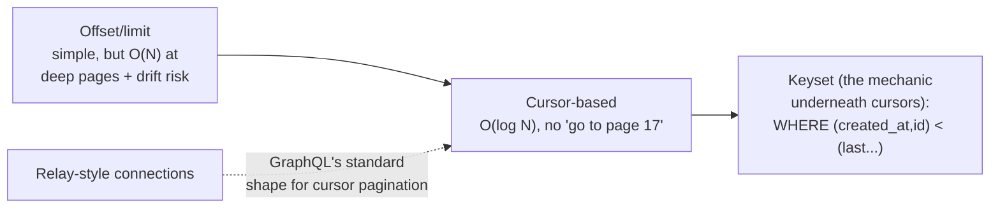
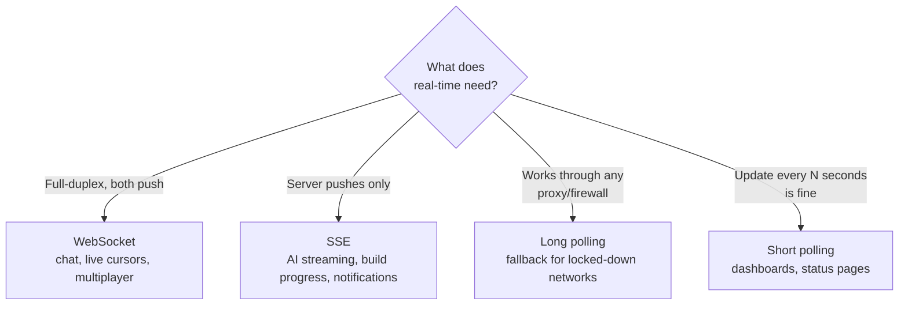

> **TL;DR:** REST, GraphQL, tRPC, and gRPC each trade off differently on caching, over/under-fetching, and typing. Pick based on your actual consumers, not hype.

## API styles, compared

| | REST | GraphQL | tRPC | gRPC / gRPC-web |
|---|---|---|---|---|
| **Shape** | Nouns at URLs, HTTP verbs | Client describes exact shape wanted | Server procedures, client imports the type | Binary, protobuf schema-first |
| **Strength** | Universally understood, HTTP-cacheable, wire-visible intent | No over/under-fetching, one round-trip for nested data | Full type safety, zero codegen, fast to build | Performance, bidirectional streaming, polyglot typing |
| **Weakness** | Over-fetching, versioning gets political | Every query is a POST by default (harder to cache); N+1 problem | TypeScript-only, not for external consumers | Needs an Envoy-style proxy for browsers; steep learning curve |
| **Use for** | Public/general APIs | Complex nested UI data needs | Your own frontend ↔ your own backend | Internal microservice meshes |

**Idempotency** (REST): `GET`/`PUT`/`DELETE` produce the same result called once or many times; `POST` does not. For anything that retries on network failure, send an **idempotency key** header so the server can dedupe.

**GraphQL's N+1 problem:** a query like `users { posts { comments } }` naively triggers N database queries inside the resolver — **DataLoader** batches and dedupes resolver calls within a request to fix it. **Persisted queries** turn a heavy POST body into a cacheable hash (`?id=hash123`).

**gRPC-web** needs a proxy (Envoy or similar) because browsers can't speak raw HTTP/2 trailers — that's the practical reason it's mostly an internal-mesh tool, not a public-API choice.

## Pagination patterns

- **Offset/limit** — trivial, but inserting rows mid-list causes drift, and deep pages cost O(N) to skip.
- **Cursor-based** — server returns items + `nextCursor` (usually an encoded `(created_at, id)` pair), letting the DB seek via B-tree index. No "jump to page 17," but the tradeoff is worth it for real-time feeds.
- **Infinite scroll vs. explicit pagination** — infinite scroll feels modern but breaks "back" navigation and accessibility; best for feeds, worst for archives. **Always pair infinite scroll with virtualization** or you'll accumulate thousands of DOM nodes.

## Request optimization

| Technique | What it does |
|---|---|
| **Deduplication** | Two components requesting the same key → one network call (React Query/SWR/Apollo/Relay all do this) |
| **Batching** | Small requests within a tick coalesce into one (DataLoader server-side, `BatchHttpLink` for Apollo) |
| **Cancellation** | `AbortController` — cancel a fetch when the user navigates away mid-request; React Query does this automatically on unmount |

## Real-time mechanisms

| Need | Right answer |
|---|---|
| Chat, live cursors, multiplayer | WebSocket |
| AI streaming, build/job progress | SSE |
| Dashboard updating every 30s | Short polling |
| Collaborative document editing | WebSocket + CRDT |

## Collaborative editing — when two users edit at once

**The hardest distributed-systems problem regular web apps run into:** offline edits from two users arrive at the server in some order — what's the final state?

- **OT (Operational Transformation)** — Google Docs' classical approach. Each operation is transformed against concurrent ones so end states converge. Conceptually elegant, famously complex to implement correctly.
- **CRDTs (Conflict-free Replicated Data Types)** — data structures that *mathematically guarantee* convergence regardless of merge order. Libraries: **Yjs** (mature, used by Notion/Linear/Sentry), **Automerge** (Rust core, academically rigorous), **Loro** (newer, fast).

**Decision: is your app multiplayer or collaborative?**

| | Multiplayer (Figma) | Collaborative (a Jira board) |
|---|---|---|
| Everyone sees everyone's changes in real-time | Yes | Rarely simultaneous |
| Needs | CRDTs or OT | Just good cache invalidation + last-write-wins |

If your app doesn't need offline edits or true simultaneous editing, you don't need a CRDT.

## Offline-first

| Piece | What it does |
|---|---|
| **Service Workers** | Intercept network requests for their scope, respond from cache. Foundation of offline/PWA. Use **Workbox** — the raw lifecycle (install→waiting→activate) is notoriously confusing. |
| **Caching strategies** | Cache-first (immutable static assets) · Network-first (HTML where freshness matters) · Stale-while-revalidate (most read-only API endpoints) · Network-only (mutations) · Cache-only (offline-first features) |
| **IndexedDB** | The browser's local database — async, transactional, indexed. Use **Dexie.js** or **idb** (raw API is painful). Linear stores its entire working set here, which is why it feels instant. |
| **Background Sync** | A service worker defers requests until connectivity returns. Chrome-only as of early 2026 — polyfill with an explicit IndexedDB retry queue for Safari. |
| **Sync engines** | The next abstraction: reconciles a local IndexedDB cache with a server (Linear Sync Engine, Replicache, ElectricSQL, RxDB, PowerSync). Building one is a multi-year project — buy when you can. |

**PWA** — installable, offline-capable, native-feeling: a manifest + a service worker + push where supported. Full install on Android; "Add to Home Screen" with reduced capability on iOS.
