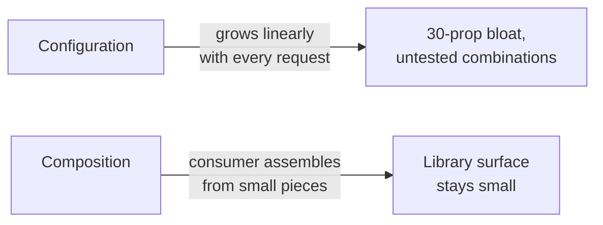
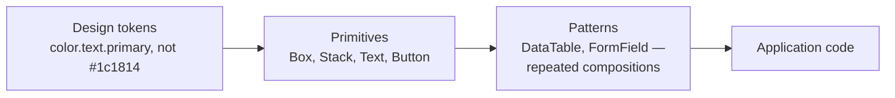

> **TL;DR:** Most component libraries hit a wall around 50 components — a 30-boolean prop interface, cascading style regressions. Component architecture is the discipline that prevents it.

## Composition over configuration



**The right default:** expose more, smaller, composable pieces. Reserve configuration props for things every consumer needs identically (`disabled`, `loading`).

**Compound components** make composition work in React — a parent shares state via Context, children read what they need:

```tsx
<Tabs defaultValue="overview">
  <Tabs.List>
    <Tabs.Trigger value="overview">Overview</Tabs.Trigger>
  </Tabs.List>
  <Tabs.Content value="overview">…</Tabs.Content>
</Tabs>
```

The dominant pattern in modern React libraries: Radix, Headless UI, Ariakit, every shadcn/ui port.

## Headless UI — behavior + accessibility, no styles

| Library | Notes |
|---|---|
| **Radix Primitives** | Most popular. Dialog, Popover, Tooltip, Tabs, Accordion. Foundation of shadcn/ui. |
| **React Aria** | Adobe's — arguably the most rigorous WAI-ARIA reference implementation. |
| **Headless UI** | Tailwind Labs, smaller surface, Tailwind-native. |
| **Ariakit** | Older, comprehensive, less hyped. |
| **TanStack Table/Form/Virtual** | Same headless philosophy for tables/forms/virtualization. |

**Why it wins:** no CSS conflicts, WAI-ARIA patterns (focus management, keyboard nav) solved once in a tested place, trivially themable.

## Polymorphic components & slots

`<Button as="a" href="…">` renders an `<a>` with button behavior — gets messy in TypeScript. Radix's **`Slot`** pattern is cleaner: pass the styling through to a child instead of choosing an element by name:

```tsx
<Button asChild><a href="/somewhere">Go</a></Button>
```

## Design tokens → primitives → patterns → application



Change a token, every consumer updates — no find-and-replace across hundreds of files. **Style Dictionary** compiles one source of truth into CSS variables, Tailwind config, Swift constants, Android XML. Token tiers: **reference** (`gray.100`, raw palette) → **system** (`color.background.surface`, semantic) → **component** (`button.primary.background`).

**shadcn/ui** inverts the npm-install model: you *copy* component source into your repo via CLI instead of installing a package. Thin wrappers over Radix, styled with Tailwind — you own and can edit everything.

**Variants** — `class-variance-authority` (cva) is the popular way to declare variant × size combinations without conditional-classname spaghetti; **Vanilla Extract**, **Panda CSS**, **Tailwind Variants** are alternatives.

Atomic design (Brad Frost, 2013 — atoms/molecules/organisms/templates/pages) is influential but strains at scale; the contemporary replacement is closer to **tokens → primitives → patterns → application** above.

## Monorepo tooling, if you're at that scale

| Tool | Role |
|---|---|
| **pnpm/Bun workspaces** | Package manager primitives |
| **Turborepo** | Task runner, intelligent caching |
| **Nx** | More opinionated, generators, dependency graph, codemods |
| **Changesets** | Per-PR changelogs, coordinated version bumps |

**Module Federation** (Webpack 5) is not a monorepo tool — it's a *runtime* mechanism for independently-deployed apps to share code, the main vehicle for micro-frontends.

## Micro-frontends — and why probably not

| Promise | Reality, more often |
|---|---|
| Team autonomy, independent deploys | Shared design system fragments across N repos "kept in sync by faith" |
| | Auth/theming/analytics duplicated or broken across boundaries |
| | React shipped three times because three teams pinned different versions |

**Justified when:** an org where the alternative is a thousand-dev monorepo with multi-hour CI, or a foundation migration where two stacks must coexist. For most apps: a well-organized monorepo with linted module boundaries handles "team autonomy" without the integration cost.

## CSS architecture, briefly

| Approach | Character |
|---|---|
| **Tailwind CSS** | Utility-first, maps to tokens. Hated for an hour, beloved for a year. |
| **CSS Modules** | Scoped classnames, plain CSS, zero runtime. The default if not Tailwind. |
| **Vanilla Extract** | Type-safe CSS-in-TS, zero runtime. |
| **Panda/StyleX/Pigment CSS** | Atomic CSS generated at build time, TS-first. |
| **CSS-in-JS (styled-components, Emotion)** | Runtime cost aged poorly in the RSC era — rarely picked for new projects. |

## The rule that survives everything

> When a component feels hard to maintain, ask: "is this one component pretending to be three?" Split it. A `<Modal>` with fifteen `if` branches probably wants to be `<Modal>` + `<ConfirmationModal>` + `<DrawerModal>`, sharing a primitive.

Keep **primitives** (general, composable, design-system-owned) distinct from **patterns** (specific, opinionated, feature-owned). Mixing the two is how every component grows fifteen props it doesn't need.
