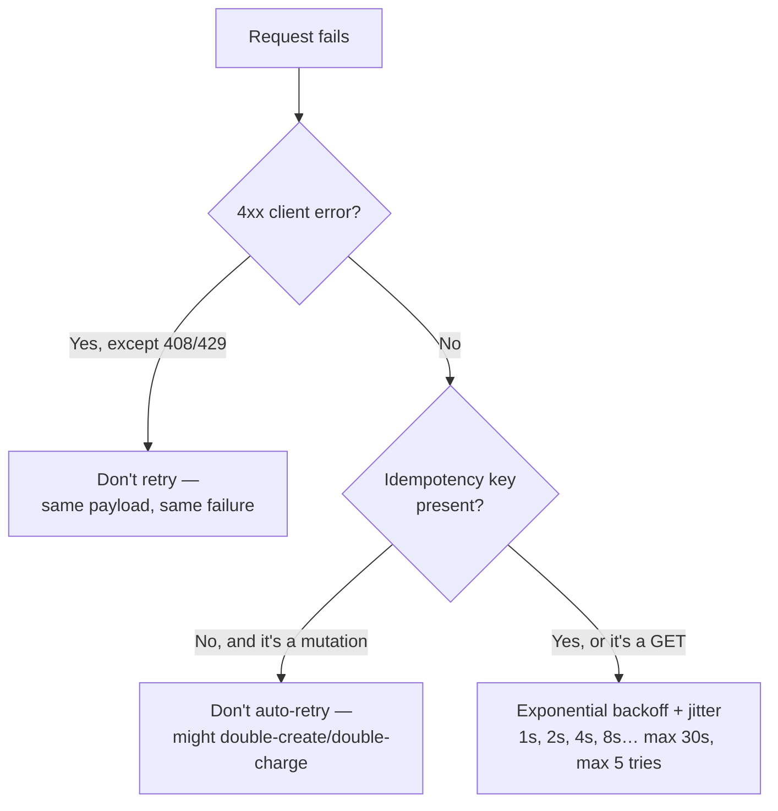

> **TL;DR:** A modern frontend is a long-running app that holds session state and breaks in ways ranging from a console error to a blank page. **Reliability** keeps it working when things go wrong; **observability** tells you what went wrong.

## Error boundaries

React's mechanism for catching render/lifecycle errors in a subtree and showing a fallback instead of unmounting everything:

```tsx
class ErrorBoundary extends React.Component {
  state = { error: null };
  static getDerivedStateFromError(error) { return { error }; }
  componentDidCatch(error, info) { logToSentry(error, info); }
  render() {
    return this.state.error ? <FallbackUI /> : this.props.children;
  }
}
```

Use the `react-error-boundary` package for a hooks-friendly API. **Won't catch:** event handler errors (use try/catch), async errors (must be surfaced via Suspense/a data library), errors inside the boundary itself.

> **Nest boundaries.** A top-level boundary catches everything; section-level boundaries (sidebar, main panel, each dashboard widget) contain local errors so the rest of the app keeps working. Deeper boundary = smaller blast radius.

## Retry strategy



- **Exponential backoff** avoids retry storms — many clients hammering a struggling service tips it over.
- **Jitter** (`wait = 2^attempt * 1000 * (0.5 + Math.random())`) spreads retries out so they don't all land at once.
- **User-initiated actions:** don't auto-retry a failed submit — show the error and let the user click again.
- **Circuit breaker:** after a failure threshold, stop sending requests for a cooldown, then try one ("half-open") before resuming. More common server-side; useful client-side for non-critical features (a failing analytics endpoint shouldn't slow the app).

## Fallback UIs

| Pattern | What it does |
|---|---|
| **Skeleton screens** | Greyed shapes approximating final layout — perceived load feels shorter than a spinner; reserve space to avoid CLS |
| **Optimistic UI** | Show the result before the server confirms (ch. 3) |
| **Empty states** | A list with 0 items ≠ still loading — spell out the difference, with a real CTA |
| **Graceful degradation** | Chart fails to load → show a table. Map fails → show the address. Embed fails → show a link. |
| **Progressive enhancement** | Baseline works without JS (real `<form>` posting to a real URL), enhance when JS loads |

## RUM and synthetic monitoring

**RUM (Real User Monitoring)** — what actually happened, on real devices/networks; this is the data Google ranks you on. The `web-vitals` library is the standard:

```ts
import { onLCP, onINP, onCLS } from "web-vitals";
onLCP((m) => analytics.track("web-vitals", m));
```

Tools: Vercel Analytics, SpeedCurve, Datadog RUM, Sentry Performance, Cloudflare Web Analytics.

**Synthetic monitoring** — scheduled Lighthouse runs against prod URLs, catches regressions before users do (Lighthouse CI, Calibre, DebugBear). Run on every PR (catches code regressions) *and* hourly against prod (catches CDN/third-party/infra issues).

## Error tracking

| Piece | Why it matters |
|---|---|
| **Source maps** | Minified stack traces are useless without them. Upload at build time (Sentry CLI); never serve them publicly — that exposes your full source. |
| **Breadcrumbs** | The event trail before the error — turns "TypeError, undefined" into "user clicked Save after editing issue #3, after the WebSocket disconnected." |
| **Releases** | Tag every event with a release version — correlate error spikes to a specific deploy. |
| **Sampling** | High-traffic apps can't store every event — sample normal events at 10%, keep 100% of unique error types and above-threshold severity. |

Tools: Sentry (the default), Bugsnag, Rollbar, LogRocket/FullStory (+ session replay), Datadog Error Tracking, PostHog.

## Feature flags — decoupling deploy from launch

```ts
if (flags.newCheckoutFlow) return <NewCheckout />;
return <LegacyCheckout />;
```

Roll out gradually (1% → 10% → 50% → 100%), target by segment, kill-switch a broken feature without a redeploy, enable trunk-based development (half-built features merge safely behind a flag).

Tools: LaunchDarkly (market leader), Statsig (flags + experimentation), Unleash/GrowthBook (open source), Vercel Flags, ConfigCat.

⚠️ Flags rot. Every flag needs an owner and a sunset date, audited periodically — otherwise they become permanent cruft.

## A/B testing

Feature flags + statistics: the flag picks a variant, you instrument the conversion event, the platform tells you if the difference is real or noise. **p < 0.05** is the conventional significance bar — more art than commonly admitted. **Sample size, statistical power, and MDE** determine whether an experiment can succeed at all — check before launching; calling a winner too early is the most common mistake. **Bandits** dynamically shift traffic to the better variant — faster to a winner, harder to interpret statistically.

## Cross-cutting resilience

- **Feature detection, not UA sniffing:** `if ("share" in navigator) { … }`.
- **Polyfills:** conditional loading beats universal bundling beats nothing. Build-time browserslist targets need fewer polyfills to begin with.
- **Transpilation:** Babel (workhorse), SWC/esbuild (fast modern alternatives). Targeting evergreen browsers needs near-zero transpilation.

## Reliability checklist

- [ ] Error boundary at the app root, plus at each major layout section
- [ ] Sentry (or equivalent) wired with source maps, release tagging
- [ ] Failed queries retry with exponential backoff + jitter
- [ ] Mutations that retry have idempotency keys
- [ ] Every loading state has a designed skeleton, not a default spinner
- [ ] Every empty state has copy + CTA
- [ ] Web Vitals reported to RUM; Lighthouse CI on every PR
- [ ] Feature flags have named owners and sunset dates
- [ ] Forms work even before JS finishes hydrating
- [ ] `unhandledrejection` and `error` wired up at the window level
