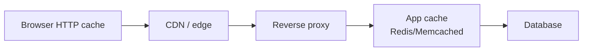
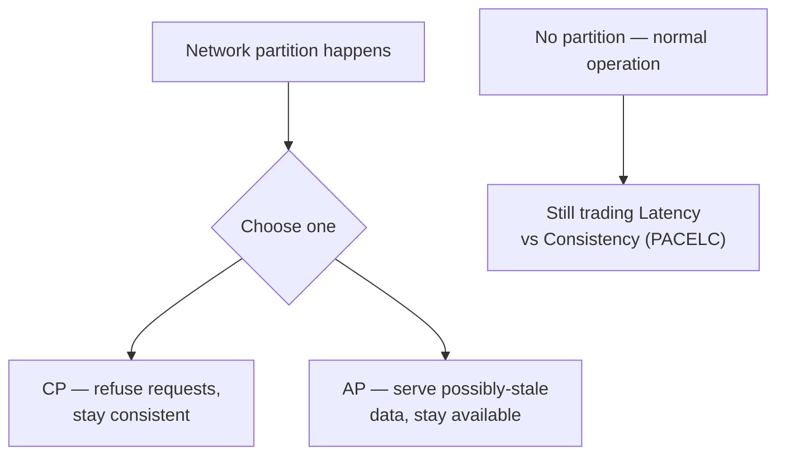

> **TL;DR:** These primitives aren't frontend-specific, but they all show up in frontend code — the browser is a caching layer, a queue (the event loop), an eventually-consistent client of a remote store. This chapter covers the core ones well rather than every distributed-systems topic shallowly — deeper coverage lives in the Backend System Design course in this library.

## Caching

A cache is a fast, smaller copy of a slower, larger source of truth — every layer of a modern stack is one.

**Write strategies:**

| Strategy | How | Tradeoff |
|---|---|---|
| **Write-through** | Every write hits cache + source synchronously | Reads always fresh; write latency = the slower of the two |
| **Write-back** | Writes hit cache, flush to source async | Fast writes; risk of loss if cache dies pre-flush |
| **Cache-aside** | App reads cache, populates on miss from source; writes invalidate | The most common pattern in app code |

**Eviction when full:** LRU (evict oldest-untouched — the default for most caches) · LFU (evict least-accessed) · TTL (expire regardless of recency, often combined with LRU).

**Invalidation** — the actually hard part: TTL-based (fine for predictable staleness) · tag/key-based (a mutation invalidates everything tagged — `revalidateTag`, React Query's `invalidateQueries`) · event-driven (pub/sub, webhooks) · versioned URLs (`app.a1b2c3.js` + `immutable` — the cache never invalidates, the *name* changes instead).

## Queuing

Decouples producers from consumers — the producer doesn't wait, the consumer doesn't have to keep real-time pace.

| Why use one | Frontend analogue |
|---|---|
| Smooth burstiness (10k signups shouldn't 10k× your email service) | The event loop is itself a queue (task + microtask) |
| Decoupling (signup endpoint doesn't care if email service is up) | Background Sync queues failed requests offline |
| Retry on failure (dead-letter queue for messages that fail N times) | React's concurrent-mode render queue prioritizes updates |

**Delivery semantics:** at-most-once (may lose messages, no dupes) · at-least-once (no loss, consumer must dedupe via idempotency) · exactly-once (mostly a marketing claim — usually at-least-once + idempotent consumers underneath). Tools: SQS/SNS, RabbitMQ, Kafka (log-structured, high-throughput streaming), BullMQ/Sidekiq (app-level job queues over Redis).

## Idempotency

An operation is idempotent if applying it once looks the same as applying it many times. `DELETE /user/123` is; `POST /orders` isn't.

| Method | Safe (no side effects) | Idempotent |
|---|---|---|
| GET, HEAD | ✅ | ✅ |
| PUT, DELETE | ❌ | ✅ |
| POST | ❌ | ❌ |

**Idempotency keys:** client generates a UUID per logical operation, sends as a header; the server caches the response against that key so a retry returns the cached result instead of re-processing. Required by Stripe, Square, and most payment APIs — because networks fail mid-request, and retrying a non-idempotent mutation can double-charge.

## Consistency models

When data is replicated (DB replicas, edge caches, client caches), the model defines what a reader sees relative to recent writes.

| Model | Guarantee | Example |
|---|---|---|
| **Strong** | Every read sees the latest write | Single-node relational DB; distributed strong needs **consensus algorithms** — Paxos/Raft, protocols where multiple nodes agree on one value despite failures — and pays real latency for it |
| **Eventual** | Replicas converge *if* no new writes arrive — unbounded "eventually" | DNS, CDNs, DynamoDB (default) |
| **Causal** | If A caused B, no observer sees B before A | Many collaborative apps |
| **Read-your-writes** | A user always sees their own writes | Route the user's reads to the replica that handled their write |
| **Monotonic reads** | A user's reads only move forward in time | Prevents data "going backwards" in the UI |

## CAP and PACELC

**CAP:** you can have at most 2 of Consistency / Availability / Partition tolerance — and since partitions happen in the real world, the real choice during one is CP vs. AP. **PACELC** extends it: even without a partition, you're always trading latency for consistency on every replicated write — a "strong consistency" system pays that cost permanently, an "eventual" one doesn't.

## Fan-out vs. fan-in

**Fan-out** — one write, many notifications (a post appearing in every follower's feed).

| Approach | Writes | Reads | Good for |
|---|---|---|---|
| **Push (fan-out on write)** | O(N followers) | Fast — just read your feed | Average follower counts |
| **Pull (fan-out on read)** | O(1) | O(M follows), merged at read time | Low-frequency readers |
| **Hybrid** | Push for normal users, pull for celebrities | — | Twitter's actual approach — solves the "celebrity problem" (one tweet ≠ a million writes) |

**Fan-in** — many sources, one destination (activity logs, analytics). Usually a queue + stream processor (Kafka + Flink/Spark), and the destination is the bottleneck.

## Data modeling and schema design

**Normalization** reduces redundancy (1NF: atomic cells → 2NF → 3NF: no transitive dependencies — "3NF or thereabouts" is the practical target). **Denormalization** deliberately reintroduces redundancy for read speed (a `users.post_count` column instead of `COUNT(*)` on every read) — the right call depends on your read/write ratio.

| Database family | Model | Use when |
|---|---|---|
| **Relational (SQL)** | Strict schema, joins, ACID | The default for most applications |
| **Document** | JSON-like, flexible schema | Data read in chunks matching the document shape |
| **Key-value** | `get(key)`/`put(key, value)` | Fastest, least query power (Redis, DynamoDB KV mode) |
| **Graph** | Nodes + edges as first-class | Relationships dominate the query (social, fraud detection) |
| **Time-series** | Append-only, time-indexed | Metrics, telemetry (InfluxDB, TimescaleDB) |

(Wide-column stores like Cassandra and vector databases like Pinecone exist for more specialized write-at-massive-scale and embeddings-search use cases respectively — worth knowing the names exist, not core to frontend-adjacent system design.)

## Indexes

Without one, a query is O(N) — scan every row. With one: O(log N) (B-tree) or O(1) (hash).

- **B-tree** — the default, supports `=`/`<`/`>`/`BETWEEN`/prefix `LIKE`.
- **Hash** — O(1) exact lookup only, no ranges.
- **GIN** — full-text search, JSONB, array containment (Postgres).
- **Covering index** — includes every column a query needs, so the DB never touches the table itself.

**Composite indexes** follow the **leftmost-prefix rule** — an index on `(status, created_at)` serves queries on `status` alone or `status + created_at`, but not `created_at` alone. Indexes speed reads and slow every write (each index needs updating) — don't index "just in case," profile first.

## Transactions

| ACID (relational) | BASE (eventual/NoSQL) |
|---|---|
| **A**tomicity — all or nothing | **B**asically available |
| **C**onsistency — constraints hold at commit | **S**oft state — may change without new input |
| **I**solation — concurrent txns don't see each other's intermediate state | **E**ventual consistency — converges over time |
| **D**urability — committed survives crashes | |

Not strictly binary — many modern systems offer per-operation choice (DynamoDB lets you opt into strong reads).

## Sharding, partitioning, replication

- **Replication** — copies on multiple nodes (primary-replica or multi-primary). Enables read scaling and failover, at the cost of **replication lag** — a replica can be milliseconds-to-seconds behind, which breaks read-your-writes if you read from a lagging one.
- **Partitioning** — splitting one table across slices, by range, hash, or list of the partition key.
- **Sharding** — the same idea across multiple full database instances. **Consistent hashing** is the canonical algorithm for spreading keys across shards so adding/removing a shard doesn't require remapping everything.

## How this lands on the frontend

- Browser cache + Service Worker cache = the client-side caching layer, same write strategies and invalidation problems.
- Background Sync = a local queue with retry semantics.
- Idempotency keys are generated client-side, attached to every retried mutation.
- Eventual consistency is the lived experience of any optimistic-update UI or offline-first PWA.
- Fan-out is what your WebSocket layer does when 500 clients subscribe to one channel.

Knowing these makes "we have a stale cache issue" or "we need read-your-writes here" an actionable conversation across the stack, not a vocabulary fight.
