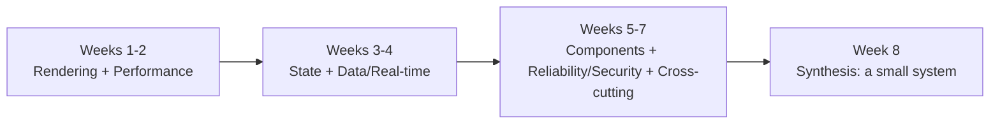

> **TL;DR:** Eight weeks, ~4-6 hours/week, for an experienced frontend developer (5+ years) internalizing the system-design half of the role. Each week: **Read** → **Build** (small, deliberately scoped) → **Reflect** (a paragraph, not an essay).

Resist scope creep on the build prompts — the goal is shipping *something* in a week, not the perfect version.

## Weeks 1-2

| Week | Read | Build | Reflect on |
|---|---|---|---|
| **1 — Rendering** | Ch. 1 + Vercel's rendering explainers + Netflix's performance case study (ch. 10) | Ship one data-driven page three ways: CSR-only, SSG, streaming SSR. Measure LCP/TTFB with WebPageTest on slow-3G. | When is SSG actually preferable? Where does streaming SSR fall apart? Where does CSR shine despite its load-time tax? |
| **2 — Performance** | Ch. 2 + Vercel's Speed Insights posts | Run Lighthouse on an existing app. Improve the worst metric by 50%+ without switching frameworks or deleting features. Log every change and what it moved. | What was the single highest-leverage change? |

## Weeks 3-4

| Week | Read | Build | Reflect on |
|---|---|---|---|
| **3 — State** | Ch. 3 + TanStack Query docs + Linear's sync engine writeup | A small CRUD app exercising all four state kinds (URL/server/client/form). No piece of data lives in two places; a reload preserves the user's place. | Where did you almost mash two kinds of state together? |
| **4 — Data/real-time** | Ch. 4 + Figma's multiplayer architecture post | Either: a real-time multi-cursor demo (Yjs + WebSocket), or an offline-first todo list (Service Worker + IndexedDB, verified with DevTools' network toggle). | Where does the library hide complexity you needed to understand anyway? |

## Weeks 5-7

| Week | Read | Build | Reflect on |
|---|---|---|---|
| **5 — Components** | Ch. 5 + shadcn/ui + Radix Primitives docs | Refactor 3 over-configured components (10+ prop modal → compound parts; a button → `cva` variants; a form field → composable parts). | What in the old API felt "convenient" but actually trapped consumers? |
| **6 — Reliability/security** | Ch. 6-7 + Stripe's idempotency post | Add to a real project: Sentry with source maps/breadcrumbs/releases, a `web-vitals` reporter, a CSP with `strict-dynamic` + nonces (verify via a CSP evaluator), an `httpOnly` refresh + in-memory access token flow. | Which felt like overkill for a small app — and would you actually cut it from a one-week MVP? |
| **7 — Cross-cutting** | Ch. 8 + WCAG 2.2 "What's New" + MDN's logical CSS properties docs | Add i18n with 2 languages (one with non-English plural rules), a dark mode toggle with no FOART, `dir="rtl"` fixed via logical properties, axe DevTools issues fixed. | Which was the most retrofit-heavy? What would day-one design have avoided? |

## Week 8 — Synthesis

| Read | Build | Reflect on |
|---|---|---|
| Ch. 9 (system design primitives) + skim ch. 10 | Design + partially implement a small end-to-end system (a multiplayer kanban board, a real-time analytics dashboard, or a document editor with version history). Write a one-page design doc: rendering strategy, state architecture, caching, real-time mechanism, failure modes, security. Implement enough to validate the core abstractions — don't ship a full product. | Where did your design diverge from what you'd have done before week 1? |

## After the eight weeks

Two paths. **Full-stack continuation** — go deep on the backend half (Postgres internals, message brokers, distributed observability); the Backend System Design course in this library and chapter 9's primitives are your map. **AI-engineer continuation** — LLM API integration on top of what you've built (streaming via SSE, tool-calling architectures, RAG with a vector store) — you already have the harder half: knowing how to build the application around the AI features.

Both paths share one discipline: **build one real thing, in public, every quarter.** A small shipped project beats ten unfinished ones.

**Pacing:** if 4-6 hours/week is too aggressive, halve it and take 16 weeks — the plan still works, compressed to 2 weeks it doesn't (the reflection and build friction need to settle). If it's too easy, make the build prompts harder rather than reading more chapters — build the multi-cursor demo as your own CRDT instead of using Yjs.
