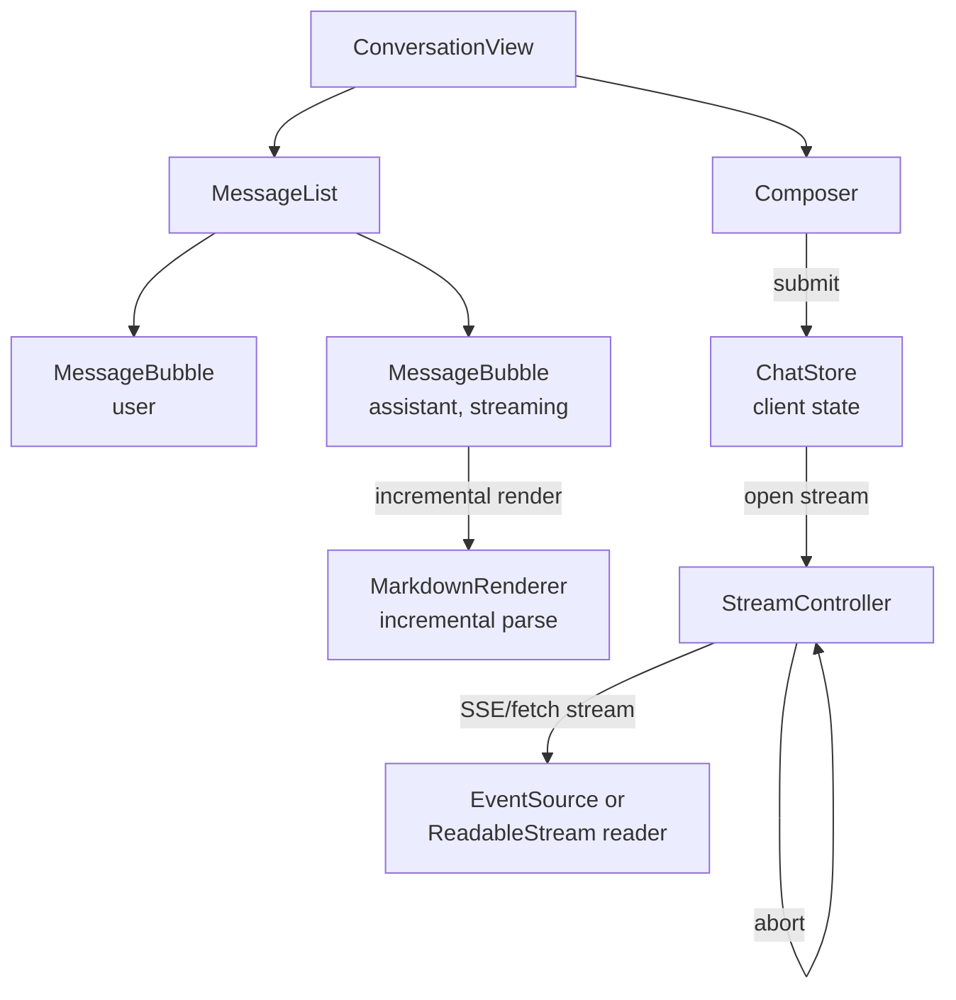
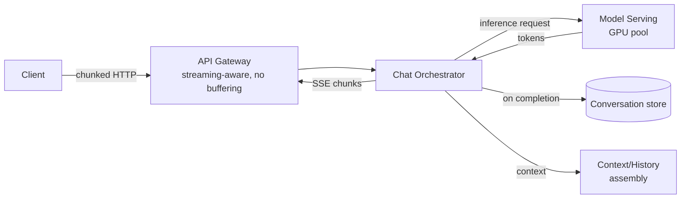

## Overview

- **Real-world analog:** ChatGPT, Claude — token-streaming conversational UI.
- **Difficulty:** Hard · **Asked at:** OpenAI, Anthropic, and most companies shipping AI features.
- The core challenge isn't calling an LLM — it's rendering a response that's arriving token-by-token, over seconds, in a way that feels alive rather than janky, while the user can stop it, regenerate it, or watch it fail mid-sentence and recover.

## Clarifying Questions & Requirements

> **Ask these first:**
> 1. Streaming only, or does the UI also need to support a non-streaming fallback (some models/providers don't stream)?
> 2. Multi-turn conversation with history, or single-shot? History changes what "context" the client has to track and resend.
> 3. Does the assistant's response include rendered Markdown/code blocks that need syntax highlighting *as tokens arrive*, or only after the stream completes?
> 4. Can the user edit an earlier message and regenerate from there, forking the conversation?

| | In scope | Out of scope |
|---|---|---|
| **Functional** | Streamed assistant replies, stop/regenerate, conversation history, retry on stream failure, Markdown/code rendering mid-stream | Model selection UI, billing/usage metering, multi-modal (image) input |
| **Non-functional** | First token latency feels fast even if total generation takes 10+ seconds; UI never appears frozen; stream failures are recoverable | Guaranteed token-level ordering across a load-balanced multi-region backend (assume single-region generation per request) |

## ── FRONTEND TRACK (RADIO) ──

### R — Requirements

| | Requirement | Why it's not optional |
|---|---|---|
| **Functional** | Render tokens incrementally as they arrive, not after the full response completes | The entire point of streaming is perceived latency — buffering defeats it |
| **Functional** | Stop generation mid-stream; regenerate a response; retry a failed stream | These are the three most-used controls in every real AI chat product — none is optional polish |
| **Non-functional** | The user can keep scrolling up to read earlier messages while new tokens are still arriving below, without being yanked back down | A chat that force-scrolls on every token is one of the most common, most annoying real bugs in this category |
| **Non-functional** | A dropped stream (network blip, server error mid-generation) is recoverable without losing what already arrived | Losing 800 already-rendered tokens because the last one failed is a real, bad user experience |

### A — Architecture



- **`StreamController` is per-request, not a singleton** — unlike the chat course's `ConnectionManager`, an AI chat stream is a one-shot request/response, not a persistent multiplexed connection. Each send opens a new stream and owns its own `AbortController`; there's no reconnect-and-replay model here, because a partial LLM generation can't be resumed mid-token from the server side in the general case.
- **`MarkdownRenderer` needs an incremental parser, not "re-run the Markdown parser on every token."** Re-parsing the entire accumulated text on every token arrival is O(n²) over the length of the response and visibly janky past a few hundred tokens — the real approach parses incrementally and only re-renders the trailing, still-changing block (e.g. an unclosed code fence), leaving already-closed blocks stable.

```ts
class StreamController {
  private abortController = new AbortController();
  private buffer = '';

  async start(prompt: string, onToken: (text: string) => void, onDone: () => void) {
    const res = await fetch('/api/chat/stream', {
      method: 'POST',
      body: JSON.stringify({ prompt }),
      signal: this.abortController.signal,
    });
    const reader = res.body!.getReader();
    const decoder = new TextDecoder();

    while (true) {
      const { done, value } = await reader.read();
      if (done) return onDone();
      for (const line of decoder.decode(value).split('\n')) {
        if (!line.startsWith('data: ')) continue;
        const payload = line.slice(6);
        if (payload === '[DONE]') return onDone();
        const { token } = JSON.parse(payload);
        this.buffer += token;
        onToken(this.buffer);
      }
    }
  }

  stop() {
    this.abortController.abort(); // triggers the fetch's AbortError, cleanly ends the read loop
  }
}
```

This is the concrete substance behind "handle streaming and stop" — a real `[DONE]`-sentinel parse loop and a real, working abort path, not a description of one.

### D — Data Model

| | Owner | Example |
|---|---|---|
| **Server state** | The model's actual generated tokens, conversation persisted server-side for later retrieval | Streamed in, appended to local state as it arrives |
| **Client state** | Which message is currently streaming, the accumulated partial text, whether the user has scrolled away from the bottom | Never sent to the server — pure UI/rendering state |

```ts
type Message = {
  id: string;
  role: 'user' | 'assistant';
  content: string;              // accumulated text so far, if still streaming
  status: 'complete' | 'streaming' | 'stopped' | 'error';
};

type ChatState = {
  messagesById: Record<string, Message>;
  messageOrder: string[];
  activeStreamId: string | null;   // which message is currently receiving tokens
  autoScroll: boolean;             // false the instant the user manually scrolls up
};
```

> **Key insight:** `autoScroll` is not a nice-to-have — it's the field that resolves the single most common real complaint about streaming UIs ("it keeps yanking me back down"). It flips to `false` on any user-initiated scroll and only flips back to `true` when the user scrolls back to the bottom themselves; it is never set programmatically while the user is actively reading upward.

### I — Interface / API

**Component API**

```
<Composer onSend={(text) => void} disabled={boolean} />
<MessageBubble message={Message} onStop={() => void} onRegenerate={(fromId: string) => void} />
<MessageList messages={Message[]} autoScroll={boolean} onUserScroll={() => void} />
```

**Network API** — the shared contract with the backend track below:

| Action | Transport | Shape |
|---|---|---|
| Send prompt | `POST /api/chat/stream` | Request body `{ conversationId, prompt }`, response is a streamed body |
| Receive tokens | SSE-over-fetch (chunked HTTP), `text/event-stream` framing | `data: {"token": "..."}\n\n` per chunk, terminated by `data: [DONE]\n\n` |
| Stop generation | Client-side only | `AbortController.abort()` — no network call needed; the aborted fetch closes the connection, which the server detects and stops generating |
| Regenerate | `POST /api/chat/stream` | Same shape, with `regenerateFromId` instead of appending a new user message |

### O — Optimizations

**Performance**
- Batch DOM updates across tokens arriving faster than the browser can paint (a fast model can emit multiple tokens per animation frame) — accumulate into a buffer and flush on `requestAnimationFrame`, not on every single token.
- Incremental Markdown parsing (above) rather than full re-parse per token.

**Accessibility**
- The streaming region announces via `aria-live="polite"`, but **debounced** — announcing every single token would be unusable with a screen reader; announce on sentence/paragraph boundaries or on stream completion instead.
- Stop/Regenerate controls are real, labeled, keyboard-reachable buttons — never icon-only with no accessible name.

**Networking**
- Retry a dropped stream from where it left off *conceptually* (a new generation, informed by what was already shown), since raw token-level resume isn't generally possible — the retry UX should say "reconnecting..." and, on failure, offer a clear retry action, not silently hang.
- Client and server agree on a heartbeat/keep-alive comment line in the SSE stream (`: ping\n\n`) so a silently-dead connection (no data, no close event) is detected within a bounded time instead of hanging indefinitely.

**Resilience**
- A stream that errors mid-response preserves what already rendered and marks the message `error` with a retry affordance — it does not discard the partial response the user was already reading.

### Frontend Deep Dives

**1. Incremental Markdown/code rendering without flicker or O(n²) re-parsing.** The naive approach — re-run a Markdown-to-HTML parser on the full accumulated string on every token — gets quadratically slower as the response grows and re-creates DOM nodes for already-stable content, causing visible flicker (e.g. a syntax-highlighted code block re-highlighting on every token). The real fix: parse incrementally, tracking which blocks (paragraphs, closed code fences) are "settled" and only re-rendering the currently-open, still-changing block — settled blocks are memoized and never touched again once a closing delimiter arrives.

**2. The `[DONE]` sentinel and stream-end race.** A stream can end three different ways: the `[DONE]` sentinel arrives normally; the connection closes without one (server crash, proxy timeout); or the user aborts it. All three have to converge on the same terminal state transition (`streaming` → `complete`/`stopped`/`error`) exactly once — a common bug is handling `onDone` from the sentinel *and* the reader loop's natural `done: true` exit independently, firing the completion logic twice.

**3. Auto-scroll that respects the user reading upward.** Naive auto-scroll calls `scrollIntoView` on every token, which fights the user the instant they try to scroll up to re-read something. The fix is the `autoScroll` boolean in the data model: track scroll position, flip the flag off on any manual scroll away from the bottom, and only auto-scroll when it's still `true` — this is the same class of problem as a live-updating feed, but with a much higher event frequency (every token, not every new post).

**4. Aborting cleanly without leaking state.** `AbortController.abort()` on the client is necessary but not sufficient — the component that owns the stream has to actually handle the resulting `AbortError` in its `catch` block as a normal, expected outcome (transition to `stopped`), not an unexpected error (which would incorrectly show an error state on a user-initiated stop).

### Frontend Bottlenecks & Tradeoffs

| Bottleneck | Mitigation | Tradeoff accepted |
|---|---|---|
| Re-parsing full Markdown on every token | Incremental parse, only re-render the open block | More parser state to maintain across renders, in exchange for no O(n²) blowup on long responses |
| Too many DOM updates per second on a fast model | Batch token application to `requestAnimationFrame` | Rendering trails generation by up to one frame — imperceptible, and far cheaper than layout thrash |
| Screen reader announcing every token | Debounce `aria-live` announcements to sentence/paragraph boundaries | Slightly less granular live feedback, in exchange for the region actually being usable |

## ── BACKEND TRACK ──

### Requirements & Scope

- Accept a prompt, call the model, stream tokens back to the client as they're generated, persist the final conversation turn once complete.
- Support cancellation (stop the actual model call, not just stop sending to a client that's gone) and regeneration (a new generation from an earlier point in the conversation).

### Scale & Estimation

| | Estimate |
|---|---|
| Concurrent active streams (peak) | 200K |
| Avg tokens/response | ~500 |
| Avg tokens/sec per stream | ~40 (model-dependent) |
| Avg stream duration | ~12s |
| Bandwidth per stream | Small (token payloads are tiny) — the real constraint is **concurrent open connections**, not bytes |
| Model inference cost | The actual bottleneck resource — GPU capacity, not network or storage |

### API Design

Server-side view of the same contract the frontend track defined above:

```
POST /api/chat/stream
  body: { conversationId, prompt, regenerateFromId? }
  response: text/event-stream
    data: {"token": "..."}
    data: {"token": "..."}
    ...
    data: [DONE]
```

- The endpoint holds the HTTP connection open for the duration of generation — this is chunked HTTP streaming, not a request/response round trip, so infrastructure in front of it (load balancers, proxies) must be configured not to buffer or timeout the response early.
- Client disconnect (abort) must be detected server-side via the request's own abort/close event, and used to actually cancel the in-flight model call — an aborted client that doesn't stop the backend generation wastes GPU capacity on tokens nobody will ever see.

### Data Model & Storage

```
conversations
  id            uuid PK
  user_id       uuid
  created_at    timestamp

messages
  id                uuid PK
  conversation_id   uuid, indexed
  role              enum('user','assistant')
  content           text          -- final, complete text; not written until generation finishes
  parent_message_id uuid nullable  -- supports regenerate-from-here as a branch, not an overwrite
  created_at        timestamp
```

| Choice | Why |
|---|---|
| `content` written only on completion, not incrementally per token | Streaming state lives in memory on the serving process for the duration of the request — persisting every token to the DB would be enormous write amplification for no benefit, since only the final text matters for history |
| `parent_message_id` instead of mutating the previous assistant message on regenerate | Preserves the original response as a real, retrievable branch rather than destructively overwriting it — matches how every major AI chat product actually lets a user compare regenerated answers |

### High-Level Architecture



- **The orchestrator, not the gateway, owns cancellation.** When a client disconnects, the gateway's connection close has to propagate to the orchestrator, which must actively cancel its in-flight call to the model-serving layer — GPU time is the scarcest resource in this system, and letting an abandoned generation keep running is a direct cost leak.
- **Context assembly is a real service, not an inline step** — for a multi-turn conversation, building the prompt sent to the model requires fetching and truncating conversation history to fit the model's context window, which is its own bounded, cacheable piece of work separate from the generation itself.

### Deep Dives

**1. Cancellation has to reach the GPU, not just stop the HTTP response.** A client aborting a fetch closes the connection, but the model-serving call underneath can keep running unless cancellation is explicitly propagated through every layer — gateway → orchestrator → model service — as a real cancellation token, not just an HTTP-level disconnect. Getting this wrong means every stopped generation still burns full inference cost.

**2. Context-window truncation under a growing conversation.** Every model has a maximum context length; a long-running conversation eventually exceeds it. The system needs a deterministic truncation/summarization strategy (drop oldest turns, or summarize older turns into a condensed system message) applied consistently — inconsistent truncation between what the user sees and what's actually sent to the model produces confusing "the assistant forgot what we discussed" behavior.

**3. Backpressure when the model generates faster than the client can consume.** On a fast connection this rarely matters, but on a slow/mobile client, tokens can arrive from the model faster than the HTTP response can flush to the client — the orchestrator needs to either buffer with a bounded queue (drop or coalesce if the client is far behind) or apply real backpressure to the model call, rather than growing an unbounded buffer in server memory per active stream.

### Bottlenecks & Tradeoffs

| Bottleneck | Mitigation | Tradeoff accepted |
|---|---|---|
| GPU capacity is the real ceiling, not request throughput | Queue + admit control ahead of the model-serving layer, with a real "server busy, retry" signal | Some requests wait or get a clear capacity error rather than silently degrading generation quality/speed for everyone |
| Abandoned streams still consuming GPU | Propagate cancellation from HTTP disconnect through to the model call | Slightly more plumbing across every layer, in exchange for not paying for generations nobody sees |
| Context window truncation losing early conversation detail | Summarize dropped turns into a condensed system message rather than silently dropping them | Some fidelity loss on very long conversations, in exchange for staying within the model's real limit at all |

## The Shared Contract

- **Transport:** chunked HTTP / SSE framing, not WebSocket — the client never needs to push mid-stream (stop/abort is a client-side connection action, not a message sent over the stream), so the simpler one-way transport is the right choice, same tradeoff the chat course's `websocket`/`server-sent-events` terms cover, resolved the other way here because the interaction pattern is different.
- **Ownership boundary:** the client owns *when* to stop rendering (abort); the server owns *whether the model call actually stops* — an aborted client connection must be treated by the backend as an authoritative cancellation signal, not advisory.
- **Sentinel protocol:** both sides agree on `[DONE]` as the explicit end-of-stream marker, distinct from an unexpected connection close — this is what lets the frontend distinguish "finished normally" from "dropped mid-generation" and choose the right terminal UI state.
- **Error propagation:** a model error mid-generation is sent as a distinct SSE event type (not just a closed connection), so the client can show a real error state with retry rather than treating it identically to a successful completion.

## Interview Signals

| | Strong answer | Weak answer |
|---|---|---|
| **Frontend** | Explains incremental parsing and the auto-scroll-vs-user-scroll conflict unprompted | Describes rendering tokens but never mentions what happens if the user scrolls up mid-stream |
| **Backend** | Explains that cancellation must reach the model call, not just close the HTTP response | Treats stop as "the client stops listening," missing the GPU-cost angle entirely |
| **Both** | Treats the `[DONE]` sentinel and abnormal disconnect as two distinct, separately-handled cases | Assumes the stream always ends cleanly |

**Common failure modes:** designing the happy-path token render and never discussing stop/regenerate; forgetting that context-window limits exist at all; auto-scrolling in a way that fights a reading user; not propagating client cancellation to the actual model call.

## Glossary Links

This question draws on: Server-Sent Events, RADIO framework, optimistic UI, idempotency (for retrying a failed send), consistency model — each linked on first mention above. See Proposed glossary additions for new terms introduced here (AbortController, context window).
