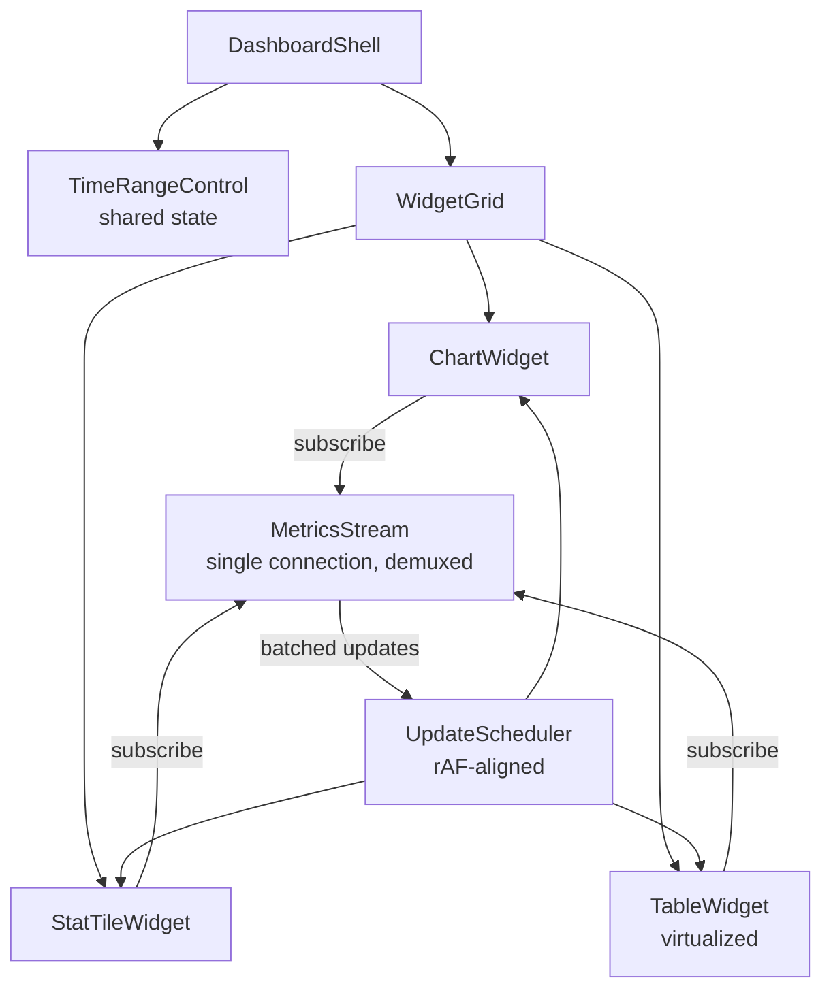
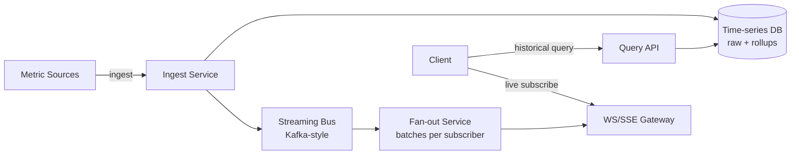

## Overview

- **Real-world analog:** Live metrics dashboards (Datadog/Grafana-style) for thousands of concurrent viewers.
- **Difficulty:** Medium-Hard · **Asked at:** Amazon, data-platform & observability companies.
- The core challenge isn't drawing a chart — it's rendering many independent, continuously-updating widgets fed by a genuinely high-frequency data stream, without either flooding the browser's main thread with updates or drowning the backend in per-second requests from thousands of simultaneously-open dashboards.

## Clarifying Questions & Requirements

> **Ask these first:**
> 1. How fresh does "real-time" actually need to be — sub-second, or is a few-seconds-behind acceptable? (This alone decides WebSocket/SSE vs. polling.)
> 2. Is this a fixed, curated set of widgets, or a user-configurable dashboard-builder (which changes the data model significantly)?
> 3. How far back does the time-range control need to query — minutes, or full historical range requiring a different (likely batch) data path?
> 4. Single-tenant internal tool, or multi-tenant with per-customer data isolation?

| | In scope | Out of scope |
|---|---|---|
| **Functional** | Multiple independently-updating widgets (charts, tables, single-stat tiles), time-range selection, live streaming updates | Dashboard-builder drag-and-drop authoring UI, alerting/anomaly-detection rules engine |
| **Non-functional** | The browser stays responsive with dozens of live-updating widgets on screen at once; the backend isn't overwhelmed by thousands of dashboards each polling independently | Sub-100ms end-to-end latency at extreme scale (a valid deep-dive extension, not the base requirement) |

## ── FRONTEND TRACK (RADIO) ──

### R — Requirements

| | Requirement | Why it's not optional |
|---|---|---|
| **Functional** | Multiple widget types (time-series chart, single-stat tile, table) updating independently, a shared time-range control affecting all widgets at once | Widgets sharing a time-range control but updating independently is a real state-coordination problem, not just a layout choice |
| **Non-functional** | The page stays responsive (no jank, no dropped input) with dozens of widgets updating multiple times per second | This is the single defining engineering constraint of the whole question — a dashboard that's accurate but janky has failed its actual job |
| **Non-functional** | A single slow-to-render widget (e.g., a dense chart with thousands of points) never blocks other widgets from updating | Widget isolation is a real architectural requirement, not an afterthought — see Architecture below |
| **Non-functional** | Handles a burst of updates (a metric spiking, generating a flood of data points) without the UI falling behind or the tab becoming unresponsive | Real production metrics genuinely spike — this isn't a hypothetical edge case, it's when the dashboard matters most |

### A — Architecture



- **`MetricsStream` is a single connection for the whole dashboard, demultiplexed to individual widgets by metric id — not one connection per widget.** A dashboard with 20 widgets opening 20 separate WebSocket/SSE connections is both wasteful and a real scalability problem for the backend at thousands of concurrent dashboards; one connection carries updates for every subscribed metric, and each widget subscribes/unsubscribes to the specific metric ids it renders.
- **`UpdateScheduler` batches incoming updates and flushes them aligned to `requestAnimationFrame`, not immediately on arrival.** This is the piece that directly answers "batching high-frequency updates" from the question bank's own must-cover list, and it's the mechanism that keeps the page responsive under a burst — see Deep Dives for why naive per-message rendering fails here.
- A sketch of the demux-and-batch mechanism, since "the frontend handles streaming updates" hides the actual hard part:

```ts
class MetricsStream {
  private subscribers = new Map<string, Set<(point: DataPoint) => void>>();
  private pendingByMetric = new Map<string, DataPoint[]>();

  subscribe(metricId: string, cb: (point: DataPoint) => void) {
    if (!this.subscribers.has(metricId)) this.subscribers.set(metricId, new Set());
    this.subscribers.get(metricId)!.add(cb);
  }

  private onSocketMessage(raw: DataPoint) {
    // Buffer, don't render synchronously — the render pass happens on the next animation frame.
    const buf = this.pendingByMetric.get(raw.metricId) ?? [];
    buf.push(raw);
    this.pendingByMetric.set(raw.metricId, buf);
  }

  private flushOnAnimationFrame = () => {
    for (const [metricId, points] of this.pendingByMetric) {
      const cbs = this.subscribers.get(metricId);
      cbs?.forEach((cb) => points.forEach(cb)); // widgets still get every point, just batched per frame
    }
    this.pendingByMetric.clear();
    requestAnimationFrame(this.flushOnAnimationFrame);
  };
}
```

### D — Data Model

| | Owner | Example |
|---|---|---|
| **Server state** | Raw and downsampled metric time series, per-widget query definitions | Streamed incrementally; historical range fetched separately from live tail |
| **Client state** | Selected time range, per-widget local render buffer (recent points not yet flushed to the chart), which widgets are currently mounted/subscribed | Render buffers are ephemeral, batched client state — never persisted or treated as a source of truth |

```ts
type DataPoint = { metricId: string; timestamp: number; value: number };
type WidgetConfig = { id: string; type: 'chart' | 'stat' | 'table'; metricIds: string[]; downsampleTo?: number };

type TimeRange = { from: number; to: number; live: boolean }; // live: true means "keep extending `to` as time passes"
```

> **Key insight:** `TimeRange.live` is what lets a single time-range control drive both a historical query (a fixed `from`/`to`) and a live-tailing view (`to` continuously advancing) through the same widget code path — widgets don't need two separate rendering modes, just a range that either is or isn't still moving.

### I — Interface / API

**Component API**

```
<TimeRangeControl range={TimeRange} onChange={(r: TimeRange) => void} />
<ChartWidget config={WidgetConfig} range={TimeRange} />
<StatTileWidget config={WidgetConfig} range={TimeRange} />
<TableWidget config={WidgetConfig} range={TimeRange} />
```

Each widget receives the *same* `range` prop from the shared `TimeRangeControl` — widget independence is about rendering/update isolation, not about each widget owning its own notion of what time window it's showing.

**Network API** — the shared contract with the backend track below:

| Action | Transport | Shape |
|---|---|---|
| Historical query | `GET /metrics/:id/query?from=&to=&downsampleTo=` | REST, returns pre-downsampled points for the requested range |
| Live subscribe | WebSocket/SSE event | `{ type: 'subscribe', metricIds: string[] }` sent once per session, server streams matching points |
| Live update | WebSocket/SSE event | `{ type: 'point', metricId, timestamp, value }`, batched server-side too — see backend Deep Dives |

### O — Optimizations

**Performance**
- Render dense time-series charts on `<canvas>`, not SVG/DOM per-point — a chart with thousands of points as individual SVG/DOM nodes is a well-known, avoidable performance cliff.
- Virtualize table widgets the same way as every other list-heavy question in this bank.
- Isolate each widget's re-render from the others (e.g., each widget subscribed independently, updates batched per-widget) so a burst on one metric doesn't force every other widget to re-render along with it.

**Accessibility**
- Every chart has a data-table equivalent view (or at minimum, a text summary of current values) — a purely visual chart with no accessible alternative excludes screen reader users from a core part of the product entirely.
- Live-updating regions use `aria-live="polite"` sparingly and only for genuinely important single-value changes (a stat tile crossing a threshold), never for every single incoming data point, which would be constant, unusable noise for a screen reader user.

**Networking**
- One shared streaming connection per dashboard (the `MetricsStream` design above), not one per widget.
- Backpressure-aware client behavior — if updates are arriving faster than the client can render them (even after batching), drop/coalesce intermediate points rather than queuing unboundedly, which is covered in Deep Dives below.

**Resilience**
- A dropped streaming connection falls back to polling at a coarser interval until reconnected, rather than the dashboard silently going stale with no indication.
- Historical-range queries and live-tail updates are independent code paths — a live-stream failure doesn't take down the ability to still view historical data for the selected range.

### Frontend Deep Dives

**1. Client-side backpressure when updates outpace render capacity.** During a genuine spike (the exact moment a dashboard matters most), a metric can emit far more points per second than the chart can usefully render or than a human can perceive. Naively queuing every point for eventual rendering means the queue grows unboundedly and the UI falls further and further behind real-time. Fix: the client enforces a render budget per frame — if more points have arrived for a metric than can be meaningfully rendered in this frame, coalesce them (keep min/max/last within the frame's window, discard the rest) rather than queuing all of them for a future frame that will itself already be behind.

> **Signature gotcha:** one DOM node per event. At firehose rates you must aggregate and render to canvas — a DOM-per-point chart is a well-known, avoidable performance cliff, not a scaling problem you can tune your way out of later.

```ts
function coalesceForFrame(points: DataPoint[], maxPerFrame: number): DataPoint[] {
  if (points.length <= maxPerFrame) return points;
  // Keep evenly-spaced samples rather than just the most recent N — preserves the shape of a spike
  // instead of only showing its tail.
  const step = Math.ceil(points.length / maxPerFrame);
  return points.filter((_, i) => i % step === 0);
}
```

**2. Widget update isolation without duplicating the subscription-management logic per widget type.** Chart, stat-tile, and table widgets all need to subscribe/unsubscribe to metrics and receive batched updates identically, but naively, each widget type reimplements its own subscription lifecycle, which duplicates bugs. Fix: a shared `useMetricSubscription(metricIds)` hook owns subscribe-on-mount/unsubscribe-on-unmount and batched-update delivery uniformly; every widget type consumes the same hook and only differs in *how* it renders the points it receives, not in how it manages the subscription itself.

**3. Time-range changes mid-stream without a flash of stale/empty data.** Changing the time range (e.g., zooming into a narrower window) requires fetching new historical data for that range while potentially still receiving live updates for the old range momentarily. Fix: the widget holds the *previous* range's rendered data visible while the new range's historical query is in flight, swapping only once the new data has actually arrived — never clearing to an empty/loading state first, which produces a jarring flash on every range change.

### Frontend Bottlenecks & Tradeoffs

| Bottleneck | Mitigation | Tradeoff accepted |
|---|---|---|
| Rendering every incoming point immediately as it arrives | Batch updates to `requestAnimationFrame` | Visual update lags the true data by at most one frame — imperceptible in practice |
| A metric spike generating far more points than can be usefully rendered | Client-side coalescing with even sampling, not just "keep the latest N" | The chart shows a representative shape of the spike rather than literally every point, which is the correct tradeoff since a human couldn't perceive every point anyway |
| One connection per widget | Single shared, demultiplexed connection per dashboard | Slightly more complex client-side routing logic, in exchange for not multiplying connection count by widget count across thousands of dashboards |

## ── BACKEND TRACK ──

### Requirements & Scope

- Ingest high-frequency metric data, serve downsampled historical queries efficiently, stream live updates to potentially thousands of concurrently open dashboards, apply backpressure/downsampling server-side too, not just client-side.
- Must not let a single hot metric or a single busy dashboard degrade service for others.

### Scale & Estimation

| | Estimate |
|---|---|
| Concurrent open dashboards | 50K |
| Avg widgets/dashboard | 10, avg 3 metrics/widget → ~150K distinct metric subscriptions system-wide (with heavy overlap on popular metrics) |
| Raw ingest rate | ~1M distinct metrics × 1 point/sec ≈ **~1M points/sec** ingested |
| Peak fan-out rate | 150K subscriptions × up to a few updates/sec each ≈ **hundreds of thousands of streamed updates/sec** to dashboards, decoupled from raw ingest volume via downsampling |
| Historical storage | ~1M metrics × 1 point/sec × 200 bytes ≈ ~200GB/day raw, before downsampling/retention tiering |

### API Design

```
GET  /metrics/:id/query?from=&to=&downsampleTo=&limit=
WS   subscribe   {metricIds: string[]}
WS   point        → {metricId, timestamp, value}   -- server-batched, not one message per raw ingest point
```

- The server, like the client, batches outgoing stream messages rather than forwarding every raw ingest point 1:1 to every subscriber — see backend Deep Dives.

### Data Model & Storage

```
metrics_raw          -- short retention, full resolution
  metric_id, timestamp, value
  (typically a time-series DB: InfluxDB/TimescaleDB-style, partitioned by time)

metrics_rollup_1m / metrics_rollup_1h   -- pre-aggregated downsample tiers
  metric_id, bucket_start, min, max, avg, count

dashboards
  id PK, owner_id, widget_configs jsonb
```

| Choice | Why |
|---|---|
| **Time-series database, not a general relational store, for raw metrics** | Purpose-built for exactly this write pattern (extremely high-volume, append-only, time-partitioned) and exactly this query pattern (range scans over time, aggregations) — a general RDBMS handles this workload far less efficiently at this scale |
| **Pre-computed rollup tiers (1-minute, 1-hour) rather than downsampling on every query** | A dashboard showing a 30-day range never needs full-resolution per-second data — computing the rollup once at ingest time and serving from it is far cheaper than recomputing an aggregation over raw data on every single query |
| **Retention tiering** (raw data kept briefly, rollups kept far longer) | Raw-resolution data at this ingest volume is expensive to retain indefinitely and is rarely needed beyond a short recent window — long-term historical queries are served entirely from rollups by design, not as a fallback |

### High-Level Architecture



- The **Fan-out Service batches outgoing updates per subscriber over a short window** (analogous to the client's `requestAnimationFrame` batching, just server-side) rather than forwarding every raw ingested point individually — this is what keeps the "hundreds of thousands of streamed updates/sec" fan-out number bounded and decoupled from the raw 1M points/sec ingest rate.
- **Ingest and query/streaming are on entirely separate paths**, the same decoupling pattern as the e-commerce and email questions in this bank — a spike in incoming metric volume never directly competes with a dashboard's live-query traffic.

### Deep Dives

**1. Server-side backpressure and batching before fan-out.** Forwarding every raw ingest point to every subscriber 1:1 would mean the fan-out volume scales directly with ingest volume, which is both wasteful (most consumers can't usefully render that resolution anyway) and a real scalability ceiling. Fix: the Fan-out Service batches points per subscriber over a short window (a few hundred milliseconds, tunable), applying the same min/max/last-representative-sample coalescing the frontend does client-side — the two layers of batching (server-side pre-fan-out, client-side pre-render) address genuinely different bottlenecks and both are needed, not redundant.

**2. Efficient range queries across retention tiers.** A query spanning "the last 5 minutes" and a query spanning "the last 90 days" have very different efficient execution paths — the first wants raw data, the second wants the coarsest rollup tier that still gives an acceptable-resolution chart. Fix: the Query API selects which storage tier (raw, 1-minute rollup, 1-hour rollup) to read from based on the requested range's span, not the client explicitly specifying it — a `from`/`to` spanning 90 days automatically routes to the hourly rollup rather than attempting an enormous raw-data scan, transparently to the frontend, which only ever asks for a range and a target resolution.

**3. Avoiding a hot-metric fan-out from overwhelming shared infrastructure.** A small number of extremely popular metrics (subscribed to by thousands of dashboards simultaneously) can create fan-out hot spots disproportionate to their share of total ingest volume. Fix: fan-out for a given metric is sharded/replicated based on subscriber count, not treated uniformly — a metric with thousands of subscribers gets fanned out through multiple parallel fan-out workers rather than one worker attempting to serve every subscriber of that one metric serially.

### Bottlenecks & Tradeoffs

| Bottleneck | Mitigation | Tradeoff accepted |
|---|---|---|
| Fan-out volume scaling directly with raw ingest volume | Server-side batching/coalescing before fan-out | Streamed updates lag raw ingest by the batching window (hundreds of milliseconds) — imperceptible for this product's actual needs |
| Long-range historical queries against raw data | Tiered rollups, auto-selected by query span | Long-range views show lower-resolution (rolled-up) data by design, not a limitation to work around |
| A small number of extremely popular metrics creating fan-out hot spots | Per-metric fan-out sharding proportional to subscriber count | Additional operational complexity in the fan-out layer, justified specifically by the skew this workload actually has |

## The Shared Contract

- **Real-time transport:** WebSocket or SSE (either is defensible; SSE is simpler if the client genuinely never needs to push anything beyond an initial subscribe list) — both tracks agree the deciding factor is whether the client needs to push data mid-session, and for a read-only dashboard, it typically doesn't beyond the initial subscription.
- **Ownership boundary:** the backend owns which storage tier serves a given query and how aggressively to batch fan-out; the frontend owns how to render/coalesce what it receives — both apply batching independently, at different layers, for different reasons, and neither assumes the other has already solved the problem.
- **Pagination/range:** time-range based, not cursor/offset — the natural unit of pagination here is a time window, and both tracks agree the frontend always specifies a range plus a target resolution, letting the backend choose the actual storage tier transparently.
- **Error propagation:** a dropped streaming connection is a designed, expected reconnect path on both sides — the backend's fan-out service and the frontend's `MetricsStream` both treat a resubscribe-on-reconnect as the normal recovery mechanism, not an exceptional error state.

## Interview Signals

| | Strong answer | Weak answer |
|---|---|---|
| **Frontend** | Explains batching to `requestAnimationFrame` and coalescing under backpressure explicitly, with real code | Says "use a WebSocket and update the chart" with no discussion of update volume or render cost |
| **Backend** | Reasons about tiered rollups and query-span-based tier selection, and server-side fan-out batching as distinct from client-side batching | Treats all time ranges as querying the same raw-data table regardless of span |
| **Both** | Recognizes batching is needed at *both* layers for different reasons, not just one | Assumes solving it on one side (e.g., "just batch server-side") makes client-side batching unnecessary |

**Common failure modes:** rendering every incoming point synchronously with no batching; querying raw, full-resolution data for long time ranges; one WebSocket connection per widget instead of one per dashboard; no accessible alternative to a purely visual chart.

## Glossary Links

This question draws on: RADIO framework, WebSocket, Server-Sent Events, consistency model — each linked on first mention above.

## Proposed Glossary Additions

- **Downsampling / rollup tiers** — pre-aggregating high-resolution time-series data into coarser-resolution summaries (min/max/avg per bucket) so long-range queries don't have to scan raw data. Central to this question's backend track; likely reusable in any future question involving time-series or high-volume event data.
- **Backpressure** — a system's mechanism for handling data arriving faster than it can be consumed, by shedding, batching, or coalescing rather than queuing unboundedly. Used on both tracks in this question (client-side render-budget coalescing, server-side fan-out batching); general enough to be worth a real registry entry.
