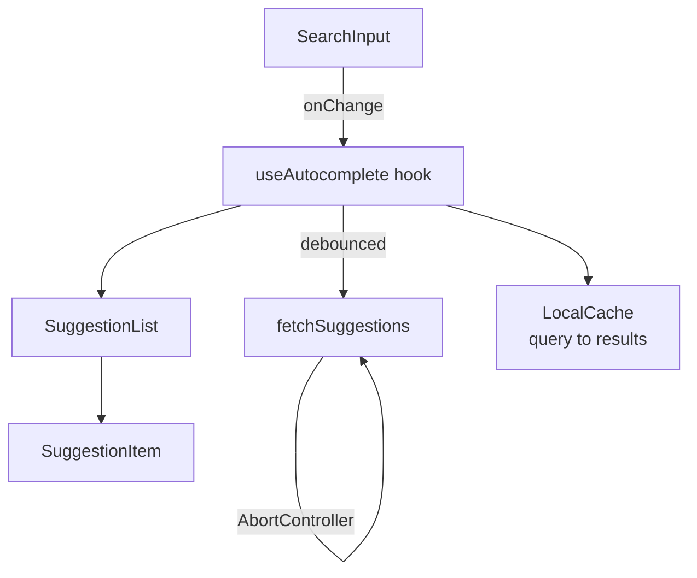
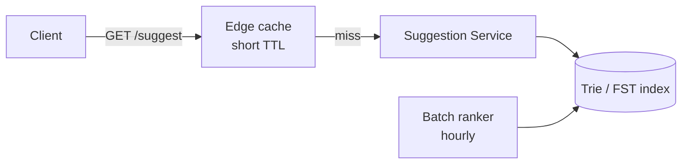

## Overview

- **Real-world analog:** Google search box, Facebook search, e-commerce product search.
- **Difficulty:** Medium · **Asked at:** Google, Meta, Amazon, Airbnb, Uber — the single most-asked frontend system-design question.
- The core challenge isn't showing suggestions — it's making sure the suggestions on screen always match the *last* character the user typed, even though the network responses answering earlier keystrokes can arrive **after** the response for a later one.

## Clarifying Questions & Requirements

> **Ask these first:**
> 1. Is the suggestion source purely remote, purely local (e.g. recent searches), or both merged together?
> 2. Does it need fuzzy/typo-tolerant matching, or is prefix matching enough?
> 3. Roughly how large is the result set per keystroke — a handful of suggestions, or does it need windowing?
> 4. Does selecting a result navigate away, or does it fill the input (search-as-you-type vs. jump-to-result)?

| | In scope | Out of scope |
|---|---|---|
| **Functional** | Debounced remote suggestions, keyboard navigation, result highlighting, recent-search fallback when empty | Full-text search ranking algorithm internals, spell-correction model |
| **Non-functional** | Suggestions never regress to an older, stale response; perceived latency stays low even on slow connections | Sub-10ms server response time (a real target, but not a frontend design concern) |

## ── FRONTEND TRACK (RADIO) ──

### R — Requirements

| | Requirement | Why it's not optional |
|---|---|---|
| **Functional** | Input box, suggestion list, keyboard nav (↑↓ to move, Enter to select, Esc to close), loading/empty/error states | This is a real combobox widget, not a plain `<input>` + `<ul>` |
| **Non-functional** | Never render a suggestion list for a stale query once a newer one has been typed | The entire hard part of this question — everything else is comparatively routine |
| **Non-functional** | Doesn't fire a network request per keystroke | At 60ms average typing speed, an unthrottled input generates far more requests than any backend needs to see |

### A — Architecture



- All the state and race-handling logic lives in one hook (`useAutocomplete`), not scattered across the input and list components — `SearchInput` and `SuggestionList` are both dumb, controlled-by-props components.
- `LocalCache` is checked **before** debouncing fires a network call — repeating a query the user already typed (a common pattern: type, backspace, retype) should be instant, not re-fetched.

### D — Data Model

| | Owner | Example |
|---|---|---|
| **Server state** | Suggestion results per query | Fetched on demand, cached client-side by query string |
| **Client state** | Current input value, highlighted index, open/closed state, in-flight request id | Never sent to the server |

```ts
type AutocompleteState = {
  query: string;
  suggestions: Suggestion[];
  highlightedIndex: number;
  status: 'idle' | 'loading' | 'success' | 'error';
  latestRequestId: number; // see race-condition fix below
};
```

> **Key insight:** the race condition this question is actually testing isn't solved by debouncing alone — debouncing reduces *how often* a request fires, but two in-flight requests can still resolve out of order over a real network. That needs its own explicit fix, covered in Deep Dives.

### I — Interface / API

**Component API**

```
<Autocomplete
  fetchSuggestions={(query: string, signal: AbortSignal) => Promise<Suggestion[]>}
  onSelect={(item: Suggestion) => void}
  minChars={number}
  debounceMs={number}
/>
```

**Network API** — the shared contract with the backend track below:

| Action | Transport | Shape |
|---|---|---|
| Fetch suggestions | `GET /suggest?q=<query>&limit=10` | REST, cancelable via `AbortController` |

### O — Optimizations

**Performance**
- Debounce input at ~150-300ms — long enough to skip most intermediate keystrokes, short enough that the UI still feels responsive.
- Cache results per exact query string client-side; a repeated or backspaced-then-retyped query resolves from cache with zero network round-trip.
- Virtualize the suggestion list if it can exceed roughly 20-30 items — rare for autocomplete specifically, but worth naming as a consideration for a "did you think about this" signal.

**Accessibility**
- `role="combobox"` on the input, `aria-expanded`, `aria-activedescendant` pointing at the highlighted suggestion's id, `role="listbox"`/`role="option"` on the list/items — this is the ARIA combobox pattern, not an invented one.
- Arrow keys move the highlighted index without moving focus off the input; Enter selects the highlighted item; Escape closes the list without clearing the input.

**Networking**
- Cancel the in-flight request the moment a new one fires — an uncancelled stale request wastes bandwidth and, if not handled correctly, is the exact source of the race condition below.

### Frontend Deep Dives

**1. The out-of-order response race.** Debouncing controls *when* a request fires, not the order responses come back in — a fast response to query `"ab"` fired slightly later can still resolve *after* a slow response to query `"a"` fired slightly earlier, if the network conditions differ per-request. If the UI naively renders whatever response arrives last, it can show stale suggestions for a query the user has already moved past.

```ts
async function search(query: string) {
  const requestId = ++latestRequestId;
  controller?.abort(); // cancel whatever was in flight
  controller = new AbortController();
  const results = await fetchSuggestions(query, controller.signal);
  if (requestId !== latestRequestId) return; // a newer request has since started — discard
  setSuggestions(results);
}
```

Both defenses matter together: `AbortController` stops wasted work (and lets the backend free the connection early), and the `requestId` guard is what actually prevents a stale response from rendering — a request can still resolve even after `.abort()` in some environments/mocks, so the id check is the real correctness guarantee, not the cancellation.

**2. Highlighting matched substrings safely.** Bolding the matched portion of "san francisco" inside a suggestion means interpolating a search term into rendered HTML — done via `dangerouslySetInnerHTML` or a manual string-splice, this is a real XSS vector if the suggestion text itself (not just the query) can contain user-influenced content (e.g. a "recent searches" suggestion sourced from another user's search in a shared/team context). Highlight by locating the match index and rendering three separate text nodes (`before`, `match`, `after`) as React children, never by concatenating raw HTML strings.

**3. Windowing a long, keyboard-navigable list.** If the result set is large enough to virtualize, the highlighted-index-follows-arrow-keys logic has to keep the highlighted item scrolled into view even though it may not be mounted in the DOM at the moment the key is pressed — virtualization and roving keyboard focus are two mechanisms that have to be coordinated explicitly, not independent afterthoughts.

### Frontend Bottlenecks & Tradeoffs

| Bottleneck | Mitigation | Tradeoff accepted |
|---|---|---|
| One request per keystroke | Debounce ~150-300ms | A few tens of milliseconds of perceived lag on the very first keystroke of a burst |
| Stale response overwriting a newer one | `requestId` guard + `AbortController` | A small amount of wasted server work for aborted requests that still complete server-side |
| Large suggestion lists janking on render | Virtualize past ~20-30 items | Slightly more complex keyboard-highlight logic to keep in view |

## ── BACKEND TRACK ──

### Requirements & Scope

- Serve ranked, prefix/fuzzy-matched suggestions for a partial query, fast enough that the round-trip fits comfortably inside the debounce window.
- Handle a very high read QPS relative to almost any other endpoint in the product, since it fires on nearly every keystroke across every active user.

### Scale & Estimation

| | Estimate |
|---|---|
| DAU issuing searches | 20M |
| Avg keystrokes per search (after debounce, so not every raw keystroke) | ~4 |
| Peak QPS | 20M × 4 / 86,400 × 5 (peak multiplier) ≈ **~4,600 QPS** |
| P99 latency budget | < 100ms — has to return well inside the frontend's debounce window plus round-trip |

### API Design

```
GET /suggest?q=<prefix>&limit=10
  → { suggestions: [{ id, text, score }] }
```

- Stateless, cacheable by query string — no session or auth dependency for the suggestion lookup itself, which is what makes a CDN/edge cache layer viable ahead of the origin service.

### Data Model & Storage

- **Index:** a trie or a finite-state transducer (FST) keyed by prefix, not a relational `LIKE 'prefix%'` query against a normal table — a trie gives O(prefix length) lookup regardless of corpus size, where a `LIKE` scan degrades as the dataset grows.
- **Ranking signal:** a precomputed popularity/frequency score per term, refreshed on a batch cadence (hourly/daily), not recalculated per request — recalculating rank live for every keystroke of every user is far more work than the read pattern justifies.
- Elasticsearch/OpenSearch's completion suggester, or a dedicated trie service, are the common real-world choices — both are optimized specifically for this access pattern rather than being a general-purpose datastore repurposed for it.

### High-Level Architecture



- An edge cache with a short TTL (seconds, not minutes) absorbs a large fraction of traffic for common prefixes ("a", "am", "ama...") without needing the origin service to be enormous — a handful of prefix characters account for a disproportionate share of total query volume.

### Deep Dives

**1. Keeping the index fresh without blocking reads.** Popularity scores and the term set itself change continuously (new products, trending searches), but rebuilding a trie in place while serving reads is unsafe. Fix: build the new index version off to the side, then atomically swap a pointer to the "current" index — reads never see a half-rebuilt structure, and the swap itself is a cheap pointer update, not a lock held across a rebuild.

**2. Long-tail prefixes with no good match.** A prefix with very few historical queries has little ranking signal — falling back to plain alphabetical/lexical ordering for these silently produces low-quality suggestions. A better fallback blends in a lighter-weight, real-time signal (e.g. category-level popularity) rather than either serving nothing or serving a rank-blind list.

### Bottlenecks & Tradeoffs

| Bottleneck | Mitigation | Tradeoff accepted |
|---|---|---|
| Very high read QPS relative to other endpoints | Aggressive edge caching on short TTL | Suggestions can lag true real-time popularity by the TTL window — acceptable, since suggestion rank doesn't need to be second-by-second accurate |
| Rebuilding the ranking index | Build off to the side, atomic pointer swap | A batch cadence (hourly/daily) rather than continuous re-ranking |

## The Shared Contract

- **Transport:** plain REST, not WebSocket/SSE — this is a request/response pattern with no server-initiated push, so the simplest transport wins.
- **Cancellation:** the frontend's `AbortController` on each request is what lets the backend actually stop doing wasted work for a query the user has already typed past, not just a client-side optimization.
- **Ownership boundary:** the client owns *debounce timing and stale-response discarding*; the server owns *ranking*. Neither side can compensate for the other being wrong — a perfectly-ranked backend still looks broken if the frontend renders responses out of order.

## Interview Signals

| | Strong answer | Weak answer |
|---|---|---|
| **Frontend** | Explicitly separates debouncing from the out-of-order-response fix — names both as distinct problems | Treats debouncing alone as sufficient to prevent stale results |
| **Backend** | Explains why a trie/FST beats a relational `LIKE` scan at this access pattern | Proposes a generic SQL query with no discussion of index structure |
| **Both** | Discusses the fresh-index-without-blocking-reads problem unprompted | Never mentions how the suggestion data actually gets updated |

**Common failure modes:** relying on debouncing alone to prevent stale suggestions; forgetting `AbortController`/cancellation entirely; not asking whether the source is local, remote, or both before designing.

## Glossary Links

This question draws on: Cursor-based pagination is *not* used here (a genuinely relevant negative case — offset/cursor pagination doesn't apply to a top-N ranked suggestion list the way it does to a scrollable feed). No other existing glossary terms apply directly; see Proposed glossary additions below.

**Proposed glossary additions:** none from this question — the two candidate terms (trie/FST index, debouncing) are common enough frontend/CS vocabulary that a dedicated glossary entry would be padding, not genuinely new terminology.
