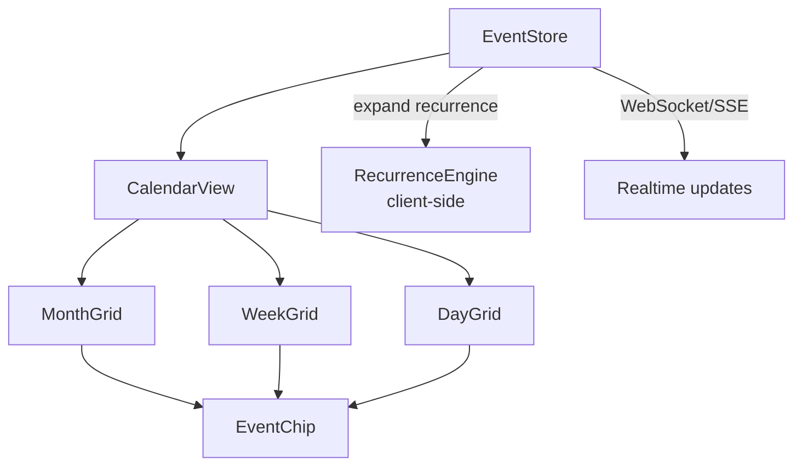
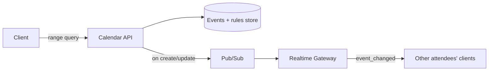

## Overview

- **Real-world analog:** Google Calendar — an event grid with real-time updates.
- **Difficulty:** Medium-Hard · **Asked at:** Google, Microsoft, scheduling products.
- The core challenge isn't drawing a grid of boxes — it's rendering that grid performantly across day/week/month views, correctly across timezones, and correctly for recurring events, which have to be *computed*, not stored as millions of individual rows.

## Clarifying Questions & Requirements

> **Ask these first:**
> 1. Single timezone, or does the calendar need to display events created in different timezones correctly relative to the viewer's own?
> 2. Recurring events — simple daily/weekly, or full RRULE-style complexity (every 2nd Tuesday, with exceptions)?
> 3. Real-time collaborative editing of one event by multiple attendees, or just single-owner edits with real-time visibility to others?
> 4. Drag-to-create/resize in scope, or read-mostly with a separate create form?

| | In scope | Out of scope |
|---|---|---|
| **Functional** | Day/week/month grid views, recurring events, drag-to-create/resize, real-time updates, timezone-correct rendering | Meeting-room/resource booking logic, video-call integration |
| **Non-functional** | Rendering a month view with hundreds of events stays smooth; recurring events expand correctly across any date range without pre-materializing years of rows | Sub-second global real-time propagation for very large shared calendars (bounded-delay sync is acceptable) |

## ── FRONTEND TRACK (RADIO) ──

### R — Requirements

| | Requirement | Why it's not optional |
|---|---|---|
| **Functional** | Day/week/month grids, recurring events rendered correctly, drag-to-create/resize, real-time updates from other attendees | Each view has a genuinely different layout algorithm — this isn't one grid with a CSS zoom level |
| **Non-functional** | An event created in one timezone displays at the correct local time for every viewer, in every view | Getting this wrong is the single most common, most embarrassing real bug class in calendar UIs |
| **Non-functional** | A month view with a busy day (many overlapping events) stays readable and performant, not visually broken | Overlap layout is a real, non-trivial rendering problem, not an edge case |

### A — Architecture



- **`RecurrenceEngine` expands recurring events on the client, for the currently visible date range only** — a weekly event isn't stored (or fetched) as one row per occurrence forever; the store holds the recurrence *rule*, and the engine computes concrete occurrences just-in-time for whatever range is currently rendered.
- Each grid component (`MonthGrid`/`WeekGrid`/`DayGrid`) shares the same underlying `EventChip` rendering but has its own layout algorithm — month view needs overlap-collapsing ("+3 more"), week/day view needs real time-axis positioning with overlap side-by-side layout.

```ts
// Client-side expansion for the visible range only — never materializes the full series.
function expandRecurrence(rule: RecurrenceRule, rangeStart: Date, rangeEnd: Date): EventOccurrence[] {
  const occurrences: EventOccurrence[] = [];
  let cursor = rule.startDate;
  while (cursor <= rangeEnd) {
    if (cursor >= rangeStart && !rule.exceptions.includes(toDateKey(cursor))) {
      occurrences.push({ start: cursor, end: addDuration(cursor, rule.duration) });
    }
    cursor = advanceByFrequency(cursor, rule.frequency, rule.interval);
  }
  return occurrences;
}
```

### D — Data Model

| | Owner | Example |
|---|---|---|
| **Server state** | Event details, recurrence rules, attendee list, timezone the event was created in | Fetched per visible range, kept live via realtime updates |
| **Client state** | Current view (day/week/month), currently displayed date range, drag-in-progress state | Never sent to the server until an explicit create/edit action completes |

```ts
type CalendarEvent = {
  id: string;
  title: string;
  startUtc: string;          // always stored/transmitted in UTC
  endUtc: string;
  creatorTimeZone: string;   // IANA zone, e.g. 'America/New_York' — needed for correct recurrence math across DST
  recurrenceRule: RecurrenceRule | null;
};
```

> **Key insight:** events are stored and transmitted in UTC, converted to the *viewer's* local timezone only at render time — never the other way around. A calendar that stores local time strings without a timezone (or worse, converts once at creation and forgets the original zone) breaks the moment a recurring event crosses a daylight-saving transition, because "every day at 9am" in one zone is not a fixed UTC offset year-round.

### I — Interface / API

**Component API**

```
<CalendarView view={'day' | 'week' | 'month'} date={Date} events={EventOccurrence[]} />
<EventChip event={EventOccurrence} onDragResize={(newEnd: Date) => void} />
<EventEditor event={CalendarEvent} onSave={(event) => void} />
```

**Network API** — the shared contract with the backend track below:

| Action | Transport | Shape |
|---|---|---|
| Fetch events for a range | `GET /events?start=<utc>&end=<utc>` | Returns raw events + recurrence rules; client expands, not the server, for ranges the client is actively navigating |
| Create/update event | `POST /events` / `PATCH /events/:id` | `{ title, startUtc, endUtc, creatorTimeZone, recurrenceRule? }` |
| Add a recurrence exception (edit/delete one occurrence) | `POST /events/:id/exceptions` | `{ occurrenceDate, action: 'skip' | 'modify', override? }` |
| Real-time updates | WebSocket/SSE | `{ type: 'event_changed', event }` |

### O — Optimizations

**Performance**
- Expand recurrence only for the visible date range, re-computing (cheaply) as the user navigates rather than precomputing a large window up front.
- Virtualize month-view rendering for calendars with very dense event days, and cap the "+N more" collapse threshold rather than rendering every overlapping event's full chip.

**Accessibility**
- Every event chip is a real, keyboard-focusable, labeled control (`aria-label` including title and time) — a calendar rendered purely as absolutely-positioned colored divs with no semantic structure is unusable by screen reader.
- Drag-to-create/resize has a keyboard-operable equivalent (e.g. select a slot, press Enter to open the create form with that slot pre-filled) — drag-only interactions exclude keyboard users entirely.

**Networking**
- Fetch only the currently visible range (plus a small prefetch buffer for adjacent navigation) rather than a user's entire calendar history on load.

**Resilience**
- An optimistic drag-to-resize shows the new size immediately and reverts cleanly on a rejected update (e.g. a conflicting event now overlaps in a way the backend rejects, if that's a product rule).

### Frontend Deep Dives

**1. Timezone-correct rendering across daylight-saving transitions.** A recurring "every weekday at 9am" event, expanded across a DST transition, must still render at 9am *local time* on both sides of the transition — which means the recurrence rule has to be defined and expanded in terms of the *creator's local time and zone*, converted to UTC per-occurrence (since the UTC offset for "9am Eastern" changes across the DST boundary), not as a single fixed UTC time repeated at a fixed interval. This is one of the most consistently under-tested edge cases in real calendar implementations.

**2. Editing a single occurrence of a recurring series without breaking the rest.** Moving one Tuesday's recurring meeting to Wednesday shouldn't move every future occurrence. The data model needs an explicit exceptions mechanism (the `POST /events/:id/exceptions` endpoint above) — the client renders the base rule's expansion, then applies any exceptions for the visible range on top, rather than the recurrence engine having any way to represent "this one occurrence is different" within the rule itself.

**3. Overlap layout in week/day view.** Three overlapping meetings need to render side-by-side, proportionally sized, without visually colliding — a real interval-scheduling layout problem (assign each event a column such that no two overlapping events share one, minimizing total columns used), not something achievable with naive absolute positioning based on start time alone.

### Frontend Bottlenecks & Tradeoffs

| Bottleneck | Mitigation | Tradeoff accepted |
|---|---|---|
| Pre-materializing years of recurring occurrences | Expand only the visible range, on demand | A small amount of repeated computation on every range change, negligible compared to the alternative |
| Dense month-view days with many overlapping events | Collapse to "+N more" past a threshold, virtualize | Some events require an extra click (expand the day) to see, an accepted, common real-product tradeoff |
| Naive absolute-position overlap rendering colliding visually | Real interval-scheduling column-assignment layout | More layout computation per render, necessary for the view to be legible at all |

## ── BACKEND TRACK ──

### Requirements & Scope
- Store events and recurrence rules durably, serve range-based queries efficiently, support editing individual occurrences of a series, and propagate changes to attendees in real time.

### Scale & Estimation

| | Estimate |
|---|---|
| Events created/day (large org) | 5M |
| Avg attendees/event | 3 |
| Recurring vs. one-off | Roughly 40% recurring |
| Read pattern | Heavily range-queried ("give me everything between date A and B"), not point lookups |

### API Design

```
GET   /events?start=<utc>&end=<utc>          -- returns base events + rules overlapping the range
POST  /events                                  {title, startUtc, endUtc, creatorTimeZone, recurrenceRule?}
PATCH /events/:id
POST  /events/:id/exceptions                  {occurrenceDate, action, override?}
WS    event_changed → {event}
```

- The range-query endpoint returns **base events and rules**, not expanded occurrences — expansion happens client-side (Frontend Track, A) specifically so the server never has to materialize or transmit an unbounded number of occurrences for an indefinitely-recurring event.

### Data Model & Storage

```
events
  id                 uuid PK
  title              text
  start_utc          timestamp
  end_utc            timestamp
  creator_timezone   text          -- IANA zone name
  recurrence_rule    jsonb nullable -- frequency, interval, until/count, byweekday etc.

event_exceptions
  event_id           uuid, indexed
  occurrence_date    date
  action             enum('skip','modify')
  override           jsonb nullable  -- new time/title for a 'modify' exception

attendees
  event_id           uuid, indexed
  user_id            uuid
  response_status    enum('pending','accepted','declined')
```

| Choice | Why |
|---|---|
| Recurrence stored as a rule (jsonb), not materialized rows per occurrence | An indefinitely-recurring event ("every week, forever") has no finite row count to materialize — storing the rule and expanding on read is the only approach that actually terminates |
| `event_exceptions` as a separate table, not mutating `events` | Keeps the base recurrence rule clean and lets a query cheaply check "are there any exceptions in this range" separately from expanding the rule itself |
| Range queries indexed on `(start_utc, end_utc)` | The dominant query pattern is "everything overlapping this range" — an index shaped for range overlap, not point lookup by id, is what actually serves it efficiently |

### High-Level Architecture



### Deep Dives

**1. Efficient range queries against recurring rules.** "Give me everything between March 1 and March 7" has to include recurring events whose *rule* implies an occurrence in that range, even though the base row's own `start_utc`/`end_utc` might be from months or years earlier. This needs either a bounded-lookahead materialization strategy (pre-compute and cache the next N occurrences per recurring event, refreshed periodically) or a rule-evaluation step at query time — most production systems use a hybrid: cache computed occurrences for a rolling near-term window, fall back to on-the-fly rule evaluation for far-future queries.

**2. Timezone-correct storage across DST.** As on the frontend, the backend must store enough information (`creator_timezone` alongside a UTC-normalized rule) to correctly recompute each occurrence's actual UTC start time across DST transitions — a rule stored as a fixed UTC time with a fixed interval silently produces wrong local times the moment a DST boundary is crossed.

**3. Consistency for real-time attendee updates.** When an event changes, every attendee's client needs to see the update — this is the same fan-out-to-online-participants pattern the chat course covers, applied to a lower-frequency, higher-stakes event (a meeting time actually changing, not a chat message).

### Bottlenecks & Tradeoffs

| Bottleneck | Mitigation | Tradeoff accepted |
|---|---|---|
| Evaluating recurrence rules for far-future range queries | Cache near-term occurrences, evaluate on-the-fly for far-future ranges | Slightly more complex read path, in exchange for never needing unbounded storage |
| Range queries against a large events table | Index shaped for range overlap, not just id lookup | Standard, worthwhile cost of a purpose-built index for the actual dominant query pattern |

## The Shared Contract

- **Timezone contract:** events are transmitted in UTC plus the creator's IANA timezone; the frontend converts to the viewer's local zone at render time, and recomputes recurrence expansion in terms of the creator's zone to stay correct across DST — both tracks have to agree on this or recurring events silently drift.
- **Recurrence expansion happens client-side**, from a rule the backend never expands itself — this bounds what the backend has to store/transmit for an indefinitely-recurring series.
- **Exceptions are additive, not destructive:** editing one occurrence never mutates the base rule; it adds an exception record both tracks read and apply on top of the expanded series.

## Interview Signals

| | Strong answer | Weak answer |
|---|---|---|
| **Frontend** | Explains recurrence expansion client-side, for the visible range only, and names the DST edge case unprompted | Assumes events are simple fixed-time rows with no recurrence-expansion discussion |
| **Backend** | Stores rules, not materialized occurrences, and has a real strategy for range queries against them | Tries to store one row per future occurrence, which doesn't terminate for an indefinite series |
| **Both** | Treats timezone correctness across DST as a first-class requirement | Stores/transmits naive local time with no timezone information at all |

**Common failure modes:** materializing recurring occurrences as literal rows; ignoring DST entirely; mutating the base recurrence rule to represent a single-occurrence edit; naive absolute-position overlap rendering that visually collides.

## Glossary Links

This question draws on: RADIO framework, Consistency model, Optimistic UI, WebSocket, Server-Sent Events — each linked on first mention above. See Proposed glossary additions for recurrence rule.
