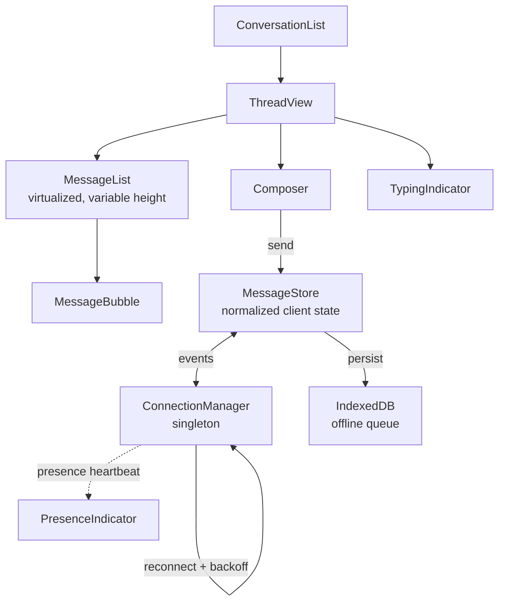
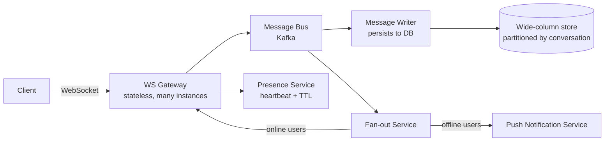

## Overview

- **Real-world analog:** Messenger, Slack, WhatsApp — real-time 1:1 and group chat.
- **Difficulty:** Hard · **Asked at:** Meta, Slack-style companies, GreatFrontEnd bank.
- The core challenge isn't sending a message — it's making the UI feel instant while the network is slow, unreliable, or briefly gone, and doing that without ever letting two people disagree about what was actually said or in what order.

## Clarifying Questions & Requirements

> **Ask these first:**
> 1. 1:1 only, or group chat too? (Group changes fan-out, read receipts, and presence significantly.)
> 2. Does history need to be end-to-end encrypted, or just encrypted in transit?
> 3. What's the offline story — read-only cache, or can a user compose and queue messages while offline?
> 4. Web only, or does state need to sync across a phone and a laptop open at the same time?

| | In scope | Out of scope |
|---|---|---|
| **Functional** | 1:1 + group text messaging, delivery/read receipts, typing indicators, presence, message history/search | Voice/video calls, end-to-end encryption key exchange |
| **Non-functional** | Perceived-instant send (< 100ms to appear), message ordering correctness, works on flaky mobile networks | Guaranteed sub-second global delivery at extreme scale (that's a deep-dive variant, not the base question) |

## ── FRONTEND TRACK (RADIO) ──

### R — Requirements

| | Requirement | Why it's not optional |
|---|---|---|
| **Functional** | Composer, thread view, conversation list, typing indicator, read receipts, presence dot, message history with infinite scroll-back | Each of these has its own hard sub-problem — this isn't "build a text box," it's five coordinated real-time surfaces sharing one connection |
| **Functional** | Works across a page refresh, a tab going to sleep and waking up, and a phone/laptop open on the same account at once | A chat app that only works in the tab that sent the last message isn't a chat app |
| **Non-functional** | Sending feels instant (< 100ms to appear) regardless of actual network RTT | This is the single requirement that forces optimistic UI — anything else fails Doherty-threshold-style perceived-speed expectations |
| **Non-functional** | Message ordering and delivery are *correct* even across a dropped connection | Getting this wrong doesn't degrade gracefully — it makes users seriously distrust the product ("did my message actually send?") |
| **Non-functional** | Degrades usably on a flaky mobile connection — no silent failures, no infinite spinners | The majority of real chat usage is exactly this condition, not a fast, stable desktop connection |

These five non-functional requirements are what make this a **Hard** question rather than a Medium one — the functional feature list alone (compose, display, notify) is closer to a Medium component question. The hard part is entirely in what happens when the network isn't cooperating.

### A — Architecture



- **`ConnectionManager` is a singleton, not a per-component hook.** One WebSocket for the whole app, multiplexing every open conversation over it — not one connection per open thread, which stops scaling past a handful of tabs and duplicates reconnect/backoff logic per thread. It owns the connection lifecycle end to end and exposes a small event-emitter surface (`onMessage`, `onPresence`, `onReconnect`) that `MessageStore` subscribes to; nothing else in the component tree talks to the socket directly.
- **`MessageStore` is the single source of truth**, not per-screen local state — `ConversationList` (previews, unread counts) and `ThreadView` (full message list) both read the *same* normalized store, so a message's read status updates in both places from one write, not two separately-synced copies.
- A sketch of what `ConnectionManager` actually has to do — this is the piece a shallow answer skips entirely:

```ts
class ConnectionManager {
  private ws: WebSocket | null = null;
  private backoffMs = 1000;
  private readonly maxBackoffMs = 30_000;
  private pendingSends = new Map<string, QueuedMessage>(); // keyed by clientId

  connect() {
    this.ws = new WebSocket(WS_URL);
    this.ws.onopen = () => {
      this.backoffMs = 1000; // reset on a clean connect
      this.flushPendingSends();       // replay anything queued while offline
      this.replayFrom(this.lastKnownSeqPerConversation()); // catch up on missed history
    };
    this.ws.onmessage = (e) => this.store.applyServerEvent(JSON.parse(e.data));
    this.ws.onclose = () => this.scheduleReconnect();
  }

  private scheduleReconnect() {
    const jitter = Math.random() * 0.3 * this.backoffMs;
    setTimeout(() => this.connect(), this.backoffMs + jitter);
    this.backoffMs = Math.min(this.backoffMs * 2, this.maxBackoffMs);
  }

  send(msg: OutgoingMessage) {
    this.pendingSends.set(msg.clientId, msg);
    if (this.ws?.readyState === WebSocket.OPEN) this.ws.send(JSON.stringify(msg));
    // if not open: it just sits in pendingSends until the next successful connect
  }
}
```

This is the real substance of "handle reconnection" — not a bullet point, an actual state machine with a resettable backoff, a jitter term (so a mass-disconnect, e.g. a gateway restart, doesn't cause every client to reconnect in the same instant and hammer it), and a queue that both offline sends and reconnect-replay share.

### D — Data Model

| | Owner | Example |
|---|---|---|
| **Server state** | Message history, delivery/read status, conversation metadata | Fetched + kept in sync via WebSocket events |
| **Client state** | Draft text, typing-indicator debounce timer, scroll position, which thread is open | Never sent to the server until an explicit action |

The store is **normalized by message id**, not a nested array per conversation — the same reasoning a backend applies to database schema design, applied to client memory:

```ts
type Store = {
  messagesById: Record<string, Message>;
  messageIdsByConversation: Record<string, string[]>; // ordered by serverSeq
  clientIdToRealId: Record<string, string>; // reconciliation map, see below
};

type Message = {
  id: string;                 // clientId until the server assigns a real one
  conversationId: string;
  senderId: string;
  text: string;
  sentAt: number;              // client timestamp — display only, never for ordering
  serverSeq: number | null;    // server-assigned monotonic sequence — the real order
  status: 'pending' | 'sent' | 'delivered' | 'read' | 'failed';
};
```

> **Key insight:** `sentAt` and `serverSeq` are deliberately two different fields. Client clocks aren't trustworthy or synchronized — the server sequence number is the only thing both tracks agree is authoritative for **message ordering**.

**Why normalized, concretely:** a message's row in `MessageList` and its preview snippet in `ConversationList` are the *same object reference* — when a read receipt arrives and flips `status`, both surfaces re-render from one state change, not two independently-patched copies that can drift out of sync. Nested-array state (`conversations: [{ id, messages: [...] }]`) makes that guarantee much harder to hold, because "the same message" now exists in two different places in the tree that have to be kept in lockstep by hand.

**The reconciliation problem this data model exists to solve:** the client sends a message optimistically with a `clientId`, then the *same* message comes back over the WebSocket as a `message` event once the server has processed it — but by then it may already be rendered. Naively appending it a second time double-renders it.

```ts
function applyServerMessage(store: Store, serverMsg: ServerMessageEvent) {
  const existingId = store.clientIdToRealId[serverMsg.clientId];
  if (existingId) {
    // We already rendered this optimistically — patch it in place, don't append.
    store.messagesById[existingId] = { ...store.messagesById[existingId], ...serverMsg, status: 'sent' };
  } else {
    // Arrived from someone else, or our own send raced the optimistic render.
    store.messagesById[serverMsg.id] = { ...serverMsg, status: 'sent' };
    insertOrdered(store.messageIdsByConversation[serverMsg.conversationId], serverMsg);
  }
}
```

`insertOrdered` matters specifically because `serverSeq`, not arrival order, determines position — a message that arrives late over a slow connection still has to land in the *correct* place in the list, not get appended to the end.

### I — Interface / API

**Component API**

```
<Composer onSend={(text) => void} disabled={boolean} maxLength={number} />
<MessageList
  messages={Message[]}
  onLoadOlder={() => Promise<void>}
  estimateRowHeight={(msg: Message) => number}   // seeds the virtualizer, see Deep Dives
/>
<MessageBubble message={Message} isOwn={boolean} onRetry={(clientId) => void} />
<ConnectionBanner status={'online' | 'reconnecting' | 'offline'} />
```

`onRetry` on `MessageBubble` isn't decorative — it's the concrete UI hook for the `failed` status in the data model above; a status enum with no corresponding affordance in the component API is a design gap, not a detail to fill in later.

**Network API** — the shared contract with the backend track below:

| Action | Transport | Shape |
|---|---|---|
| Send message | WebSocket event | `{ type: 'send', clientId, conversationId, text }` |
| Receive message | WebSocket event | `{ type: 'message', serverSeq, id, conversationId, senderId, text, sentAt }` |
| Load history | `GET /conversations/:id/messages?before=<cursor>` | REST, cursor-paginated |
| Typing | WebSocket event | `{ type: 'typing', conversationId }` (fire-and-forget, no ack) |
| Read receipt | WebSocket event | `{ type: 'read', conversationId, upToSeq }`, batched — see Deep Dives |
| Reconnect catch-up | WebSocket event | `{ type: 'sync', conversationId, afterSeq }` sent on every reconnect, before any new sends |

The `sync` event is the frontend-side half of the backend track's reconnect deep dive below — it only works because both tracks agree the client always knows and reports its last-seen `serverSeq` per conversation.

### O — Optimizations

**Performance**
- Virtualize the message list — a long thread can have tens of thousands of messages; only render what's in (or near) the viewport. The hard part is variable row height, covered in Deep Dives below.
- Debounce typing events to roughly one per few seconds per conversation, not one per keystroke — a naive implementation generates one WebSocket message per character typed, which is pure waste at scale.
- Lazy-render message content for anything below the fold on first paint (e.g. link previews, images) so opening a busy conversation doesn't block on unrelated network requests.

**Accessibility**
- New messages announce via `aria-live="polite"`, never `assertive` — a chat isn't an alarm, and `assertive` on a fast-moving list would interrupt a screen reader user mid-sentence, repeatedly.
- The composer keeps focus after send — a naive re-render that steals focus back to the top of the thread after every message is a real, common, easily-caught accessibility bug.
- The message list is fully keyboard-scrollable and each message bubble is independently focusable, so a screen reader user can navigate history message-by-message, not just as one long unstructured block of text.

**Networking**
- Reconnect with exponential backoff and jitter (the `ConnectionManager` sketch above) — never a fixed retry interval, which causes a thundering-herd reconnect storm against a recovering server.
- Batch read receipts rather than firing one per scrolled message — see Deep Dives.

**Resilience**
- Replay the offline queue on reconnect, reconciled against `clientIdToRealId` so a message the server actually received right before the disconnect can't get double-sent.
- A `failed` message is a real UI state with a retry action — never a silently-dropped message and never a silently-infinite-retry-forever loop the user has no visibility into.

### Frontend Deep Dives

These are the hard problems this question is actually testing on the frontend side — the equivalent weight to the backend track's Deep Dives below, not an afterthought.

**1. Reconciling an optimistic send against its own WebSocket echo.** The client renders a message locally the instant the user hits enter, *and* the server will echo that same message back over the socket once it's processed — these two events race, and the order they arrive in isn't guaranteed. If the echo arrives and the client naively appends it, the message renders twice. The fix is the `clientIdToRealId` map from the Data Model section: every render path — the optimistic one and the WebSocket-echo one — checks that map before deciding "append" versus "patch in place." This is the single most common thing a shallow answer misses entirely, because the happy-path demo (send a message, watch it appear) never surfaces the race; it only shows up under real network conditions.

**2. Virtualizing a list where every row is a different height.** Fixed-height virtualization (every row assumed to be, say, 48px) is straightforward; a chat thread's rows vary wildly — a one-line message versus a five-line one versus an image versus a date divider. A correct implementation either measures each rendered row's real height once and caches it (so re-scrolling past it doesn't need to re-measure), or uses a size estimator seeded with a reasonable guess (the `estimateRowHeight` prop above) and corrects the estimate once the real DOM node reports its actual height — the second approach is what libraries like `react-virtuoso`/`@tanstack/react-virtual` actually do internally. Getting this wrong produces a visibly janky scrollbar that jumps as estimates get corrected mid-scroll.

**3. Preserving scroll position when prepending older history.** Scrolling to the top of a thread triggers `onLoadOlder`, which prepends 50 older messages *above* what's currently on screen. Naively prepending shifts every existing row down by the height of the new content, which visually yanks the viewport — the user's eye was on a specific message, and now it's somewhere else on screen. The fix: capture the scroll-anchor message's DOM offset before the prepend, insert the new rows, then immediately restore scroll position relative to that same anchor — not relative to the top of the list, which has just changed size underneath it.

**4. Read receipts without flooding the socket.** Naively, "mark as read" fires once per message that scrolls into view — in a fast-scrolling thread with 50 messages on screen, that's 50 WebSocket sends in under a second. The fix is the same debounce-and-batch idea from Optimizations: an `IntersectionObserver` on the message list accumulates the highest `serverSeq` currently visible, and a single `{ type: 'read', upToSeq }` fires on a short trailing debounce (a few hundred milliseconds after scrolling settles) rather than per-message — the backend only ever needs to know the *highest* seq read, not every individual message that was seen.

### Frontend Bottlenecks & Tradeoffs

| Bottleneck | Mitigation | Tradeoff accepted |
|---|---|---|
| One WebSocket message per keystroke for typing indicators | Debounce to ~1 event per few seconds | Typing indicator has a small, acceptable lag rather than being perfectly real-time |
| Re-measuring every row's height on every scroll | Cache measured heights per message id, only re-measure on content change | A small amount of extra memory (one number per message) traded for not re-laying-out the whole list on every scroll frame |
| Read receipts fired per visible message | Batch to the max visible `serverSeq` on a trailing debounce | The backend's read state is *slightly* behind real-time by the debounce window — acceptable, since read receipts were never a sub-second-latency requirement |
| Reconnect storms after a shared network blip (e.g. a mobile user re-entering coverage) | Exponential backoff with jitter, capped | A dropped connection takes a few seconds longer to recover in the worst case, in exchange for not amplifying the outage into a self-inflicted DDoS on reconnect |

## ── BACKEND TRACK ──

### Requirements & Scope

- Durable message storage, real-time fan-out to online participants, offline delivery on reconnect, read/delivery receipt tracking, presence.
- Must tolerate a client reconnecting mid-conversation without losing or duplicating messages.

### Scale & Estimation

| | Estimate |
|---|---|
| DAU | 50M |
| Avg messages/user/day | 40 |
| Peak messages/sec | ~50M × 40 / 86,400 × 5 (peak multiplier) ≈ **~115K msg/sec** |
| Avg message size | ~200 bytes (text) |
| Storage/day | 50M × 40 × 200B ≈ **400GB/day**, ~150TB/year before compaction |
| Read:write ratio | Roughly 3:1 (message history scrolled far more than sent) |

### API Design

Server-side view of the same contract the frontend track defined above:

```
WS  send    {clientId, conversationId, text} → ack {clientId, id, serverSeq}
WS  message → {id, serverSeq, conversationId, senderId, text, sentAt}
GET /conversations/:id/messages?before=<cursor>&limit=50
POST /conversations/:id/read   {upToSeq}
```

- `serverSeq` is assigned **only** by the server, per-conversation, monotonically increasing — never by the client, never guessable.
- The `send` ack round-trip is what lets the frontend swap a `pending` optimistic message for a confirmed one — this is the exact moment ownership of "what really happened" crosses from client back to server.

### Data Model & Storage

```
messages
  id            uuid PK
  conversation_id  uuid, indexed
  sender_id     uuid
  text          text
  server_seq    bigint     -- monotonic per conversation_id
  created_at    timestamp
  UNIQUE(conversation_id, server_seq)

conversations
  id            uuid PK
  type          enum('direct','group')
  participant_ids  uuid[]

read_state
  conversation_id  uuid
  user_id          uuid
  last_read_seq    bigint
  PRIMARY KEY (conversation_id, user_id)
```

| Choice | Why |
|---|---|
| **DB:** wide-column store (Cassandra-style), partitioned by `conversation_id` | Write-heavy, append-mostly workload; a conversation's messages are always read together — partitioning by conversation makes that a single-partition scan, not a scatter-gather |
| **`server_seq` generation** | Per-partition counter, not a global one — avoids a single global sequence becoming the bottleneck for every conversation on the system |
| **`read_state` as its own table**, not a column on `messages` | Read receipts are the highest-frequency write in the system (every scroll can trigger one) — isolating them means they don't contend with message writes on the same rows |

### High-Level Architecture



- The **WS Gateway** is deliberately stateless and horizontally scaled — a user's WebSocket can land on any instance, so a **presence registry** (which gateway instance holds which user's connection) is needed to route fan-out correctly.
- The **message bus** decouples "durably store this" from "deliver this to whoever's online right now" — a slow write path never blocks real-time delivery, and a fan-out spike never blocks durability.

### Deep Dives

**1. Message ordering across a reconnect.** A client that drops for 30 seconds and reconnects needs every message it missed, in the right order, with no duplicates. Fix: on reconnect, the client sends its last-known `serverSeq` per conversation; the server replays everything after that from the durable log — the WebSocket is a live tail of the same ordered log the REST history endpoint reads from, not a separate mechanism.

> **Signature gotcha:** ordering by client timestamp. Clocks differ across devices and drift over time — order by a server-assigned sequence, always.

**2. Exactly-once-feeling delivery over an at-least-once network.** WebSocket delivery can duplicate on reconnect races. Fix: every message carries the client-generated `clientId` as an idempotency key — the server dedupes on it before persisting, so a retried `send` after a flaky ack can't create two messages.

**3. Fan-out cost for large groups.** A 500-person group means one message triggers 500 deliveries. Fix: cap group size for the direct fan-out path, or shard delivery through the message bus's own partitioning rather than the gateway iterating participants synchronously — this is the same push-vs-pull fan-out tradeoff a social feed faces, just at conversation scale instead of follower scale.

### Bottlenecks & Tradeoffs

| Bottleneck | Mitigation | Tradeoff accepted |
|---|---|---|
| Single global sequence counter | Per-conversation counters instead | Ordering is only guaranteed *within* a conversation, not globally — acceptable, since cross-conversation order was never a real requirement |
| Hot conversation (viral group) | Read replicas + fan-out sharding | Slightly stale read replicas for very hot threads |
| WS Gateway instance failure | Client reconnects to a new instance, replays from `serverSeq` | A few seconds of visible reconnect/typing-indicator flicker, acceptable given correctness is preserved |

## The Shared Contract

- **Transport:** WebSocket, chosen over SSE because the client genuinely needs to push (send messages, typing events), not just receive — the exact tradeoff the `websocket`/`server-sent-events` terms below cover.
- **Ownership boundary:** the client owns *when* to show a message (optimistically); the server owns *whether it actually happened and in what order* (`serverSeq`). Neither track's version of "the message list" is authoritative alone — the frontend's optimistic copy is provisional until reconciled against the backend's sequence.
- **Pagination:** cursor-based (`before=<serverSeq>`), for the same reason a feed uses cursors — offset pagination breaks the moment new messages arrive while scrolling up through history.
- **Error propagation:** a failed `send` ack flips the message to `failed` client-side with a retry affordance — it does **not** silently vanish, and it does **not** silently retry forever without the user knowing.

## Interview Signals

| | Strong answer | Weak answer |
|---|---|---|
| **Frontend** | Names optimistic UI *and* its reconciliation path explicitly; catches that client timestamps can't order messages | Describes sending a message but never mentions what happens if it fails |
| **Backend** | Explains *why* per-conversation sequencing beats a global one | Reaches for a global auto-increment without noticing the bottleneck |
| **Both** | Treats the WebSocket reconnect path as a first-class design problem, not an afterthought | Designs only the happy path; reconnect/offline is never mentioned unprompted |

**Common failure modes:** designing the send flow before asking whether group chat is in scope; putting message ordering authority on the client; treating a WebSocket drop as an edge case instead of something that happens constantly on mobile.

## Glossary Links

This question draws on: RADIO framework, WebSocket, Server-Sent Events, exponential backoff, optimistic UI, message ordering, read receipt, presence, offline queue, cursor-based pagination, idempotency, consistency model — each linked on first mention above.
