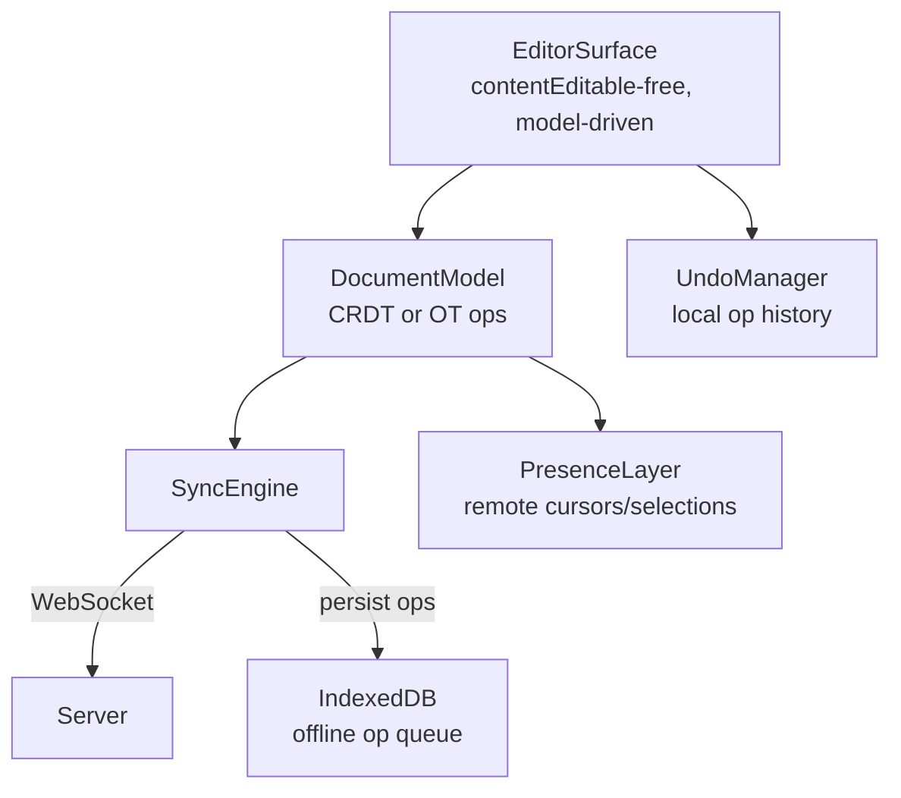
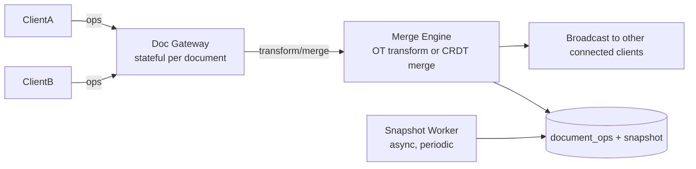

## Overview

- **Real-world analog:** Google Docs, Notion — real-time multi-user document editing.
- **Difficulty:** Hard · **Asked at:** Google, Meta, Notion-style companies.
- The core challenge is that two people can type in the same paragraph at the same instant, on two different machines, with no way to lock the document without destroying the entire point of "collaborative" — the design has to make concurrent edits converge to the same result on every client without ever blocking either user's typing.

## Clarifying Questions & Requirements

> **Ask these first:**
> 1. Rich text (bold, headings, embeds) or plain text? Rich text changes the document model significantly.
> 2. Does editing need to work fully offline, with sync resuming later, or is "briefly disconnected, reconnects within seconds" the real bar?
> 3. How many concurrent editors on one document, realistically — 2-3, or dozens (a company all-hands doc)?
> 4. Is full edit history / version restore in scope, or just "the current state converges correctly"?

| | In scope | Out of scope |
|---|---|---|
| **Functional** | Concurrent rich-text editing, cursor/selection presence, undo/redo, offline editing with later sync | Real-time voice/video alongside the doc, granular per-paragraph permissions |
| **Non-functional** | No editor is ever blocked waiting on another editor; all clients converge to an identical document state; typing latency is purely local (no network round-trip per keystroke) | Guaranteed sub-100ms cross-client propagation at massive concurrent-editor counts (a deep-dive variant, not the base bar) |

## ── FRONTEND TRACK (RADIO) ──

### R — Requirements

| | Requirement | Why it's not optional |
|---|---|---|
| **Functional** | Rich-text editing surface, remote cursor/selection presence, undo/redo, offline-capable editing | Each of these interacts with the conflict-resolution strategy — undo, in particular, is genuinely harder in a collaborative document than a single-user one |
| **Non-functional** | Every keystroke applies locally with zero network round-trip before it's visible | This is the requirement that rules out "send the keystroke and wait for the server to confirm before rendering it" outright |
| **Non-functional** | Two clients editing concurrently converge to the *same* final document, without either edit silently winning over the other | This is the actual hard problem this question tests — not the text editing UI itself |
| **Non-functional** | Reconnecting after a network drop merges cleanly, with no duplicated or lost keystrokes | The same reconnect-correctness bar as chat, but harder, because the "message" here is a fine-grained, position-dependent edit, not an atomic, ordered unit |

### A — Architecture



- **The editor is model-driven, not `contentEditable`-driven.** `EditorSurface` renders *from* `DocumentModel` — every keystroke is translated into a structured operation (insert/delete at a position, or a CRDT-native op) applied to the model first, then the view re-renders from the model. Reading the DOM's own state as the source of truth (raw `contentEditable` mutation events) is exactly what breaks under concurrent remote edits, because the DOM has no concept of "someone else just inserted three characters before my cursor."
- **`SyncEngine` is the only thing that talks to the network** — it batches local ops, sends them, receives remote ops, and applies them through the *same* model-level apply path a local op takes. There's deliberately no separate "apply a remote op" code path from "apply a local op" — that duplication is a common, avoidable source of divergence bugs.
- A sketch of the local-apply / remote-apply symmetry that has to hold:

```ts
class SyncEngine {
  private pendingOps: Op[] = [];

  applyLocal(op: Op) {
    this.model.apply(op);          // render immediately, no network wait
    this.pendingOps.push(op);
    this.flush();
  }

  applyRemote(op: Op) {
    const transformed = this.model.transformAgainstPending(op, this.pendingOps);
    this.model.apply(transformed); // same apply() path as a local op
  }

  private flush() {
    if (this.pendingOps.length === 0) return;
    this.ws.send(JSON.stringify({ type: 'ops', ops: this.pendingOps }));
    // ops stay in pendingOps until the server acks them, for transform + offline replay
  }
}
```

`transformAgainstPending` is the crux of the whole question — see Deep Dives for what it actually has to do, and why CRDTs and Operational Transformation answer it differently.

### D — Data Model

| | Owner | Example |
|---|---|---|
| **Server state** | The converged document content and its full operation history | Persisted; the client's local model is a replica, not the master copy |
| **Client state** | Cursor/selection position, undo stack, pending (unacknowledged) local ops, offline op queue | Local-only until flushed to the server |

```ts
type Op =
  | { type: 'insert'; pos: Position; text: string; opId: string; author: string }
  | { type: 'delete'; pos: Position; length: number; opId: string; author: string };

// Position is intentionally NOT a plain character index — a raw index shifts
// meaning the instant any concurrent edit changes earlier content.
type Position = { blockId: string; charId: string }; // stable identity, not an offset
```

> **Key insight:** `Position` is never a raw integer offset. If client A deletes 5 characters at the start of a paragraph while client B is inserting at what *was* character 40, a plain offset-based op silently lands in the wrong place once A's delete has shifted everything after it. Stable per-character or per-block identifiers (the same idea CRDTs are built around) are what make an op's target position independent of what anyone else has concurrently changed.

**The reconciliation problem this data model exists to solve:** a local op is applied immediately (for zero-latency typing) but hasn't been acknowledged by the server yet. If a remote op arrives in the meantime, it has to be transformed *against* whatever local ops are still pending, or it can land somewhere that no longer makes sense relative to what the user is actively looking at.

### I — Interface / API

**Component API**

```
<Editor documentId={string} onOp={(op: Op) => void} />
<RemoteCursor userId={string} position={Position} color={string} />
<PresenceBar collaborators={{ userId: string; name: string; color: string }[]} />
<UndoRedoControls canUndo={boolean} canRedo={boolean} />
```

**Network API** — the shared contract with the backend track below:

| Action | Transport | Shape |
|---|---|---|
| Send local ops | WebSocket event | `{ type: 'ops', ops: Op[], baseVersion }` |
| Receive remote ops | WebSocket event | `{ type: 'ops', ops: Op[], version }` |
| Cursor/selection broadcast | WebSocket event | `{ type: 'presence', userId, position }` (fire-and-forget, no ack) |
| Load document | `GET /documents/:id` | Returns current snapshot + `version`, not the full op history |

### O — Optimizations

**Performance**
- Apply local ops synchronously, before any network involvement — typing latency must be purely a function of local rendering, never network RTT.
- Batch outgoing ops on a short window (tens of milliseconds) rather than one WebSocket send per keystroke, without ever delaying the *local* render.
- For very large documents, virtualize rendering by block (paragraph/section), not the whole document tree, so a 200-page doc doesn't force a full re-render on every keystroke.

**Accessibility**
- Remote cursor/selection indicators need a non-color-only signal (a name label on hover/focus), since color alone fails for colorblind users trying to tell collaborators apart.
- The editor surface must remain fully screen-reader-navigable as a real document structure (headings, lists) — a model-driven editor makes this easier than raw `contentEditable`, because the model already has real structural meaning to render into semantic HTML.

**Networking**
- Reconnect with exponential backoff (same pattern as chat's `ConnectionManager`), and on reconnect, request any ops after the client's last-known `version` before sending queued local ops.
- Presence (cursor) updates are fire-and-forget and can be dropped under load without correctness consequences — unlike document ops, which must never be dropped.

**Resilience**
- Offline edits queue locally (IndexedDB) and replay through the same `applyLocal`/transform path on reconnect — not a special "offline sync" code path, the ordinary one.
- If the local and server-reported document versions have diverged unrecoverably (rare, but possible after a bug or a very long offline period), fail loudly with an explicit "resolve conflict" UI rather than silently picking one version and discarding the other.

### Frontend Deep Dives

**1. CRDTs vs. Operational Transformation — the actual tradeoff.** Both solve "make concurrent edits converge," but differently. **OT** transforms an incoming remote op against the local pending ops at apply time (the `transformAgainstPending` call above) — it requires a central server to establish a canonical order and mediate transforms, and the transform functions themselves are notoriously easy to get subtly wrong. **CRDTs** (Conflict-free Replicated Data Types) design the data structure itself so that *any* order of applying the same set of ops converges to the same result, with no central mediation required — at the cost of more memory overhead per character (each needs a stable, globally-unique identity, not just a position) and a more complex underlying structure. Google Docs historically used OT-style approaches; most modern collaborative editors (Notion, Figma's non-canvas text) lean CRDT specifically because it also makes offline-first editing dramatically simpler — a CRDT document can merge two independently-edited offline copies with no server round-trip at all, which an OT-based one structurally cannot do as cleanly.

> **Signature gotcha:** saying "I'd use CRDTs" without being able to name what a CRDT actually guarantees — commutativity and convergence, specifically — reads as a memorized buzzword, not real understanding. Be ready to say *why* those two properties are what make central mediation unnecessary.

**2. Rendering remote cursors without fighting the local caret.** A remote user's cursor has to render as an overlay *positioned relative to the same stable identifiers* as the document content — if it's positioned by raw character offset, every local edit before it invalidates its position. The fix is using the exact same `Position` type from the Data Model for presence broadcasts as for document ops, so a remote cursor's rendered position updates automatically as the document model reflows, the same way document content does.

**3. Undo in a collaborative context.** Single-user undo is "reverse my last op." Collaborative undo is harder: if you type "hello", someone else inserts a character in the middle, and *then* you hit undo, undoing your original insert can't just blindly remove the last 5 characters — some of those characters aren't even yours anymore. The correct approach tracks undo per-author as a *selective* inverse of that author's own ops, computed against the current document state, not a blind pop of a shared history stack — this is a real, frequently-underestimated piece of scope that a shallow answer skips entirely.

### Frontend Bottlenecks & Tradeoffs

| Bottleneck | Mitigation | Tradeoff accepted |
|---|---|---|
| Re-rendering the whole document on every keystroke | Block-level virtualization/rendering granularity | More rendering-pipeline complexity, in exchange for typing latency staying flat regardless of document length |
| Transform cost growing with the number of pending local ops during a slow connection | Cap and periodically force-flush the pending-ops window | A very slow connection can briefly show a larger local-only lag before forcing a sync, rather than transform cost growing unbounded |
| CRDT per-character metadata overhead on very large documents | Batch runs of unchanged text into larger CRDT units where possible | Slightly more complex merge logic, in exchange for memory overhead that doesn't scale linearly with raw character count |

## ── BACKEND TRACK ──

### Requirements & Scope

- Durably store documents as a mergeable operation log (or CRDT state), broadcast ops to all connected editors of a document, and mediate/transform concurrent ops if using an OT-style approach.
- Must support a client that was offline for an extended period rejoining and merging cleanly.

### Scale & Estimation

| | Estimate |
|---|---|
| DAU (active editors) | 20M |
| Avg concurrent editors per active document | 2-3, rare tail up to dozens |
| Ops/sec at peak (per-keystroke-ish granularity, batched client-side) | ~20M active docs × ~0.5 ops/sec avg ≈ **~10M ops/sec system-wide**, batched down significantly by client-side windowing before it reaches the server |
| Avg document size | ~50KB rich text |
| Op storage/day (post-batching) | Roughly ~2TB/day across all documents before compaction/snapshotting |

### API Design

Server-side view of the same contract the frontend track defined above:

```
WS  ops     {ops: Op[], baseVersion} → ack {appliedVersion}
WS  ops     ← broadcast to other connected editors {ops, version}
WS  presence {userId, position}  -- fire-and-forget, no persistence
GET /documents/:id → {snapshot, version}
```

- `baseVersion` on an incoming op batch tells the server what version the client thought it was editing against — this is what lets the server (in an OT model) transform the incoming ops against everything that's happened since, or (in a CRDT model) simply merge them, since CRDT ops don't need a base version to merge correctly.
- The server never sends the *entire* op history to a client on load — it sends a periodically-computed **snapshot** plus `version`, and only ops *after* that version on reconnect, the same "replay from last-known point" pattern chat uses for message history.

### Data Model & Storage

```
documents
  id            uuid PK
  snapshot      jsonb      -- periodic materialized state, not recomputed from full op log every read
  version       bigint     -- monotonic, incremented per applied op batch
  updated_at    timestamp

document_ops
  id            uuid PK
  document_id   uuid, indexed
  version       bigint     -- matches the documents.version this op produced
  op            jsonb
  author_id     uuid
  UNIQUE(document_id, version)
```

| Choice | Why |
|---|---|
| **Periodic `snapshot` materialization, not full-op-log replay on every load** | Replaying potentially millions of ops to reconstruct current state on every document open doesn't scale — a snapshot plus "ops since the snapshot" bounds the replay cost |
| **`version` monotonic per document, not global** | Same reasoning as chat's per-conversation sequence — a document's own edit history only needs to be ordered relative to itself |
| **CRDT state stored directly (if CRDT-based), rather than only an op log** | A CRDT's current state can often be persisted as the merged structure itself, which simplifies snapshotting since "the current state" and "a mergeable unit" are the same representation |

### High-Level Architecture



- Unlike chat's stateless gateway, the **Doc Gateway is stateful per document** — all editors of the *same* document need to be routed to (or coordinated by) the same merge authority, because transform/merge order matters and can't be arbitrarily distributed the way independent conversations can.
- The **Snapshot Worker** runs asynchronously, materializing a fresh snapshot periodically so replay cost on document load never grows unbounded with edit history.

### Deep Dives

**1. Ordering concurrent ops from multiple clients fairly.** Two clients' ops arrive at the gateway in some arrival order that has nothing to do with when the user actually typed them (network latency differs per client). Fix: the merge engine establishes a canonical server-side order (a logical clock or the CRDT's own built-in ordering) and every client's view converges to *that* order, not to "whichever arrived first" — this is precisely the class of problem CRDTs are designed to make correct by construction, versus OT needing a carefully-implemented transform function to get right.

**2. Reconnect after an extended offline period.** A client offline for hours has a large batch of local ops to reconcile against potentially thousands of ops from other editors in the interim. Fix: rather than transforming the entire offline batch against the entire interim history op-by-op (expensive and error-prone at that scale), the server merges against the latest snapshot plus only the necessary ops, and CRDT-based systems specifically benefit here since merging two divergent-but-related states doesn't require replaying a linear history at all.

**3. Merge-engine statefulness as a scaling constraint.** Because a document's merge authority has to be consistent (see architecture above), a single wildly popular shared document (an all-hands doc with dozens of concurrent editors) can't trivially shard its merge work the way chat's per-conversation partitioning does. Fix: cap realistic concurrent-editor expectations per document in the requirements (this course's Clarifying Questions explicitly surfaced this), and if extreme fan-in is a real requirement, consider a hierarchical merge (regional aggregators feeding a single authority) rather than assuming flat horizontal scaling works here the way it does for independent conversations.

### Bottlenecks & Tradeoffs

| Bottleneck | Mitigation | Tradeoff accepted |
|---|---|---|
| Full op-log replay cost growing with document age | Periodic snapshot materialization | Snapshot workers add operational complexity and a small window of "ops since last snapshot" replay cost |
| Stateful per-document merge authority limits horizontal scaling for one hot document | Cap expected concurrent editors per doc; hierarchical merge for extreme cases | Cannot trivially shard one document's merge work the way independent conversations can be sharded |
| OT transform correctness is notoriously hard to implement bug-free | Prefer CRDT-based merge where offline-first and correctness-by-construction matter more than raw storage efficiency | More per-character metadata overhead than a pure OT approach |

## The Shared Contract

- **Transport:** WebSocket, both directions — unlike a feed or chat's read side, presence and ops genuinely need bidirectional, low-latency push in both directions simultaneously.
- **Ownership boundary:** the client's local model is provisional the instant an op is applied (for zero-latency typing); the server's merge engine is the sole authority on the *canonical* order concurrent ops from different clients converge to. Every client's local state is a replica that continuously reconciles toward that canonical state, never the reverse.
- **Versioning, not pagination, is the sync primitive here** — reconnect logic is "give me everything after version N," structurally identical in spirit to chat's `serverSeq`-based catch-up, just applied to a document's edit history instead of a message stream.
- **Error propagation:** an unmergeable divergence (rare) surfaces an explicit, honest conflict UI — it never silently discards one side's edits without telling anyone.

## Interview Signals

| | Strong answer | Weak answer |
|---|---|---|
| **Frontend** | Explains CRDT vs. OT as a real tradeoff with concrete consequences (offline-first ease, transform correctness risk), not just naming both terms | Treats "just use a CRDT library" as a complete answer with no discussion of what it actually buys or costs |
| **Backend** | Explains why the merge authority has to be stateful per document, and what that implies for scaling one hot document | Assumes documents scale identically to independent, shardable conversations |
| **Both** | Discusses undo/redo in a collaborative context as a real, nontrivial problem | Assumes undo is "the same as any text editor" |

**Common failure modes:** using raw character offsets as edit positions instead of stable identifiers; treating remote-op application as a separate code path from local-op application; not addressing what happens to undo when someone else has edited since your last change; assuming a document's merge work can be sharded as freely as independent conversations.

## Glossary Links

This question draws on: consistency model — linked on first mention above. See "Proposed glossary additions" below for terms new to this question.

**Proposed glossary additions:**
- **CRDT (Conflict-free Replicated Data Type)** — a data structure designed so that any order of applying the same set of concurrent updates converges to the same result, with no central coordination required to resolve conflicts.
- **Operational Transformation (OT)** — a concurrency-control technique that transforms an incoming operation against operations it wasn't originally composed with, so a canonically-ordered server can apply concurrent edits consistently; requires central mediation, unlike a CRDT.
