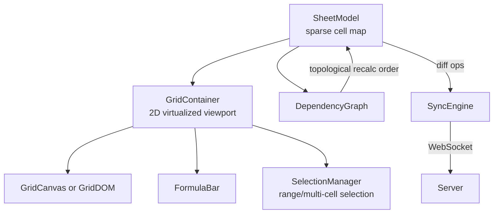
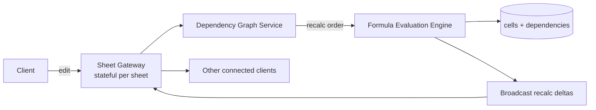

## Overview

- **Real-world analog:** Google Sheets, Excel Online — a grid of millions of cells with formulas and multi-user editing.
- **Difficulty:** Hard · **Asked at:** Google, GreatFrontEnd bank.
- The core challenge layers two hard problems on top of each other: rendering and editing a grid too large to ever fully mount in the DOM, *and* correctly recalculating a web of formula dependencies whenever any one cell changes — while multiple people edit different cells of the same sheet at once.

## Clarifying Questions & Requirements

> **Ask these first:**
> 1. What's the realistic grid ceiling — tens of thousands of rows, or genuinely millions of cells (Sheets' actual limit is in the low millions)?
> 2. Do formulas need to support cross-sheet references, or is this single-sheet only for the base question?
> 3. Real-time multi-user editing of the same sheet, or is "last write wins per cell, no live presence" an acceptable simplification?
> 4. Copy/paste of large ranges — is that in scope, or is single-cell editing the base bar?

| | In scope | Out of scope |
|---|---|---|
| **Functional** | Virtualized 2D grid, formulas with a dependency graph, cell-level real-time collaboration, range selection and copy/paste | Charting, pivot tables, scripting/macros |
| **Non-functional** | Editing any single cell feels instant regardless of grid size; a formula change recalculates only what actually depends on it, not the whole sheet; two users editing different cells never block each other | Real-time cell-level conflict resolution for two users editing the *exact same* cell simultaneously at sub-100ms convergence (last-write-wins with a visible indicator is an acceptable base-question answer) |

## ── FRONTEND TRACK (RADIO) ──

### R — Requirements

| | Requirement | Why it's not optional |
|---|---|---|
| **Functional** | 2D virtualized grid with fixed header row/column, formula bar, range selection, formula evaluation | A spreadsheet's entire value proposition is formulas — a grid without them is just a big table |
| **Non-functional** | Scrolling in either direction stays smooth regardless of total grid size | This is a 2D virtualization problem, strictly harder than a 1D list — both axes need windowing simultaneously |
| **Non-functional** | Editing cell A1 recalculates every cell that *depends* on A1, and nothing else | Recalculating the entire sheet on every edit is the single most common way a naive implementation becomes unusable past a few thousand cells |
| **Non-functional** | Two users editing different cells of the same sheet never see the UI block or lag waiting on each other | This rules out any design that serializes edits through a single lock |

### A — Architecture



- **`SheetModel` is a sparse map, not a dense 2D array.** A million-cell sheet is almost always overwhelmingly empty — storing `Map<CellId, CellValue>` keyed by `"row,col"` (or a similar stable key) means memory scales with *populated* cells, not the theoretical grid size, and iterating "all cells" for recalculation never has to touch empty ones.
- **`DependencyGraph` is maintained incrementally, not rebuilt on every edit.** When a formula in a cell changes, only that cell's outgoing edges (which cells it references) update — the graph as a whole isn't recomputed from scratch on every keystroke, which is what makes targeted recalculation possible at all.
- A sketch of the incremental recalculation path — the part a shallow answer reduces to "recalculate dependent cells" without showing how:

```ts
class DependencyGraph {
  private dependents = new Map<CellId, Set<CellId>>(); // cellId -> cells that reference it

  setFormula(cellId: CellId, formula: string) {
    const refs = parseReferences(formula);         // cells this formula reads
    this.clearOutgoing(cellId);
    for (const ref of refs) this.addEdge(ref, cellId); // ref -> cellId (cellId depends on ref)
  }

  recalcOrder(changedCellId: CellId): CellId[] {
    // Topological order of everything transitively dependent on the change —
    // NOT the whole sheet.
    const visited = new Set<CellId>();
    const order: CellId[] = [];
    const visit = (id: CellId) => {
      if (visited.has(id)) return;
      visited.add(id);
      for (const dep of this.dependents.get(id) ?? []) visit(dep);
      order.push(id);
    };
    visit(changedCellId);
    return order.reverse(); // dependencies before dependents
  }
}
```

### D — Data Model

| | Owner | Example |
|---|---|---|
| **Server state** | Cell values, formulas, and the resulting computed values once evaluated | Authoritative once reconciled; each user's local recalculation is provisional until confirmed |
| **Client state** | Current selection/range, viewport scroll position, in-progress formula edit before commit | Local-only, never sent until the edit is committed |

```ts
type CellId = string; // e.g. "A1", stable and human-legible unlike an arbitrary index

type Cell = {
  formula: string | null;   // "=SUM(A1:A10)" or null for a plain value
  rawValue: string | number | null; // literal value if no formula
  computedValue: string | number | null; // cached result of the last evaluation
};

type SheetModel = {
  cells: Map<CellId, Cell>; // sparse — absent key means genuinely empty cell
};
```

> **Key insight:** `computedValue` is cached, not recomputed on every render. A cell's rendered value comes from this cached field; recalculation only re-derives it when the `DependencyGraph` says this specific cell is in the affected set for a given change. Recomputing every visible cell's formula on every render (rather than reading a cache) is a common, expensive mistake.

**The reconciliation problem this data model exists to solve:** a local edit to a cell computes new values for every dependent cell immediately (for responsiveness), but the server may compute a slightly different result if a concurrent remote edit to one of those same dependencies landed first. The client applies its own recalculation optimistically, then reconciles against whatever the server's authoritative recalculation actually produces once it arrives — the same optimistic-then-reconcile shape as chat's message send, applied to a formula result instead of a message.

### I — Interface / API

**Component API**

```
<Grid rowCount={number} colCount={number} getCell={(id: CellId) => Cell} onEdit={(id: CellId, value: string) => void} />
<FormulaBar cellId={CellId | null} value={string} onCommit={(formula: string) => void} />
<SelectionOverlay range={{ start: CellId; end: CellId }} />
```

**Network API** — the shared contract with the backend track below:

| Action | Transport | Shape |
|---|---|---|
| Edit cell | WebSocket event | `{ type: 'edit', cellId, formula, baseVersion }` |
| Receive recalculated cells | WebSocket event | `{ type: 'recalc', changes: { cellId, computedValue }[], version }` |
| Load sheet | `GET /sheets/:id?range=A1:Z1000` | REST, range-scoped — never the whole sheet at once |
| Presence/selection | WebSocket event | `{ type: 'selection', userId, range }` (fire-and-forget) |

The **range-scoped load** matters specifically for a million-cell sheet: the client only ever requests the cells within (and slightly beyond) the current viewport, not the entire sparse map, which is the loading-side equivalent of the rendering-side virtualization.

### O — Optimizations

**Performance**
- Virtualize both axes independently — compute the visible row range and visible column range separately, and only mount cells at their intersection, not a full row × full column cross product beyond what's visible.
- Cache `computedValue` per cell and only invalidate the specific cells the dependency graph marks as affected by a given change — never a blanket "recalculate everything visible" pass.
- For very large pasted ranges, batch the resulting edits into one dependency-graph update and one recalculation pass, not one per cell — pasting 10,000 cells one-edit-at-a-time would trigger 10,000 separate recalculation traversals.

**Accessibility**
- Grid navigation supports full keyboard control (arrow keys, Tab, Enter to commit) as a first-class interaction, not a mouse-only fallback — this is table-stakes for any real spreadsheet, sighted or not.
- The formula bar and the currently-selected cell are kept in sync and both screen-reader-addressable, so a screen reader user can navigate by cell and always know both the raw formula and the computed value.

**Networking**
- Batch rapid sequential edits (e.g. fast typing across cells via Tab) into one WebSocket message where feasible, rather than one send per committed cell.
- Range-scoped fetching (above) doubles as a networking optimization and a memory one — never fetch cell data far outside the viewport's near vicinity.

**Resilience**
- If a formula references a cell that doesn't exist or creates a circular reference, fail that *specific* cell with a visible error (`#REF!`, `#CIRCULAR!`) — never let one bad formula crash recalculation for the rest of the sheet.
- A failed edit rolls back to the last known-good `computedValue` for the affected cells, with a visible indicator, rather than leaving a stale or blank cell with no explanation.

### Frontend Deep Dives

**1. Detecting circular references without hanging the browser.** `A1 = B1+1` and `B1 = A1+1` creates an infinite recalculation loop if the dependency-graph traversal doesn't guard against it. The fix: `recalcOrder`'s `visit` function above tracks a *currently-being-visited* set (not just a fully-visited one) — if `visit` re-enters a cell already on the current path, that's a cycle, and the fix is to mark every cell in that cycle as `#CIRCULAR!` and stop, rather than recursing forever. This is the single most common thing that actually crashes a naive spreadsheet implementation, and it's rarely mentioned unprompted in a shallow answer.

**2. Virtualizing two axes without breaking sticky headers.** A 1D virtualized list only has to track one scroll offset; a grid has to track vertical scroll (which rows are visible) and horizontal scroll (which columns are visible) independently, while keeping the header row pinned to the top and the header column pinned to the left regardless of either scroll position. The practical implementation renders the header row/column as separate, position-synced overlays rather than as part of the same scrollable body — they read the same scroll-offset state but render outside the scrolling container, which is what keeps them visually fixed while the body content scrolls underneath.

**3. Reconciling a local recalculation against a server-authoritative one after a concurrent edit.** If two users edit different cells that happen to feed into the same downstream formula, each client optimistically recalculates that formula locally using its own (possibly incomplete) view of recent changes — and the two clients can briefly disagree about that downstream cell's value. The fix mirrors chat's message reconciliation: the local recalculation is provisional and tagged with the `baseVersion` it was computed against; when the server's own recalculation for that version arrives, it *replaces* the locally-computed value rather than merging with it — the client never tries to guess how to combine two independently-derived formula results, it just accepts the server's as authoritative once it arrives.

### Frontend Bottlenecks & Tradeoffs

| Bottleneck | Mitigation | Tradeoff accepted |
|---|---|---|
| Recalculating the whole sheet on every edit | Incremental, dependency-graph-scoped recalculation | More bookkeeping (maintaining the graph itself) in exchange for recalculation cost scaling with affected cells, not sheet size |
| Rendering a dense grid at true scale | Sparse cell storage + 2D virtualization | Cells outside the viewport (or genuinely empty) never materialize in memory as rendered nodes |
| Large-range paste triggering many sequential recalculations | Batch the whole pasted range into one dependency update and one recalc pass | Slightly more complex batching logic, in exchange for a 10,000-cell paste not visibly freezing the tab |
| Two concurrent edits briefly disagreeing on a shared downstream formula's value | Server-authoritative recalculation always overwrites the local guess | A brief, usually-imperceptible flicker to the server's value is possible right after a concurrent edit — acceptable, since exact-value consistency during that split-second window was never a stated hard requirement |

## ── BACKEND TRACK ──

### Requirements & Scope

- Store sparse cell data and formulas per sheet, maintain (or re-derive) the dependency graph server-side, recalculate authoritatively on edits, and serve range-scoped reads efficiently for very large sheets.
- Must resolve concurrent edits to different cells without serializing all edits through a single global lock.

### Scale & Estimation

| | Estimate |
|---|---|
| DAU | 30M |
| Avg populated cells per active sheet | ~50K (most sheets are far smaller than the theoretical grid ceiling) |
| Edits/sec at peak | ~30M users × ~2 edits/min avg / 60 × 3 (peak multiplier) ≈ **~3M edits/sec** system-wide, heavily skewed toward a small number of actively-edited sheets at any moment |
| Avg sheet storage (sparse) | ~2MB per active sheet (50K cells × ~40 bytes avg) |
| Recalculation fan-out | Highly variable — most edits affect a handful of dependents; a small fraction of "hub" cells (referenced by hundreds of formulas) drive most of the actual recalculation cost |

### API Design

Server-side view of the same contract the frontend track defined above:

```
WS  edit    {cellId, formula, baseVersion} → recalc {changes: [{cellId, computedValue}], version}
GET /sheets/:id?range=A1:Z1000 → {cells: [{cellId, formula, computedValue}]}
WS  selection {userId, range}  -- fire-and-forget, no persistence
```

- `baseVersion` on an edit tells the server what state the client's recalculation assumed — the server recomputes authoritatively regardless, but this lets it detect and log divergence for debugging, the same role it plays in the collaborative-editor question.
- The server sends back only the *changed* cells' new computed values in `recalc`, never the whole sheet — this is the wire-level expression of the same "only recalculate what's affected" principle the frontend track applies locally.

### Data Model & Storage

```
sheets
  id            uuid PK
  version       bigint

cells
  sheet_id      uuid, indexed
  cell_id       text        -- "A1" style, stable key
  formula       text NULL
  raw_value     jsonb NULL
  computed_value jsonb NULL
  PRIMARY KEY (sheet_id, cell_id)

dependencies
  sheet_id      uuid, indexed
  cell_id       text        -- the cell whose formula depends on referenced_cell_id
  referenced_cell_id text
  PRIMARY KEY (sheet_id, cell_id, referenced_cell_id)
```

| Choice | Why |
|---|---|
| **`cells` keyed by `(sheet_id, cell_id)`, sparse rows only for populated cells** | Same sparsity reasoning as the client model — storing empty-cell rows for a million-cell grid would be almost entirely wasted storage |
| **`dependencies` as its own table, not derived at read time from parsing every formula** | Recomputing the dependency graph by re-parsing every formula on every recalculation is the server-side version of the client's "don't rebuild the graph from scratch" rule — persisting edges directly makes incremental updates cheap |
| **Range-scoped reads via a `cell_id` prefix/range query**, not "fetch the whole sheet row" | Mirrors the frontend's range-scoped load — a server that only ever returns whole-sheet payloads pushes the scaling problem onto every client regardless of what they're actually looking at |

### High-Level Architecture



- Like the collaborative editor, the **Sheet Gateway is stateful per sheet** — all edits to one sheet need to go through the same dependency-graph authority, since recalculation order and correctness depend on a consistent view of that sheet's graph.
- The **Formula Evaluation Engine** is deliberately separated from the gateway itself so evaluation logic (parsing, executing `SUM`/`VLOOKUP`/etc.) can be scaled, tested, and versioned independently of connection handling.

### Deep Dives

**1. Incremental server-side recalculation at scale.** Recomputing an entire sheet's formulas on every single edit doesn't scale past small sheets. Fix: the same topological, dependency-graph-scoped recalculation the frontend does locally, done authoritatively server-side — the server maintains `dependencies` as a real, incrementally-updated table (not re-derived by re-parsing every formula on every edit) specifically so a single-cell edit only walks the subgraph that's actually affected.

**2. Handling a small number of "hub" cells with very high fan-out.** A cell referenced by hundreds of other formulas (a common total, a shared constant) makes every edit to it expensive, regardless of how efficient the rest of the graph traversal is — this is a structural hot-spot, not a general scaling problem. Fix: for cells above a fan-out threshold, batch and briefly debounce their downstream recalculation (a few tens of milliseconds) so a burst of rapid edits to a hub cell doesn't trigger a full cascade recalculation per keystroke — mirroring the same batching principle the frontend applies to rapid sequential edits.

**3. Concurrent edits to different cells that share a downstream dependent.** Two users editing different upstream cells that both feed one shared formula can race at the server. Fix: the dependency-graph-scoped recalculation is applied atomically per incoming edit batch, in arrival order at the gateway — the *last* edit to actually land determines the final recalculated value for the shared dependent, and every client (including the ones whose edit "lost" the race for that specific downstream cell) receives the same authoritative `recalc` delta, which is what keeps every client converged despite the race.

### Bottlenecks & Tradeoffs

| Bottleneck | Mitigation | Tradeoff accepted |
|---|---|---|
| Full-sheet recalculation on every edit | Persisted, incrementally-updated dependency graph; scoped recalculation | More storage and write overhead for maintaining `dependencies` explicitly |
| High fan-out "hub" cells causing recalculation cascades | Debounce/batch recalculation for cells above a fan-out threshold | A hub cell's dependents can lag a hub edit by tens of milliseconds during rapid changes |
| Stateful per-sheet gateway limits horizontal scaling of one hot sheet | Cap realistic concurrent-editor expectations; consider sharded sub-ranges for extreme cases | Cannot trivially shard one sheet's recalculation authority the way independent sheets can be sharded across the fleet |

## The Shared Contract

- **Transport:** WebSocket, bidirectional — edits flow client→server, recalculated deltas flow server→client(s), and both directions are genuinely needed simultaneously.
- **Ownership boundary:** the client's locally-recalculated values are provisional (computed for immediate responsiveness); the server's `Formula Evaluation Engine` is the sole authority on final computed values, and a `recalc` message always wins over whatever the client guessed.
- **Pagination-equivalent:** range-scoped reads (`?range=A1:Z1000`), not classic pagination — the concept transfers directly (never load more than the client can currently show) even though the shape is 2D rather than a linear cursor.
- **Error propagation:** a bad formula (`#REF!`, `#CIRCULAR!`) is a per-cell error state, never a whole-sheet failure — this boundary is enforced on both tracks identically, since a shallow answer on either side is tempted to let one bad cell take down the whole recalculation pass.

## Interview Signals

| | Strong answer | Weak answer |
|---|---|---|
| **Frontend** | Explains 2D virtualization as genuinely harder than 1D, with sticky headers handled as position-synced overlays | Treats the grid as "just a big virtualized list" without addressing the second axis |
| **Backend** | Persists the dependency graph explicitly rather than re-deriving it by re-parsing formulas on every read | Recomputes dependencies from scratch on every edit, without noticing the cost |
| **Both** | Catches circular references as a first-class failure mode with a real detection strategy | Never mentions circular references at all |

**Common failure modes:** recalculating the entire sheet (client- or server-side) on every edit; storing the grid densely instead of sparsely; missing circular-reference detection entirely; treating 2D virtualization as a trivial extension of 1D list virtualization.

## Glossary Links

This question draws on: consistency model — linked on first mention above. See "Proposed glossary additions" below (shared with the Collaborative Editor question, where these terms are defined in full) for CRDT and Operational Transformation, both relevant if this question's real-time collaboration is pushed toward cell-level concurrent-edit merging rather than last-write-wins.
