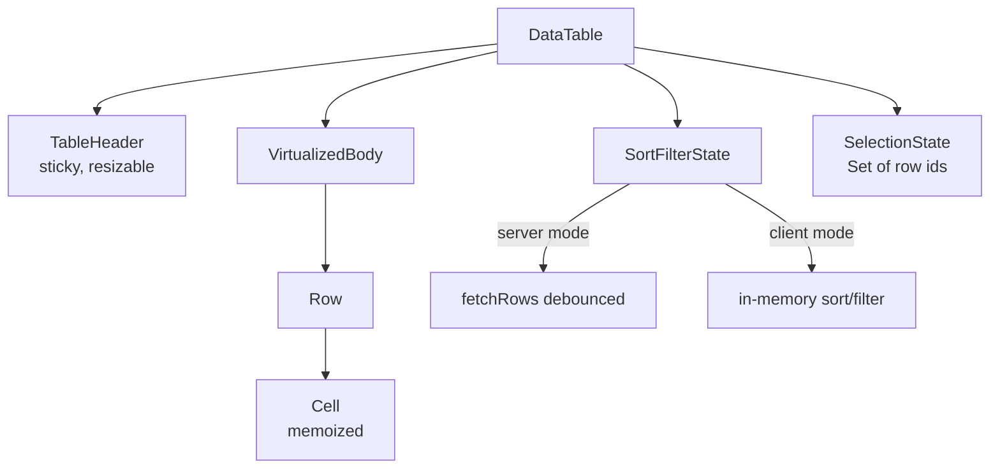
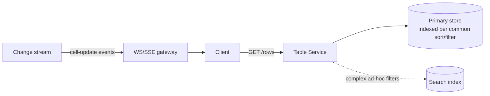

## Overview

- **Real-world analog:** Admin dashboards, inventory grids.
- **Difficulty:** Medium-Hard · **Asked at:** Amazon, Google, ByteDance, GreatFrontEnd bank.
- The core challenge is that "sort/filter/paginate a table" looks trivial at small scale and becomes a genuine system-design problem at real scale — the decision of *where* sorting and filtering happen (client vs. server) reshapes both tracks.

## Clarifying Questions & Requirements

> **Ask these first:**
> 1. Roughly how many total rows — hundreds (client-side is viable) or millions (server-side is required)?
> 2. Do cells update live (e.g. a stock price ticking), or is the data static per page load?
> 3. How many columns, and do any need custom cell renderers (badges, inline actions, nested data)?
> 4. Does the table need to support export (CSV) or is on-screen display the only requirement?

| | In scope | Out of scope |
|---|---|---|
| **Functional** | Fixed headers, column resize/reorder/visibility, sort, filter, pagination, row selection/expansion/grouping, virtualization | Full pivot-table/spreadsheet-style formula support, drag-to-reorder rows |
| **Non-functional** | Renders smoothly with a huge underlying dataset; sort/filter changes feel immediate even when the actual computation happens server-side | Sub-millisecond sort latency on a dataset in the tens of millions of rows |

## ── FRONTEND TRACK (RADIO) ──

### R — Requirements

| | Requirement | Why it's not optional |
|---|---|---|
| **Functional** | Virtualized rows, sticky header, resizable/reorderable columns, sort/filter controls, row selection | This is a genuinely complex composite component — the sum of several hard sub-problems, not one |
| **Non-functional** | Scrolling stays smooth (no dropped frames) with tens of thousands of rows in the underlying dataset | The entire reason virtualization is a required, not optional, part of the answer |
| **Non-functional** | A cell update (e.g. a live price change) doesn't force a re-render of the whole table | Naive state management re-renders every row on every data change — a real, commonly-tested performance bug |

### A — Architecture



- `SortFilterState` explicitly branches into a server-driven path (refetch on change) or a client-driven path (recompute in memory) — this is the single biggest architectural decision in the whole question, and it's a real fork, not a detail: a table designed for one doesn't cleanly support the other without rework.
- `SelectionState` is a `Set` of row ids, not an array or a boolean flag per row object — a `Set` gives O(1) "is this row selected" checks for every rendered row, which matters directly for render performance at scale.

### D — Data Model

| | Owner | Example |
|---|---|---|
| **Server state** | The actual row data, current sort/filter/page (in server mode) | Server mode: refetched on every sort/filter/page change |
| **Client state** | Column widths/order/visibility, selection set, scroll position, sort/filter *values* (even in server mode — the UI controls are local until submitted) | Persisted to localStorage in many real products, since users expect column layout to survive a refresh |

```ts
type TableState = {
  sort: { columnId: string; direction: 'asc' | 'desc' } | null;
  filters: Record<string, unknown>;
  page: { cursor: string | null; pageSize: number };
  columnOrder: string[];
  columnWidths: Record<string, number>;
  selectedIds: Set<string>;
};
```

> **Key insight:** column layout (`columnOrder`/`columnWidths`) is client-only state that never touches the server in most designs, while sort/filter/page are client state that *drives* a server request in server mode. Conflating these two categories — treating everything as "just UI state" — is what leads to designs that can't actually scale past client-side sort/filter.

### I — Interface / API

**Component API**

```
<DataTable
  columns={ColumnDef[]}
  rows={Row[]}
  mode={'client' | 'server'}
  onSortChange={(sort) => void}
  onFilterChange={(filters) => void}
  onPageChange={(cursor: string | null) => void}
  rowHeight={number | ((row: Row) => number)}
/>
```

**Network API** (server mode) — the shared contract with the backend track below:

| Action | Transport | Shape |
|---|---|---|
| Fetch page | `GET /rows?sort=<col>:<dir>&filter=<json>&after=<cursor>&limit=50` | REST, cursor-paginated |
| Live cell update | WebSocket or SSE event | `{ type: 'cell-update', rowId, columnId, value }` |

### O — Optimizations

**Performance**
- Virtualize both rows *and*, for very wide tables, columns — a table with 50+ columns rendering all of them for every visible row can be as expensive as row-count virtualization alone doesn't address.
- Memoize individual `Cell` components keyed by `(rowId, columnId, value)` so a single cell's live update re-renders exactly one cell, not the row or the table.
- Debounce filter input the same way autocomplete debounces search input — a filter that refetches (server mode) or recomputes (client mode) on every keystroke is wasteful at any real scale.

**Accessibility**
- Real `<table>`/`role="grid"` semantics with proper header/cell association (`scope`, `headers`/`id` pairs), not a `<div>`-grid with no semantic structure — a screen reader user needs to know which column a cell belongs to when navigating cell-by-cell.
- Sortable column headers are real buttons with `aria-sort` reflecting current state, not a clickable header with no accessible indication that clicking it sorts.

**Networking**
- In server mode, cancel an in-flight page/sort/filter request the moment a newer one fires — the exact same stale-response race as autocomplete, applied to table data instead of suggestions.

### Frontend Deep Dives

**1. Virtualizing rows *and* columns together.** Standard row virtualization (render only visible rows) is well-understood; a very wide table (many columns, some off-screen horizontally) additionally needs column virtualization, and the two have to compose — a cell's actual screen position depends on both its virtualized row offset *and* its virtualized column offset simultaneously, which means the virtualizer needs a 2D viewport calculation, not two independent 1D ones bolted together. This is exactly the "millions of cells" problem the Collaborative Spreadsheet question elsewhere in this bank tests at a more extreme scale — a data grid is a lighter-weight version of the same underlying problem.

**2. Live cell updates without full-table re-renders.** A price-ticking cell needs its own render lifecycle independent of the rest of the table's re-render cycle. The concrete fix: the WebSocket/SSE handler dispatches an update targeted by `(rowId, columnId)`, and each `Cell` subscribes only to its own key (via a fine-grained store like Zustand/Jotai selectors, or `React.memo` with a custom comparator checking just that cell's value) — a table-wide state object where any single cell change triggers a re-render of the whole `rows` array reference breaks this immediately, since every memoized row/cell downstream sees a "changed" prop even though 99.9% of cells didn't actually change.

```ts
// Each Cell subscribes to exactly its own slot, not the whole table state.
const Cell = memo(function Cell({ rowId, columnId }: { rowId: string; columnId: string }) {
  const value = useTableStore((s) => s.cells[`${rowId}:${columnId}`]);
  return <td>{value}</td>;
}, (prev, next) => prev.rowId === next.rowId && prev.columnId === next.columnId);
```

**3. Client-mode sort/filter correctness with column-type awareness.** Sorting a numeric column as strings ("10" sorting before "9") or a date column by raw string comparison instead of parsed date value is a common, easily-missed bug — the column definition needs to carry a real comparator per column, not one generic string-comparison sort applied uniformly across every column type.

### Frontend Bottlenecks & Tradeoffs

| Bottleneck | Mitigation | Tradeoff accepted |
|---|---|---|
| Rendering all cells in a very wide table | Column virtualization, composed with row virtualization | More complex 2D viewport math than either alone |
| Whole-table re-render on any cell update | Fine-grained per-cell subscriptions | More granular store structure (keyed by `rowId:columnId`) than a simple nested array |
| Client-side sort/filter beyond a few thousand rows | Switch to server mode | Real network latency on every sort/filter/page change, versus instant client-side recompute |

## ── BACKEND TRACK ──

### Requirements & Scope

- Serve sorted, filtered, paginated slices of a dataset that may be too large to ship to the client in full, and optionally push live cell-level updates.

### Scale & Estimation

| | Estimate |
|---|---|
| Underlying dataset | Anywhere from 10K rows (an internal tool) to 100M+ (a large inventory system) — this range is *why* mode (client vs. server) is a real design decision, not a formality |
| Page size | 50-100 rows per request |
| Read QPS | Modest relative to a consumer product (internal/admin tools, generally lower concurrent users) — the design pressure here is dataset *size*, not request *volume* |

### API Design

```
GET /rows?sort=price:desc&filter={"category":"electronics"}&after=<cursor>&limit=50
  → { rows: [...], nextCursor: string | null }
```

- Cursor-based, not offset-based, for the same reason a feed uses cursors — a sort/filter change effectively invalidates any offset anyway, so cursor stability specifically matters for *paging forward through one stable sort*, not for jumping to arbitrary pages (which this pattern doesn't support well, and most real admin tables don't actually need).

### Data Model & Storage

- **Indexing:** a composite index per commonly-sorted/filtered column combination (e.g. `(category, price)` for "filter by category, sort by price") — an unindexed sort on a large table forces a full scan plus in-memory sort, which doesn't hold up past a modest row count.
- **Filter combinations are the real scaling risk**, not sorting alone — a table that supports arbitrary combinations of filters across many columns can't practically have a composite index for every combination; the common real-world answer is either constraining which filter combinations are supported with full index backing, or delegating to a search index (Elasticsearch/OpenSearch) for the flexible, ad-hoc filtering case.

### High-Level Architecture



- A change-data-capture stream (or explicit application-level events) feeds live cell updates to connected clients, decoupled from the request/response path that serves paginated reads — the same durability-vs-real-time-delivery split the Chat/Messaging question's message bus provides, reused here for a different data shape.

### Deep Dives

**1. Sorting/filtering at a scale where no single index covers every combination.** A table with 15 filterable columns has too many possible filter combinations to index all of them directly. Fix: index the handful of combinations real usage data shows are actually common, and route anything outside that set to a search index built for arbitrary combined filtering, accepting its slightly different consistency/latency profile for that minority of queries.

**2. Cursor stability under a live-updating dataset.** If rows are being inserted/updated while a user pages through a sorted, filtered view, a naive cursor can skip or duplicate rows across pages. Fix: the cursor encodes the actual sort key value of the last-seen row (e.g. `after=price:42.50,id:8f2a1`, not just an opaque row-count offset) — a new row inserted with a lower price than the cursor's position doesn't retroactively appear in a page the user has already paged past, and a row updated after being seen doesn't cause a duplicate.

### Bottlenecks & Tradeoffs

| Bottleneck | Mitigation | Tradeoff accepted |
|---|---|---|
| Every filter-column combination needing an index | Index common combinations only; route the long tail to a search index | Two different consistency/latency profiles depending on which filter combination a user picks |
| Cursor stability under concurrent writes | Encode the actual sort-key value in the cursor, not a row offset | Slightly larger, less human-readable cursor values |
| Live cell-update fan-out to many concurrently open tables | A dedicated change stream decoupled from the read path | Read path and live-update path can be inconsistent for a brief window, acceptable since a cell update self-corrects on the next read |

## The Shared Contract

- **Mode is the actual contract, not an implementation detail:** client vs. server mode changes what the frontend's Network API section even looks like — a client-mode table has no sort/filter network calls at all. Whichever is picked has to be agreed explicitly, early, since it reshapes both tracks' entire design.
- **Pagination:** cursor-based, encoding the real sort-key value — both tracks have to agree on cursor shape, since the frontend treats it as an opaque string but the backend's stability guarantee depends on what's actually encoded inside it.
- **Live updates:** a `cell-update` event targeted at `(rowId, columnId)`, matching the frontend's fine-grained subscription model — a coarser event shape (e.g. "row changed, refetch it") would defeat the whole point of the frontend's per-cell subscription optimization.

## Interview Signals

| | Strong answer | Weak answer |
|---|---|---|
| **Frontend** | Names client-vs-server mode as *the* central design fork, not an afterthought | Designs assuming client-side sort/filter without asking about dataset size |
| **Frontend** | Explains fine-grained cell subscriptions to avoid whole-table re-renders on live updates | Handles live updates by refetching or re-rendering everything |
| **Backend** | Discusses the too-many-filter-combinations indexing problem unprompted | Assumes one index handles every sort/filter combination |
| **Both** | Cursor shape is agreed as carrying real sort-key data, not an opaque page number | Uses offset-based pagination without noticing the concurrent-write correctness problem |

**Common failure modes:** not asking about dataset size before choosing client vs. server mode; whole-table re-renders on any single cell update; offset-based pagination on a live-updating dataset; assuming one index serves every filter combination.

## Glossary Links

This question draws on: **Cursor-based pagination** (linked on first mention above) applies directly and is the clearest real-world justification for that term in this whole bank, beyond Chat/Messaging's use of it.

**Proposed glossary additions:** none — the remaining hard problems (composite indexing strategy, fine-grained cell subscriptions, 2D virtualization) are specific enough to this question's shape that a standalone glossary entry would be premature; if the Collaborative Spreadsheet question (elsewhere in this bank, at a more extreme version of the same problem) also needs them, that's the better point to add a shared entry.
