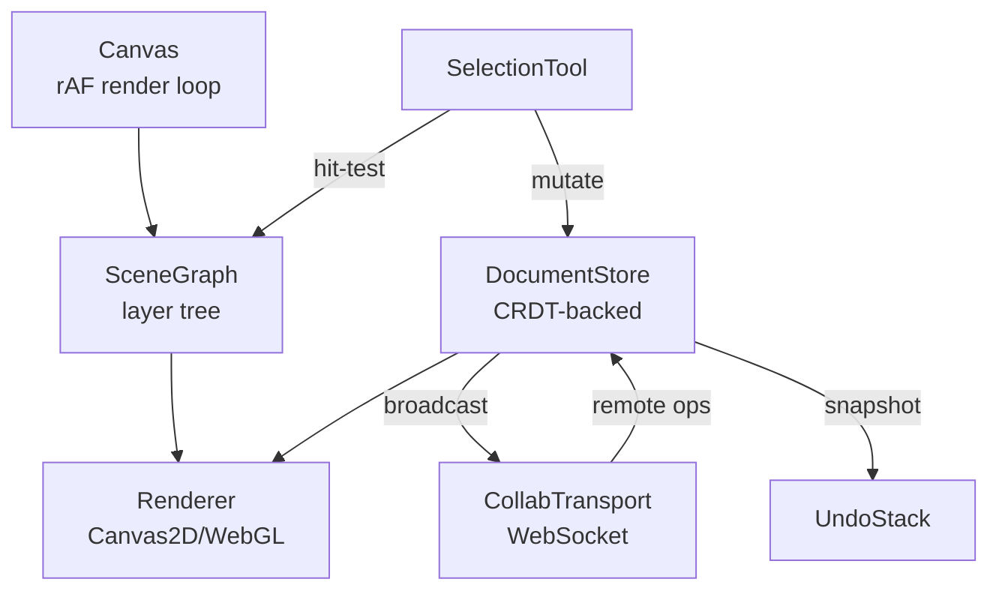
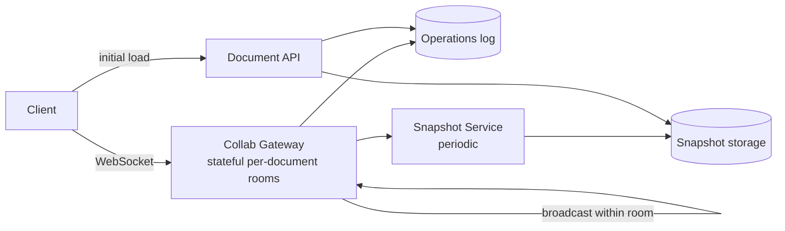

## Overview

- **Real-world analog:** Figma, Canva, Excalidraw — a canvas-based editor with layers.
- **Difficulty:** Hard · **Asked at:** Figma-style companies, GreatFrontEnd bank.
- The core challenge isn't drawing shapes — it's rendering potentially thousands of objects at 60fps while multiple people edit the same document at once, and making undo/redo, hit-testing, and real-time collaboration all agree on exactly the same notion of "what does this document currently contain."

## Clarifying Questions & Requirements

> **Ask these first:**
> 1. Real-time multiplayer collaboration in scope for this pass, or single-user first with collaboration as an extension?
> 2. Vector shapes only, or also raster (image) layers and text with rich formatting?
> 3. What's the target scene complexity — hundreds of objects, or tens of thousands (a genuinely different rendering-technology decision)?
> 4. Export requirements — just an image snapshot, or a structured format (SVG/PDF) preserving the layer structure?

| | In scope | Out of scope |
|---|---|---|
| **Functional** | Shape/text tools, layers, transforms (move/resize/rotate), pan/zoom, undo/redo, multiplayer presence + editing, export | Vector boolean operations (union/subtract), plugin/extension APIs, version history browsing UI |
| **Non-functional** | Smooth interaction (60fps drag/resize) up to a stated scene-complexity target; concurrent edits never silently overwrite each other | Offline-first multiplayer merge across days-long disconnection (a valid deep-dive extension) |

## ── FRONTEND TRACK (RADIO) ──

### R — Requirements

| | Requirement | Why it's not optional |
|---|---|---|
| **Functional** | Shape/text creation, a real layer model (z-order, grouping), transforms, pan/zoom, undo/redo, multiplayer cursors/presence | Each of these interacts with the others — undo has to know about layer order changes, multiplayer has to know about undo, none of this is independently addable later without rework |
| **Non-functional** | Dragging/resizing an object stays visually smooth (effectively 60fps) even with hundreds of other objects on the canvas | This is the single requirement that decides the whole rendering-technology choice below — it's not a polish pass, it's foundational |
| **Non-functional** | Two users editing the same object at once never silently lose one person's change | The entire value proposition of a multiplayer design tool collapses if edits can be silently dropped |
| **Non-functional** | Undo/redo behaves correctly even with multiple collaborators making changes concurrently | A local-only undo stack that ignores remote changes produces confusing, wrong results the instant a second person is in the document |
| **Non-functional** | Precise hit-testing (click exactly the shape you meant, even when shapes overlap or are tiny at the current zoom level) | Object selection is the single most frequent interaction in the whole app — if it's imprecise, everything downstream feels broken |

### A — Architecture



- **The `SceneGraph` is the layer tree — the single structure everything else reads from.** The renderer walks it to draw; the selection tool walks it (in reverse z-order) to hit-test; the collab layer applies remote operations directly to it. There is deliberately no separate "React component per shape" tree mirroring it — at scene sizes in the thousands of objects, driving rendering through React's reconciliation for every shape is a real performance liability, not a style preference.
- **`DocumentStore` is CRDT-backed**, not a plain mutable object, specifically because it has to merge concurrent remote edits without a central arbiter deciding whose edit "wins" — see Deep Dives for why this is the load-bearing decision in the whole architecture, not an implementation detail.
- A sketch of the render loop's actual responsibility — this is the piece a shallow answer collapses into "use `<canvas>`":

```ts
function renderLoop(scene: SceneGraph, ctx: CanvasRenderingContext2D, viewport: Viewport) {
  requestAnimationFrame(() => {
    if (scene.isDirty) {
      ctx.clearRect(0, 0, viewport.width, viewport.height);
      ctx.save();
      ctx.translate(-viewport.x, -viewport.y);
      ctx.scale(viewport.zoom, viewport.zoom);
      for (const node of scene.visibleNodesInViewport(viewport)) {
        node.draw(ctx); // only nodes actually within the current viewport are drawn at all
      }
      ctx.restore();
      scene.isDirty = false;
    }
    renderLoop(scene, ctx, viewport);
  });
}
```

`visibleNodesInViewport` matters as much as the draw call itself — culling objects outside the current viewport before drawing is what keeps frame time bounded as document size grows, rather than growing linearly with total object count.

### D — Data Model

| | Owner | Example |
|---|---|---|
| **Server state** | The authoritative, merged document (via CRDT), persisted history | Every client's local document converges to this over time |
| **Client state** | Current selection, tool mode, viewport (pan/zoom), local-only drag preview before commit | Selection and viewport are inherently per-user, never shared/synced |

```ts
type SceneNode = {
  id: string;                 // globally unique, stable across collaborators
  type: 'rect' | 'ellipse' | 'text' | 'group';
  transform: { x: number; y: number; rotation: number; scaleX: number; scaleY: number };
  parentId: string | null;    // null = top-level; layer order is sibling array order
  props: Record<string, unknown>;
};

type Operation =
  | { type: 'create'; node: SceneNode }
  | { type: 'update'; id: string; patch: Partial<SceneNode> }
  | { type: 'delete'; id: string }
  | { type: 'reorder'; id: string; newIndex: number };
```

> **Key insight:** every mutation to the document is expressed as an `Operation`, never a direct mutation of the scene graph in place. This is what makes both undo/redo *and* multiplayer sync possible from the same mechanism — an operation can be applied locally, broadcast to collaborators, recorded in the undo stack, and replayed during CRDT merge, all as the exact same object.

### I — Interface / API

**Component API**

```
<Canvas scene={SceneGraph} viewport={Viewport} onOperation={(op: Operation) => void} />
<LayersPanel tree={SceneNode[]} onReorder={(id, newIndex) => void} onSelect={(id) => void} />
<PresenceCursors remoteUsers={RemoteUser[]} />
<Toolbar activeTool={ToolType} onToolChange={(t: ToolType) => void} />
```

**Network API** — the shared contract with the backend track below:

| Action | Transport | Shape |
|---|---|---|
| Apply operation | WebSocket event | `{ type: 'op', op: Operation, clientId }`, broadcast to all collaborators |
| Presence/cursor | WebSocket event | `{ type: 'presence', userId, cursor: {x,y}, selection: string[] }`, fire-and-forget |
| Load document | `GET /documents/:id` | Full current CRDT state (or a recent snapshot + operation log to replay) |
| Persist checkpoint | `POST /documents/:id/snapshot` | Server periodically snapshots the merged CRDT state so a fresh client doesn't replay the entire operation history from the beginning |

### O — Optimizations

**Performance**
- Viewport culling (the render-loop sketch above) so frame cost scales with what's actually visible, not total document size.
- Batch rapid operations during a drag into one committed operation on drag-end, rather than broadcasting/undo-stacking every intermediate mouse-move position — see Deep Dives.
- Prefer Canvas2D for the common case and only reach for WebGL if the target scene complexity (per the clarifying question) genuinely demands GPU-accelerated compositing — WebGL brings real complexity cost that isn't worth paying by default.

**Accessibility**
- Every tool and object has a keyboard-accessible equivalent path (arrow keys to nudge a selected object, Tab to cycle selection) — a canvas-based UI is otherwise close to invisible to assistive technology by default, and this is a real, known gap in this product category worth naming explicitly rather than glossing over.
- The layers panel (a real DOM tree, not canvas-rendered) is the accessible primary way to navigate document structure for anyone not using a mouse.

**Networking**
- Presence/cursor updates are fire-and-forget and heavily throttled (a few updates per second, not per mousemove event) — they're inherently lossy and don't need reliability.
- Document operations, in contrast, are never dropped — they go through the same reliable-broadcast path the backend track's CRDT sync relies on.

**Resilience**
- A dropped WebSocket doesn't lose local edits — operations queue locally and merge on reconnect, the same CRDT-merge mechanism handling both real-time collaboration and reconnect-catchup with no separate code path.
- Periodic local snapshotting to IndexedDB means a crashed tab can recover an in-progress document on reload, even before the network round-trip to the server completes.

### Frontend Deep Dives

**1. Why CRDTs, not Operational Transformation, for this specific shape of state.** Both CRDTs and OT solve "merge concurrent edits without a central lock," but they fit different data shapes. OT is a strong fit for linear text (the collaborative-document question in this bank uses it, or a CRDT, as a direct comparison point) because edits are naturally positional (insert at index N). A design tool's state is a *tree* of independent objects with properties, transforms, and z-order — a CRDT with per-object, per-property last-writer-wins-or-merge semantics (e.g., a Yjs-style map of maps) fits this shape more directly, because most conflicts here are "two people changed different properties of different objects," which merges trivially, rather than "two people typed at the same character position," which is OT's actual hard case.

**2. Batching a drag into one operation without losing 60fps responsiveness.** A shape drag generates a mouse-move event, and therefore a position update, dozens of times per second. Broadcasting and undo-stacking every one of those would flood the network and produce an undo stack where one drag requires dozens of undo presses to fully reverse. Fix: local rendering updates on every frame for visual smoothness, but the actual `Operation` broadcast to collaborators and pushed onto the undo stack is a single `update` committed on drag-end (mouse-up) — intermediate frames are ephemeral local-only render state, never operations.

```ts
function onDragMove(nodeId: string, newTransform: Transform) {
  scene.setLocalPreview(nodeId, newTransform); // render immediately, every frame
}
function onDragEnd(nodeId: string, finalTransform: Transform) {
  const op: Operation = { type: 'update', id: nodeId, patch: { transform: finalTransform } };
  documentStore.commit(op); // this is the one thing that gets broadcast + undo-stacked
}
```

**3. Precise hit-testing at arbitrary zoom levels, including for rotated/scaled shapes.** A shape rotated 30° and scaled non-uniformly doesn't have an axis-aligned bounding box that matches its visual outline — naive rectangle-based hit-testing either misses valid clicks near the shape's corners or falsely hits empty space near them. Fix: hit-testing transforms the click point into the shape's *local* coordinate space (inverting the shape's own transform matrix) before testing against its untransformed geometry, rather than transforming the shape's geometry into world space on every hit-test — cheaper, and correct for rotation/scale/skew uniformly.

### Frontend Bottlenecks & Tradeoffs

| Bottleneck | Mitigation | Tradeoff accepted |
|---|---|---|
| Rendering thousands of objects every frame | Viewport culling — only draw what's visible | Objects far off-screen effectively "don't exist" for a frame's rendering cost, which is exactly the intended tradeoff |
| One operation broadcast per mouse-move during a drag | Local-only preview during drag, one committed operation on drag-end | Remote collaborators see a shape "jump" to its final position rather than animate through the drag — an accepted, common tradeoff in this product category |
| CRDT metadata overhead per object property | Accept a real memory/bandwidth cost per object for merge correctness | Slightly larger documents in exchange for a real guarantee no concurrent edit ever gets silently dropped |

## ── BACKEND TRACK ──

### Requirements & Scope

- Durable document storage, real-time operation broadcast to all connected collaborators, CRDT merge persistence, periodic snapshotting to bound replay cost.
- Must never lose an operation a client successfully sent, even across a server restart or a client's brief disconnect.

### Scale & Estimation

| | Estimate |
|---|---|
| Concurrent documents being actively edited | 500K at peak |
| Avg collaborators per active document | 3 |
| Peak operations/sec across the system | ~500K docs × 3 users × ~2 ops/sec (during active editing) ≈ **~3M ops/sec** at absolute peak across all documents — but per-document, rarely more than a few ops/sec, which matters for how this shards |
| Document size | Typically thousands of nodes; a few MB of operation history before snapshotting |
| Read:write ratio | Roughly balanced during active collaborative editing — this is a genuinely write-heavy workload compared to most of the other questions in this bank |

### API Design

```
GET  /documents/:id                      → {snapshot, opsSince: Operation[]}
WS   op       {op: Operation, clientId}   → broadcast to all connected collaborators on this document
WS   presence {userId, cursor, selection} → fire-and-forget broadcast, not persisted
POST /documents/:id/snapshot              → server-triggered periodic checkpoint
```

- The per-document nature of this workload (not a global feed) means the WS Gateway's fan-out here is naturally scoped to "everyone currently in this one document" — a much smaller, cheaper fan-out than the chat question's large-group case.

### Data Model & Storage

```
documents
  id PK, owner_id, latest_snapshot_ref, snapshot_at, updated_at

operations
  id PK, document_id (indexed), op jsonb, applied_at, client_id
  -- append-only log; never updated or deleted, only appended and eventually compacted after a snapshot

document_collaborators
  document_id, user_id, role
```

| Choice | Why |
|---|---|
| **Operations stored as an append-only log per document, separate from the snapshot** | A fresh client (or one reconnecting after a long gap) loads the latest snapshot plus only the operations since it, rather than replaying the document's entire history from creation — this is the same "snapshot + delta" pattern the email question's sync design uses, applied to CRDT operations instead of mailbox changes |
| **`operations` indexed by `document_id`, not a global sequence** | Documents are edited independently; a global ordering across all documents in the system is never actually needed, so per-document indexing is both simpler and shards more naturally |
| **Periodic snapshotting rather than snapshotting on every operation** | Snapshotting is relatively expensive (serializing merged CRDT state); doing it on a schedule (or after N operations) bounds replay cost for new joiners without paying the snapshot cost on every single edit |

### High-Level Architecture



- Unlike the chat question's stateless gateway, this **Collab Gateway is deliberately stateful, organized into per-document "rooms."** All collaborators on the same document connect to (or get routed to) the same gateway instance holding that document's in-memory merged state, because broadcasting an operation to "everyone in this document" is cheap and simple when they're co-located on one instance, versus needing a cross-instance pub/sub for every single operation.

### Deep Dives

**1. Operation ordering and merge correctness under concurrent edits.** Two collaborators edit different properties of the same object at nearly the same instant; a third edits an unrelated object. The server must apply all three in a way that every client eventually converges to the identical final state, regardless of the order operations happened to arrive in. Fix: this is exactly what the CRDT merge algorithm guarantees by construction — operations are commutative and associative by design (per-property merge rather than whole-object last-writer-wins), so the server (and every client) can apply them in *any* order and reach the same result — the server's role is reliable broadcast and durable logging, not being the arbiter of merge order the way the chat question's server is the arbiter of message sequence.

**2. Bounding replay cost for a document with years of edit history.** Without snapshotting, a document edited daily for two years has millions of logged operations, and a new collaborator joining would have to replay all of them to reconstruct current state. Fix: periodic snapshotting (the Snapshot Service above) persists the fully-merged CRDT state at intervals, and the operations log is compacted/archived for anything older than the latest snapshot — a joining client only ever needs the latest snapshot plus the (small) number of operations since it.

**3. Room-based gateway failover.** If the gateway instance holding a document's active "room" crashes, every collaborator on that document loses their live connection simultaneously. Fix: on disconnect, clients reconnect and re-join the document's room on any available gateway instance, which reconstructs the room's in-memory state from the latest snapshot plus the operations log since it (the exact same recovery path a brand-new joiner uses) — room state is a rebuildable cache of durable storage, never the only copy of anything.

### Bottlenecks & Tradeoffs

| Bottleneck | Mitigation | Tradeoff accepted |
|---|---|---|
| Stateful per-document rooms concentrating load on one gateway instance for a very popular/large document | Cap practical collaborator count per document (a real, common product constraint in this category) | Documents beyond a certain collaborator count need a different, more distributed architecture not covered by this base design |
| Operations log growing unboundedly | Periodic snapshot + compaction of older operations | Reconstructing "document state at an arbitrary point in the far past" requires archived data, not just the live log |
| CRDT metadata overhead in storage at scale | Accept the storage cost as the price of correctness | Larger storage footprint per document than a naive "just store current state" model would use |

## The Shared Contract

- **Ownership boundary:** the CRDT merge algorithm itself is the actual authority on final state, not the server acting as an arbiter — the server's real job is reliable broadcast, durable append-only logging, and periodic snapshotting, which is a genuinely different backend role than the chat question's sequence-assigning server.
- **Real-time transport:** WebSocket, for the same reason as chat — this is genuinely bidirectional, low-latency traffic (every collaborator both sends and receives operations continuously).
- **Consistency model:** eventually consistent across collaborators during live editing (a brief window where two clients can show slightly different intermediate states), converging to identical state once all operations have propagated and merged — both tracks explicitly accept this rather than pretending the system is strongly consistent moment-to-moment.
- **Error propagation:** a failed operation broadcast (e.g., a momentary disconnect) is retried by the same reconnect-and-catch-up path used for any reconnect, not a distinct error-handling code path — there's no separate "operation failed" UI state, because the CRDT merge model makes a delayed-but-eventually-applied operation indistinguishable from a slow one.

## Interview Signals

| | Strong answer | Weak answer |
|---|---|---|
| **Frontend** | Justifies Canvas2D vs. WebGL against a stated scene-complexity target, and batches drag operations rather than broadcasting every mouse-move | Reaches for WebGL by default without justifying it against actual requirements |
| **Backend** | Explains why CRDTs let the server avoid being a merge arbiter, unlike the chat question's sequence-assigning server | Tries to apply the chat question's "single authoritative sequence" pattern here, missing that this workload's concurrency shape is different |
| **Both** | Explicitly compares CRDT vs. OT and picks based on the actual data shape (tree of objects vs. linear text) | Picks one without discussing why it fits this specific problem better than the alternative |

**Common failure modes:** defaulting to WebGL without justification; broadcasting every mouse-move as a separate operation; assuming a single global operation sequence is needed (it isn't — CRDTs are explicitly designed to avoid that requirement); forgetting keyboard accessibility for a canvas-based UI.

## Glossary Links

This question draws on: RADIO framework, WebSocket, presence, consistency model — each linked on first mention above.

## Proposed Glossary Additions

- **CRDT (Conflict-free Replicated Data Type)** — a data structure designed so concurrent, independently-applied updates always merge to the same final state regardless of arrival order, without a central coordinator. Used here and directly relevant to the collaborative-document/spreadsheet questions later in this bank; a strong candidate for a real registry entry given how many upcoming questions will reference it.
- **Operational Transformation (OT)** — the alternative to CRDTs for merging concurrent edits, historically dominant for linear text editing (transforming one edit's position relative to another's), contrasted directly with CRDTs in Deep Dive 1 above.
