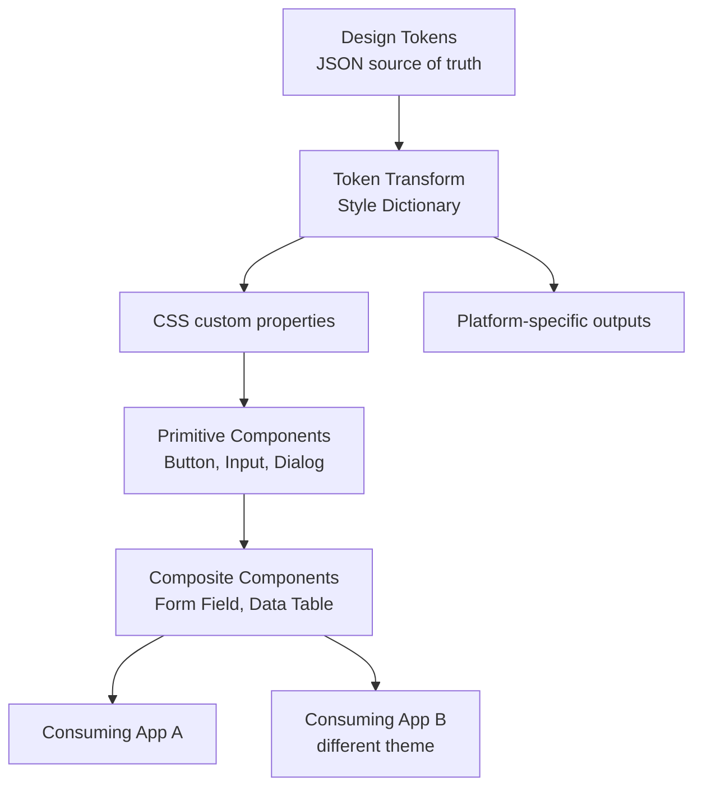
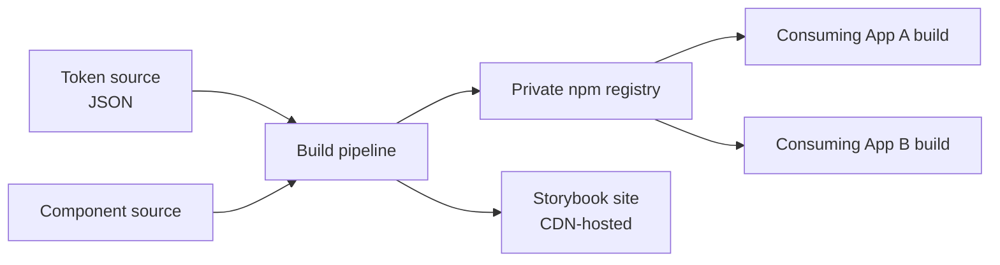

## Overview

- **Real-world analog:** a shared component library used across many product teams, like Meta's or Stripe's internal design systems.
- **Difficulty:** Medium-Hard · **Asked at:** Meta, Stripe, Airbnb, any large org with more than a couple of product teams.
- The core challenge isn't building a `<Button>` — it's building one that dozens of teams can theme, extend, and depend on for years without either becoming a bottleneck (every change needs the design-system team) or fragmenting into inconsistent forks.

## Clarifying Questions & Requirements

> **Ask these first:**
> 1. Single product, or multiple products/brands that need different visual themes on the same underlying components?
> 2. Is this a from-scratch library, or wrapping/standardizing existing per-team components that already exist and diverge?
> 3. How many consuming teams, and do they ship on independent release cadences (affects versioning strategy)?
> 4. Does accessibility compliance (WCAG AA) need to be guaranteed by the library itself, or is it left to each consuming team?

| | In scope | Out of scope |
|---|---|---|
| **Functional** | Themeable primitive components, design tokens, documentation site, versioned distribution | A visual design tool/Figma plugin, a full page-builder |
| **Non-functional** | Consistent behavior/accessibility across every consuming app; a breaking change doesn't silently break consumers | Zero-downtime migration for every possible breaking change (some genuinely require consumer code changes) |

## ── FRONTEND TRACK (RADIO) ──

### R — Requirements

| | Requirement | Why it's not optional |
|---|---|---|
| **Functional** | A themeable primitive layer (Button, Input, Dialog, etc.) built on design tokens, not hardcoded values | Without tokens, "support dark mode" or "support a second brand" means touching every component individually |
| **Functional** | Accessible by default — keyboard nav, ARIA roles, focus management built into the primitive, not bolted on by each consumer | If accessibility depends on every consuming team remembering to add it, it will be inconsistently missing |
| **Non-functional** | Tree-shakeable — a consumer using one component shouldn't ship the whole library's JS | A design system used by dozens of teams has real bundle-size stakes at that scale |
| **Non-functional** | A breaking change has a real migration path, not just a changelog entry | The cost of a badly-managed breaking change is multiplied by every consuming team, simultaneously |

### A — Architecture



- **Tokens are the actual single source of truth**, not a convention — authored once (JSON/YAML), transformed into CSS custom properties (and any other platform's native format) by a build step, never hand-duplicated per platform. This is the same duplication-drifts-silently reasoning the backend track applies to database schema — one source, generated outputs, never manually kept in sync.
- **Headless/primitive architecture**: the logic (focus management, keyboard handling, ARIA wiring) lives in an unstyled primitive; visual styling is a thin, swappable layer on top. This is what lets two consuming apps use the *same* accessible `<Dialog>` behavior with completely different visual themes, rather than forking the component to re-theme it.

```ts
// The headless primitive owns behavior; styling is injected via className/tokens, not hardcoded.
function useDialog({ open, onClose }: { open: boolean; onClose: () => void }) {
  const ref = useRef<HTMLDivElement>(null);
  useFocusTrap(ref, open);          // keyboard focus never escapes while open
  useEscapeKey(onClose, open);
  useRestoreFocusOnClose(open);     // returns focus to the trigger element on close
  return { dialogProps: { ref, role: 'dialog', 'aria-modal': true } };
}
```

### D — Data Model

This question's "data model" isn't user-facing app state — it's the **token and versioning model** the library itself is built from:

```ts
type Token = {
  name: string;              // 'color-primary-action'
  value: string | Token;     // raw value, or a reference to another token (semantic → primitive)
  tier: 'primitive' | 'semantic' | 'component';
};

type Theme = {
  name: 'light' | 'dark' | 'brand-b';
  overrides: Record<string, string>;  // only the tokens this theme changes from the default
};
```

> **Key insight:** a theme is a *diff* against the default token set, not a full independent copy — this is what makes adding a third brand cheap (override the handful of tokens that actually differ) instead of expensive (maintain three complete, independently-drifting token files).

### I — Interface / API

**Component API — composition over configuration, for anything non-trivial:**

```
// Configurable — fine for a small, closed set of variants
<Badge variant="success" size="sm" />

// Composable — necessary once the internal structure varies too much for a flat prop list
<Card>
  <Card.Header>Title</Card.Header>
  <Card.Body>...</Card.Body>
  <Card.Footer><Button>Action</Button></Card.Footer>
</Card>
```

**Distribution API** — the shared contract with the backend track below:

| Consumer action | Mechanism | Shape |
|---|---|---|
| Install a version | `npm install @org/design-system@^4.2.0` | Semver-respecting range, not a pinned exact version by default |
| Theme an app | `<ThemeProvider theme={brandBTheme}>` wrapping the app root | React context, or CSS custom property injection for non-React consumers |
| Get documentation | Storybook site, one build per published version | Static site, versioned alongside the package |

### O — Optimizations

**Performance**
- Tree-shakeable exports (`export { Button } from './Button'`, not a single barrel that re-exports everything eagerly with side effects) so a consumer importing one component doesn't pull in the whole library.
- Ship CSS as scoped, minimal per-component styles, not one giant global stylesheet every consumer pays for regardless of what they use.

**Accessibility**
- Every interactive primitive ships with real keyboard support and correct ARIA roles built in, verified by automated tests (axe) in the library's own CI — accessibility is a library-level guarantee, not something each consuming team re-derives.

**Networking**
- Documentation/Storybook site is statically generated and CDN-served — no reason for a docs site with this update frequency to be server-rendered per request.

**Resilience**
- A component that fails to receive a theme (no `ThemeProvider` in the tree) falls back to sane default token values rather than rendering unstyled or throwing — a missing theme provider shouldn't be a hard crash for a consumer that forgot to wrap their app.

### Frontend Deep Dives

**1. Composability vs. configurability, and when each breaks down.** A small, closed set of variants (a badge's color) is fine as flat props. A component whose internal structure genuinely varies (a card that sometimes has a footer, sometimes has an image, sometimes has both in different orders) breaks down into a combinatorial explosion of boolean props if forced into the configurable shape — `showFooter`, `showImage`, `imagePosition`, and their untested cross-product. The compound-component pattern (`<Card.Header>`, `<Card.Body>`) sidesteps the explosion by letting the consumer assemble the specific shape they need from parts that are each individually simple, at the cost of slightly more verbose call sites.

**2. Theming that supports both light/dark *and* multiple brands, without a combinatorial token explosion.** Naively, N brands × 2 themes means 2N complete token sets to maintain. The fix is layering: a brand overrides only its accent/identity tokens; light/dark overrides only the surface/text tokens; the two axes compose independently rather than requiring a fully-materialized token set per combination — `resolveTokens(brand, mode)` merges brand overrides on top of mode overrides on top of defaults, computed at theme-application time, not authored as N×2 static files.

**3. Preventing design-code drift at scale.** The single hardest ongoing problem for any design system, covered in this app's own Design for Engineers course in depth: a component's Figma version and its coded version diverge silently over time. The concrete frontend-owned defenses: a lint rule flagging hardcoded colors/spacing that should be token references, and treating the live Storybook (not a static Figma file) as the actual shared source of truth both designers and engineers point to.

### Frontend Bottlenecks & Tradeoffs

| Bottleneck | Mitigation | Tradeoff accepted |
|---|---|---|
| A flat-prop component's variant combinations grow combinatorially | Switch to composition (compound components) once the matrix gets too large | Slightly more verbose consumer call sites, in exchange for eliminating untested prop combinations entirely |
| N brands × 2 modes = a token-maintenance explosion | Layer brand and mode as independent, composable override sets | A small amount of runtime resolution cost per theme application, negligible in practice |
| A breaking change to a primitive used by every consuming team | Semver-disciplined releases + codemods for mechanical migrations | Real engineering investment in the migration tooling itself, which pays for itself the first time a major version ships |

## ── BACKEND TRACK ──

*(This is the lightest backend track in this course, per the task's own depth-calibration rule — a design system's "backend" is a build/distribution pipeline, not a runtime service with traffic and scale.)*

### Requirements & Scope

- Build, version, and distribute a package that many consuming applications' own build pipelines pull in — no request-serving runtime of its own.

### Scale & Estimation

| | Estimate |
|---|---|
| Consuming teams | 40-plus, on independent release schedules |
| Publish frequency | Several times/week (patches), monthly-ish for minors, rarely for majors |
| Package size budget | A hard, tracked ceiling (e.g. under 50KB gzipped for the core primitives) — bundle size is the actual "traffic" concern here, not requests/sec |

### API Design

Not a network API — the "API" here is the **package's public interface contract**:

```
@org/design-system
  exports: Button, Input, Dialog, Card, ThemeProvider, tokens
  peerDependencies: react ^18 || ^19   -- single React instance requirement
  semver: strict — patch=fix, minor=additive, major=breaking only
```

### Data Model & Storage

- **Storage is a private npm registry** (or a monorepo internal package), not a database — the "schema" is the token JSON files and the component source tree, version-controlled like any other code.
- **Storybook build artifacts** are stored per-published-version so documentation for an older version a slow-to-upgrade team still uses remains available, not overwritten by the latest docs build.

| Choice | Why |
|---|---|
| Monorepo distribution (single repo, multiple published packages) over many separate repos | Coordinated changes across tokens/primitives/composites can land in one atomic commit and one CI run, instead of a multi-repo release dance |
| Codemods shipped alongside major version releases | Turns a breaking change from "every team manually finds and fixes call sites" into "run one script" |

### High-Level Architecture



- There's no request-time "server" in the traditional sense — the entire system is a build-time dependency, which is precisely why this track is proportionately lighter than an application question's backend track.

### Deep Dives

**1. Versioning discipline at real organizational scale.** A breaking change to a widely-adopted primitive doesn't cost one team a migration — it costs every consuming team, simultaneously. Strict semver (patch/minor/major with major reserved genuinely for breaking changes) plus a real deprecation window (old API still works, with a console warning, for at least one full minor cycle before removal) is what keeps a large org from either freezing on an old version forever or being blindsided by breaking changes.

**2. The contribution-model tradeoff.** A fully centralized model (only the design-system team can change primitives) maximizes consistency but becomes a bottleneck that pushes teams to quietly fork rather than wait. A fully open-contribution model scales better but risks inconsistent quality. Most systems at this scale land on a hybrid: the core team tightly owns the primitive layer, while composite/pattern components accept real outside contribution through an RFC-style review process.

### Bottlenecks & Tradeoffs

| Bottleneck | Mitigation | Tradeoff accepted |
|---|---|---|
| Design-system team becomes a bottleneck for every change | Hybrid contribution model — tight ownership of primitives, open contribution for composites | Slightly less consistent quality on composite components, in exchange for not blocking every team on a small core team's queue |
| A breaking change lands with no warning | Deprecation window + codemods | Slower to fully remove old APIs, in exchange for consuming teams never being blindsided |

## The Shared Contract

- **The "API" is a package contract, not a network endpoint** — versioned via semver, distributed via a registry, consumed at build time rather than request time.
- **Ownership boundary:** the design-system team owns the primitive layer's behavior and accessibility guarantees; consuming teams own how they theme and compose those primitives into their own product surfaces.
- **Migration path as part of the contract:** a major version isn't "done" until its codemod exists — the deprecation/migration tooling is as much a deliverable as the new component API itself.

## Interview Signals

| | Strong answer | Weak answer |
|---|---|---|
| **Frontend** | Explains headless/primitive separation and when composition beats configuration | Describes a component library as "a folder of styled components" with no architectural reasoning |
| **Backend** | Recognizes this track is fundamentally build/distribution, not a runtime service, and reasons about versioning at organizational scale | Tries to force a traditional request-serving backend architecture onto a problem that doesn't have one |
| **Both** | Treats adoption rate and migration cost as the real success metrics | Treats "the components exist and look nice" as sufficient |

**Common failure modes:** designing components before establishing the token layer underneath them; no real answer for how a breaking change gets rolled out; conflating "we have a component library" with "teams actually use it consistently."

## Glossary Links

This question draws on: RADIO framework — each linked on first mention above. See Proposed glossary additions for design token, headless component, and tree-shaking.
