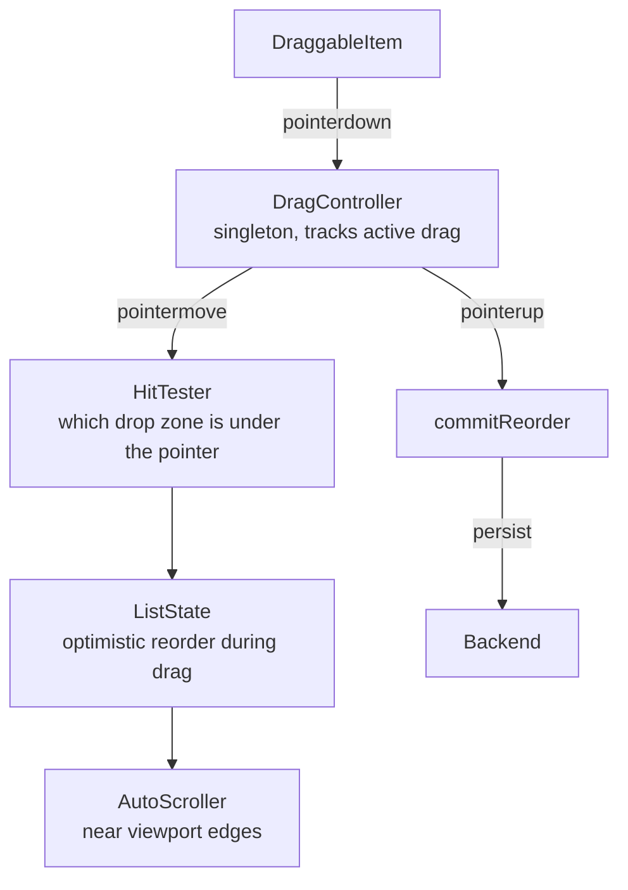

## Overview

- **Real-world analog:** Trello boards, file uploaders, list reordering.
- **Difficulty:** Medium-Hard · **Asked at:** Meta, Atlassian-style product companies.
- The core challenge is that drag-and-drop is fundamentally a pointer-tracking and spatial-reasoning problem dressed up as a UI feature — the hard parts are almost entirely how you compute "what's under the cursor right now" and "what should the final order be," not the visual drag effect itself.

## Clarifying Questions & Requirements

> **Ask these first:**
> 1. Reordering within one list, moving between multiple lists (Trello-style columns), or both?
> 2. Does it need to work on touch devices, and if so, does that change the interaction model (long-press to initiate, vs. immediate drag on desktop)?
> 3. Is the final order persisted immediately per drop, or batched/saved explicitly later?
> 4. Does it need keyboard-operable reordering as a first-class path, not just a mouse/touch fallback?

| | In scope | Out of scope |
|---|---|---|
| **Functional** | Single-list reorder, cross-list move, drop-target detection, auto-scroll near viewport edges, keyboard DnD | Free-form 2D canvas dragging (that's closer to the Design Tool question elsewhere in this bank), multi-select drag of several items at once |
| **Non-functional** | Reordering feels immediate (no visible lag between drag position and visual feedback); never desyncs from the persisted order | Physically-accurate drag momentum/inertia matching a native OS |

## ── FRONTEND TRACK (RADIO) ──

### R — Requirements

| | Requirement | Why it's not optional |
|---|---|---|
| **Functional** | Draggable items, drop targets, visual drag preview, auto-scroll, keyboard-operable alternative | Keyboard DnD specifically is a frequently-missed, frequently-tested accessibility requirement in real interviews |
| **Non-functional** | The visual order during drag always matches what will actually persist on drop — no "it looked reordered but then snapped back wrong" | This is the actual correctness bar for the whole feature |
| **Non-functional** | Works acceptably on touch, where there's no native `mouseover`-style "what's under the cursor" signal the same way desktop has | Touch handling is a genuinely different code path, not just an event-name swap |

### A — Architecture



- **`DragController` is a singleton**, not per-item state — exactly the same reasoning as `ConnectionManager` in the Chat/Messaging question: only one drag can be active at a time across the whole page, and centralizing it avoids every draggable item independently tracking overlapping, easily-desynced state.
- **`HitTester`** recomputes which drop zone the pointer is currently over on every `pointermove`, using actual DOM rects rather than relying on native `dragover`/`dragenter` events firing reliably across every browser and touch environment — see Deep Dives for why the HTML5 DnD API specifically is often *not* the right primitive here.

### D — Data Model

| | Owner | Example |
|---|---|---|
| **Client state** | The list's current order during drag (optimistic), which item is being dragged, current pointer position, active drop-target id | Recomputed continuously while dragging |
| **Server state** | The persisted, authoritative order | Written once on drop, read on load |

```ts
type DragState = {
  draggingItemId: string | null;
  sourceListId: string | null;
  overListId: string | null;
  overIndex: number | null; // where it would land if dropped right now
};

type ListState = {
  itemIdsByListId: Record<string, string[]>; // the ordered arrays reordering operates on
};
```

### I — Interface / API

```
<DraggableList
  listId={string}
  items={Item[]}
  onReorder={(newOrder: string[]) => void}
  onMoveItem={(itemId: string, fromListId: string, toListId: string, toIndex: number) => void}
/>
<DraggableItem item={Item} dragHandleProps={object} />
```

**Network API** — the shared contract with the backend track below:

| Action | Transport | Shape |
|---|---|---|
| Persist reorder | `PATCH /lists/:id/order` | `{ itemIds: string[] }` — the full new order, idempotent |
| Persist cross-list move | `PATCH /items/:id/move` | `{ toListId, toIndex }` |

### O — Optimizations

**Performance**
- Update the *visual* reorder (via CSS transforms on sibling items shifting to make room) on every `pointermove` without triggering React re-renders of the whole list on every pixel of movement — the drag-preview and sibling-shift feedback should be handled as directly as possible (transforms driven outside the normal render cycle, e.g. via refs) with the actual `ListState` array only committed on drop, not continuously during drag.
- Auto-scroll near viewport edges uses a `requestAnimationFrame` loop with scroll speed proportional to how close the pointer is to the edge, not a fixed-speed scroll that feels abrupt.

**Accessibility**
- A parallel keyboard interaction model: focus an item, a designated key (commonly Space) picks it up, arrow keys move it within/between lists, Space again drops it, Escape cancels — this is a genuinely different interaction model from pointer dragging, not an automatic byproduct of making the pointer version accessible.
- Live-announce reorder progress (`aria-live`) during keyboard-driven moves specifically — "Moved to position 3 of 7" — since a screen reader user has no visual feedback of where an item currently sits mid-move.

**Resilience**
- If the persist request fails after a drop, roll the list back to its pre-drag order and surface an error — an optimistic reorder that silently fails to persist leaves the UI showing an order the server never actually saved.

### Frontend Deep Dives

**1. Why the native HTML5 Drag and Drop API is often the wrong tool.** It looks like the obvious choice (`draggable="true"`, `dragstart`/`dragover`/`drop` events) but has real, well-known limitations: no native touch support at all (touch needs an entirely separate `pointer`/`touch` event implementation regardless), inconsistent custom drag-preview rendering across browsers, and awkward auto-scroll behavior. The common real-world answer — and the one reflected in the architecture above — is building on raw pointer events (`pointerdown`/`pointermove`/`pointerup`, which unify mouse and touch) and computing hit-testing manually via `getBoundingClientRect()` comparisons, rather than relying on the browser's native DnD event sequence. Naming this tradeoff explicitly, rather than defaulting to the native API without comment, is a real signal of having actually built this before.

**2. The reordering algorithm itself.** Given a dragged item's current pointer position and a list of sibling rects, determining the correct insertion index is a comparison problem, not a lookup:

```ts
function computeDropIndex(pointerY: number, siblingRects: DOMRect[]): number {
  for (let i = 0; i < siblingRects.length; i++) {
    const midpoint = siblingRects[i].top + siblingRects[i].height / 2;
    if (pointerY < midpoint) return i;
  }
  return siblingRects.length; // pointer is below every sibling — insert at the end
}
```

Comparing against each sibling's **midpoint**, not its top or bottom edge, is what makes the drop-target indicator flip to the correct side predictably as the pointer crosses each item — comparing against an edge instead produces a visibly jittery, inconsistent indicator near item boundaries.

**3. Auto-scroll interacting correctly with hit-testing.** While auto-scrolling near a viewport edge during a drag, sibling items' rects are continuously changing (the whole list is scrolling underneath a stationary pointer) — hit-testing has to re-run against *current* rects on every animation frame the scroll is active, not just on `pointermove`, since the pointer itself may not be moving at all while the content scrolls past underneath it. Missing this produces a drag that stops updating its drop-target indicator the moment auto-scroll kicks in, even though the visually-correct target is continuously changing underneath the cursor.

**4. Cross-list moves with different item shapes.** Moving an item between two lists that render it slightly differently (a compact card in one column, an expanded one in another) means the drag preview and the eventual dropped rendering aren't the same DOM node's visual state throughout — the drag preview has to be built as an independent, minimal representation (often just the item's title/thumbnail) rather than a literal live clone of the source list's rendering, or it looks visually broken mid-drag when dragged into a differently-styled target list.

### Frontend Bottlenecks & Tradeoffs

| Bottleneck | Mitigation | Tradeoff accepted |
|---|---|---|
| Native HTML5 DnD's lack of real touch support | Build on raw pointer events instead | More implementation work than using the native API as-is |
| Re-rendering the whole list on every `pointermove` | Drive visual sibling-shift via transforms/refs outside the render cycle, commit state only on drop | More imperative-feeling code than a fully declarative reorder |
| Hit-testing going stale during auto-scroll | Re-run hit-testing every animation frame while scroll is active, not just on pointer movement | Slightly higher CPU cost while actively auto-scrolling during a drag |
| Keyboard DnD as a genuinely separate interaction model | Build and test it as its own path, not an afterthought | Real added implementation and testing surface beyond the pointer-driven path |

## ── BACKEND TRACK ──

### Requirements & Scope

- Persist a list's item order (and cross-list moves) durably; this question has a genuinely light backend surface — the entire hard-problem weight is on the frontend track above.

### Scale & Estimation

| | Estimate |
|---|---|
| Writes | One per drop — bursty per active user, not sustained high-frequency (nobody drags continuously) |
| List size | Typically tens to low hundreds of items (a Trello column, a file list) — this isn't a big-data problem |

### API Design

```
PATCH /lists/:id/order        {itemIds: string[]}   -- full order, idempotent
PATCH /items/:id/move         {toListId, toIndex}    -- cross-list move
```

- Sending the **full new order** (not a single from-index/to-index pair) on reorder is deliberately simpler and more robust than trying to reconstruct a move operation server-side from partial information — it's idempotent (resending the same order is a no-op) and immune to the two sides' item-count or index assumptions ever drifting apart.

### Data Model & Storage

```
list_items
  id            uuid PK
  list_id       uuid, indexed
  position      float      -- fractional positioning, not integer index — see Deep Dives
  content       text / jsonb
```

| Choice | Why |
|---|---|
| **Fractional `position` (a float), not an integer index** | Inserting an item between positions 1 and 2 just needs a new value like 1.5 — no need to renumber every subsequent row, which a plain integer index would require on every single insert |

### High-Level Architecture

A single service backed by a normal relational store is sufficient — there's no real-time or fan-out component here unless multiple users are expected to see each other's reorders live (a genuinely different, harder requirement worth calling out explicitly as a scope question, closer to a lightweight version of the Collaborative Editor question, rather than assumed by default).

### Deep Dives

**1. Fractional positioning to avoid renumbering on every insert.** Storing item order as a plain integer index means inserting anywhere except the end requires shifting every subsequent item's index by one — an O(n) write for what should be a cheap, single-row operation. Fractional positioning (storing a float, computed as the midpoint between its new neighbors' positions on insert) makes a single insert a single-row write, at the cost of positions slowly needing periodic renormalization as repeated insertions between the same two neighbors produce increasingly precise (and eventually float-precision-limited) fractional values.

**2. Concurrent reorders from two devices/tabs.** If the same list can be reordered from two places near-simultaneously (even without live collaboration, e.g. a phone and a laptop), sending the full order idempotently (per the API Design above) means the *last* write wins outright — which is an acceptable, honestly-scoped answer for this question given collaboration is out of scope, but worth naming explicitly as a real, accepted limitation rather than silently ignoring the possibility.

### Bottlenecks & Tradeoffs

| Bottleneck | Mitigation | Tradeoff accepted |
|---|---|---|
| Integer-index reordering requiring O(n) row updates per insert | Fractional positioning | Periodic renormalization needed as float precision is exhausted by repeated insertions in the same gap |
| Concurrent reorders from multiple devices | Idempotent full-order writes, last-write-wins | No real conflict resolution — accepted given collaboration is explicitly out of scope |

## The Shared Contract

- **Transport:** plain REST — no real-time component unless live multi-user reordering is explicitly added to scope.
- **Ownership boundary:** the client owns the entire drag interaction and its optimistic visual state; the server's only responsibility is durably persisting whatever final order the client commits on drop.
- **Idempotency:** sending the full order (not a delta) on every persist call is what makes the write safely retryable without the two sides ever needing to agree on a shared understanding of "what changed" — directly reusing the **idempotency** concept from elsewhere in this bank, applied to a full-state-replace rather than a single-operation dedup key.

## Interview Signals

| | Strong answer | Weak answer |
|---|---|---|
| **Frontend** | Explicitly discusses why native HTML5 DnD is often skipped in favor of raw pointer events | Defaults to `draggable="true"` with no discussion of its touch/consistency limitations |
| **Frontend** | Builds keyboard DnD as a genuinely separate, tested interaction path | Treats accessibility as "add ARIA labels to the existing pointer implementation" |
| **Backend** | Names fractional positioning to avoid O(n) reindexing on insert | Uses a plain integer index and doesn't address the reindexing cost |
| **Both** | Correctly scopes backend depth as light, given the real complexity here is frontend-side | Invents unnecessary backend complexity for what's structurally a simple persistence problem |

**Common failure modes:** defaulting to native HTML5 DnD without addressing its touch limitations; comparing against sibling edges instead of midpoints, producing jittery drop indicators; using integer indices for order, causing expensive renumbering on every insert; treating keyboard DnD as an afterthought.

## Glossary Links

This question draws on: **Idempotency** (linked on first mention above), applied here to a full-state-replace write rather than a single-operation dedup key — a useful contrast to the term's other uses in this bank.

**Proposed glossary additions:** none — fractional positioning is a real, reusable pattern, but narrow enough to ordered-list persistence specifically that it's better added to the glossary if a future question in this bank needs it too, rather than introduced in isolation here.
