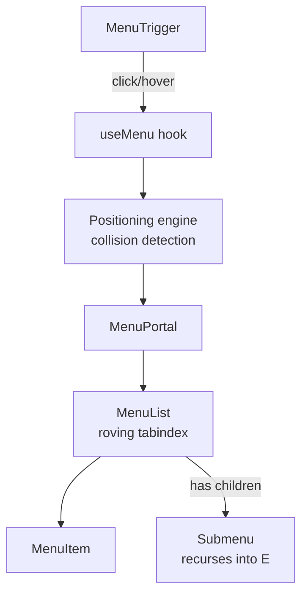

## Overview

- **Real-world analog:** Nav menus, action menus, context menus.
- **Difficulty:** Medium · **Asked at:** Meta, Amazon, GreatFrontEnd bank.
- The core challenge is positioning correctness (never rendering off-screen or overlapping its own trigger) combined with a genuinely different keyboard model than most components — arrow keys move a roving highlight, not the page focus.

## Clarifying Questions & Requirements

> **Ask these first:**
> 1. Single-level menu, or does it need nested submenus?
> 2. Click-to-open, hover-to-open (common in nav bars), or both depending on context?
> 3. Does it need type-ahead (typing "s" jumps to the next item starting with S)?
> 4. Is it ever used as a context menu (opens at cursor position on right-click) as well as an anchored dropdown?

| | In scope | Out of scope |
|---|---|---|
| **Functional** | Anchored positioning with collision handling, keyboard roving-tabindex, submenus, type-ahead | Drag-to-reorder menu items, menu items with rich embedded widgets (a mini date picker inside a menu item) |
| **Non-functional** | Never renders clipped by the viewport edge or hidden behind other content | Sub-pixel-perfect positioning parity with native OS context menus |

## ── FRONTEND TRACK (RADIO) ──

### R — Requirements

| | Requirement | Why it's not optional |
|---|---|---|
| **Functional** | Trigger, positioned panel, keyboard nav, click-outside/Escape close, optional submenus | The positioning and keyboard-model problems are genuinely hard even though the visual output looks simple |
| **Non-functional** | The panel repositions (flips above the trigger, shifts horizontally) when it would otherwise overflow the viewport | This is the single most commonly-tested "did you think about it" detail for this question |
| **Non-functional** | Only one item is ever part of the tab sequence at a time (roving tabindex), not every item | A menu with 20 items and 20 real tab stops is a keyboard-navigation failure, not a minor issue |

### A — Architecture



- Positioning is computed, not CSS-only — a pure CSS `position: absolute` approach can't detect viewport collision and flip sides; the positioning engine measures the trigger's and viewport's actual rects at open time (and on resize/scroll) and decides placement programmatically.
- `MenuList` owns exactly one piece of state — which item currently has the roving `tabindex="0"` — every other item gets `tabindex="-1"`, so Tab moves focus *out* of the whole menu in one step, while arrow keys move *within* it.

### D — Data Model

| | Owner | Example |
|---|---|---|
| **Client state** | Open/closed, computed position, currently-roving item index, type-ahead buffer | Entirely local/ephemeral |

```ts
type MenuState = {
  open: boolean;
  placement: 'bottom-start' | 'bottom-end' | 'top-start' | 'top-end'; // resolved, not requested
  activeIndex: number; // roving tabindex target
  typeaheadBuffer: string; // reset after a short timeout
};
```

### I — Interface / API

```
<Menu>
  <MenuTrigger>Actions</MenuTrigger>
  <MenuList>
    <MenuItem onSelect={() => void}>Edit</MenuItem>
    <MenuItem onSelect={() => void} disabled>Delete</MenuItem>
    <SubMenu label="Share">
      <MenuItem onSelect={() => void}>Copy link</MenuItem>
    </SubMenu>
  </MenuList>
</Menu>
```

Compound-component composition, not a flat `items={[]}` array prop — real menus commonly need per-item custom rendering (icons, disabled state, submenus), which a flat data-array API makes awkward.

There's no meaningful Network API — this is a pure UI primitive. Whatever a `MenuItem`'s `onSelect` triggers has its own, separate network concern.

### O — Optimizations

**Performance**
- Compute the menu's position only when it opens and on resize/scroll while open — not on every render — via `useLayoutEffect`, so the position is correct *before* the browser paints (avoiding a visible flash-then-jump to the correct position).
- Render the menu panel via a portal so its layout doesn't affect (or get affected by) the layout of wherever the trigger lives in the tree.

**Accessibility**
- `role="menu"`/`role="menuitem"` (or `role="menuitemcheckbox"` for toggleable items), `aria-haspopup`/`aria-expanded` on the trigger.
- Type-ahead: typing a letter jumps the roving focus to the next item whose label starts with it, cycling back to the top after the last match — a real, commonly-expected desktop-menu behavior, not an edge case.
- Escape closes the menu and returns focus to the trigger; if a submenu is open, Escape closes only the submenu first (mirrors the modal-stacking pattern from the Modal/Dialog question in this same bank).

### Frontend Deep Dives

**1. Collision detection and flipping.** The positioning engine needs the trigger's bounding rect, the intended panel's rect, and the viewport size, then decides: does the panel fit below the trigger (the default)? If not, flip to above. Does it fit aligned to the trigger's left edge? If not, shift or align to the right edge instead.

```ts
function computePlacement(triggerRect: DOMRect, panelSize: { width: number; height: number }) {
  const fitsBelow = triggerRect.bottom + panelSize.height <= window.innerHeight;
  const fitsRight = triggerRect.left + panelSize.width <= window.innerWidth;
  return {
    vertical: fitsBelow ? 'bottom' : 'top',
    horizontal: fitsRight ? 'start' : 'end',
  };
}
```

This has to be recomputed live (on open, and on scroll/resize while open, via `ResizeObserver`/scroll listeners) — a menu computed once at mount time and never revisited breaks the moment the page scrolls or the window resizes while it's open. Libraries like Floating UI/Popper exist specifically to handle this (plus edge cases like nested scroll containers) correctly, and naming one in an interview is a reasonable signal that you know this problem is well-trodden, not something to reinvent unless asked to.

**2. Roving tabindex with submenus.** A submenu complicates the roving-focus model: opening a submenu on hover or right-arrow needs to move the roving target *into* the submenu's item list, and closing it (left-arrow, or moving to a different top-level item) needs to move it back out and return focus correctly — this is a small tree of independent-but-coordinated roving-focus regions, not one flat list, and it's the part of this question that separates a working single-level menu from a genuinely complete one.

**3. Hover-intent vs. accidental mouse-over.** A menu that opens submenus purely on `mouseenter` opens and closes rapidly as a cursor merely passes over several sibling items on its way to somewhere else. The standard fix is a short intent delay (~150-300ms) before opening on hover, canceled if the cursor leaves before the delay elapses — click-to-open interactions skip this entirely and open immediately, since there's no ambiguity about intent.

### Frontend Bottlenecks & Tradeoffs

| Bottleneck | Mitigation | Tradeoff accepted |
|---|---|---|
| Position computed once, stale after scroll/resize | Recompute on open + scroll/resize listeners while open | A small amount of ongoing listener overhead while any menu is open |
| Every menu item as a real tab stop | Roving tabindex (one active item at a time) | Slightly more bookkeeping in `MenuList` to track and move the active index |
| Submenus opening/closing on every mouse pass-over | Hover-intent delay before opening | A deliberate ~150-300ms lag on hover-opened submenus |

## ── BACKEND TRACK ──

This is a pure frontend primitive with no backend component. Whatever a menu item's action triggers (a delete, a share) has its own backend concern entirely separate from the menu mechanism itself — there's nothing dropdown-menu-specific to design on the backend side.

## The Shared Contract

Not applicable — no client/server boundary exists for this component specifically.

## Interview Signals

| | Strong answer | Weak answer |
|---|---|---|
| **Frontend** | Explains collision detection as a *computed*, re-evaluated-on-scroll/resize concern, not a static CSS rule | Assumes `position: absolute` with fixed offsets is sufficient |
| **Frontend** | Distinguishes roving tabindex from "every item is independently focusable" | Gives every menu item a real, individual tab stop |
| **Backend** | Correctly says there's no real backend design surface here | Invents an unnecessary backend component |

**Common failure modes:** positioning via static CSS with no viewport-collision handling; making every menu item a real tab stop instead of using roving tabindex; opening submenus instantly on hover with no intent delay.

## Glossary Links

No existing glossary terms apply directly.

**Proposed glossary additions:** none — the hard problems here (collision detection, roving tabindex, hover-intent delay) are established, named UI-engineering patterns but narrow enough to this component family that a standalone glossary entry would be padding rather than genuinely reusable vocabulary for other questions in this bank.
