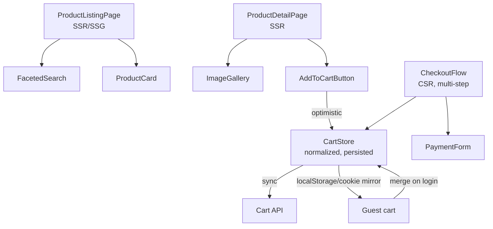
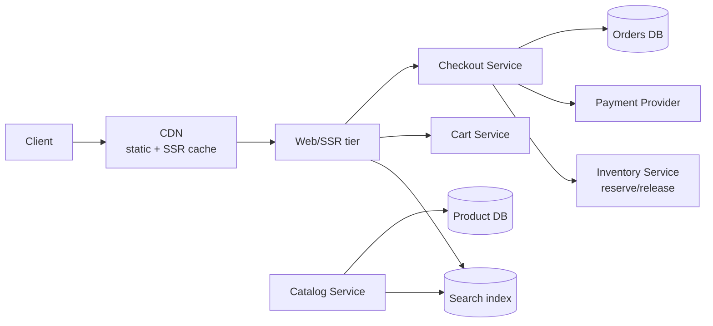

## Overview

- **Real-world analog:** Amazon, eBay — product listing, search, checkout.
- **Difficulty:** Medium · **Asked at:** Amazon (flagship), GreatFrontEnd bank.
- **Backend counterpart:** [E-Commerce Inventory Management](/backend-interviews/c/inventory-management) covers the reserve-then-confirm stock model and multi-channel sync behind this chapter's product/checkout UI.
- The core challenge isn't rendering a product page — it's rendering *the same* product page well for three different audiences at once: a search engine crawler that never runs JavaScript, a first-time visitor on a cold cache who needs it fast, and a returning shopper whose cart and personalization have to survive across devices and sessions.

## Clarifying Questions & Requirements

> **Ask these first:**
> 1. Is SEO on product/category pages actually load-bearing for the business, or is most traffic from paid/direct? (This alone decides SSR vs. CSR.)
> 2. Single seller/catalog, or a true multi-seller marketplace with per-seller inventory and shipping?
> 3. Does the cart need to survive a logged-out → logged-in transition (merge guest cart into account cart)?
> 4. Is personalization/A-B testing in scope for this pass, or is it "leave a hook for it"?

| | In scope | Out of scope |
|---|---|---|
| **Functional** | Product listing/detail pages, faceted search, cart, checkout, order confirmation | Seller onboarding, fraud/risk scoring, returns/refunds workflow |
| **Non-functional** | Product pages are SEO-indexable and hit good Core Web Vitals; checkout never silently loses cart state | Global multi-region active-active writes (a valid deep-dive extension, not the base question) |

## ── FRONTEND TRACK (RADIO) ──

### R — Requirements

| | Requirement | Why it's not optional |
|---|---|---|
| **Functional** | Product listing with facets/sort, product detail, cart, multi-step checkout, order confirmation | Each step is a distinct page with its own rendering and state-consistency concerns — this is five coordinated surfaces, not one |
| **Functional** | Cart persists across a page reload, a logged-out→logged-in transition, and a different device on the same account | A cart that resets when you close the tab is a direct, measurable revenue leak |
| **Non-functional** | Product/category pages are crawlable and fast on first load (good LCP, low CLS) | This is a business requirement, not a technical nice-to-have — organic search is a primary acquisition channel for most marketplaces |
| **Non-functional** | Checkout survives a flaky mobile connection without double-charging or losing entered data | The single highest-stakes moment in the whole flow — a failure here costs a completed sale, not just an annoyance |
| **Non-functional** | Search-to-result and add-to-cart both feel instant | Facet changes and add-to-cart are the two highest-frequency interactions on the site — any perceptible lag here compounds across a session |

### A — Architecture



- **Rendering strategy is split by page type, deliberately, not uniformly.** Listing and detail pages are SSR (or SSG + revalidation for catalog pages that don't change every request) because they need to be crawlable and fast on cold load. Checkout is CSR-only — it's never indexed, it's always an authenticated/session-bound flow, and client-side interactivity (live validation, saved-card selection) matters more there than first-paint speed.
- **`CartStore` is the one piece of state that has to survive every rendering-strategy boundary above** — it's read on an SSR listing page (to show "3 in cart" badges), written on a CSR add-to-cart click, and read again on the checkout page. It's kept in a normalized client store, mirrored to a cookie/localStorage for guests and synced to the server for logged-in users, not re-fetched fresh on every page.
- A sketch of the guest-cart-to-account-cart merge, since it's the piece a shallow answer skips:

```ts
async function mergeGuestCartOnLogin(guestCart: CartLine[], userId: string) {
  const serverCart = await fetchServerCart(userId);
  const merged = new Map<string, CartLine>();
  for (const line of serverCart.lines) merged.set(line.sku, line);
  for (const line of guestCart) {
    const existing = merged.get(line.sku);
    // Quantities add; price/availability are always re-validated server-side,
    // never trusted from the client's stale guest-cart copy.
    merged.set(line.sku, { sku: line.sku, quantity: (existing?.quantity ?? 0) + line.quantity });
  }
  return persistServerCart(userId, [...merged.values()]);
}
```

### D — Data Model

| | Owner | Example |
|---|---|---|
| **Server state** | Product catalog, price, inventory, order history | Fetched per page, revalidated on checkout |
| **Client state** | Cart contents (until synced), selected facets, form draft in checkout | Cart is optimistic client state until confirmed against real inventory at checkout |

```ts
type CartLine = { sku: string; quantity: number; priceSnapshot: number };
type Cart = { lines: CartLine[]; updatedAt: number };

type CheckoutState = {
  step: 'shipping' | 'payment' | 'review' | 'confirming';
  shippingAddress: Address | null;
  paymentToken: string | null;   // tokenized by the payment provider, never a raw card number
  cart: Cart;
};
```

> **Key insight:** `priceSnapshot` on a cart line is deliberately stale-tolerant — it's what the client *displays*, but checkout always re-fetches the authoritative current price and inventory count server-side before charging. The client's cart is a UI convenience, never the source of truth for what gets billed.

**Why price re-validation at checkout matters:** a product's price or stock can change between "add to cart" and "place order," sometimes minutes apart, sometimes days. A design that charges whatever price the client cart last cached is a real, exploitable bug — someone could screenshot a sale price, wait for it to end, and still check out at the old price if the client is trusted. Checkout must re-price and re-check availability against the server's current state, then show the customer any diff before charging, not silently charge whatever the client believed.

### I — Interface / API

**Component API**

```
<ProductCard product={Product} onAddToCart={(sku, qty) => void} />
<FacetedSearch facets={Facet[]} activeFilters={FilterState} onChange={(f: FilterState) => void} />
<CartBadge count={number} />
<CheckoutStep step={CheckoutState['step']} onNext={() => void} onBack={() => void} />
```

**Network API** — the shared contract with the backend track below:

| Action | Transport | Shape |
|---|---|---|
| Search/filter | `GET /search?q=&facets=&sort=&cursor=` | REST, cursor-paginated |
| Add to cart | `POST /cart/lines` | `{ sku, quantity }` → `{ cart }`, optimistic on client |
| Checkout price/stock re-validation | `POST /checkout/validate` | `{ lines }` → `{ lines: [{ sku, currentPrice, available }] }` |
| Place order | `POST /orders` | `{ cartId, shippingAddress, paymentToken, idempotencyKey }` |

The `idempotencyKey` on `POST /orders` is the shared contract's most important line — see Deep Dives on both tracks.

### O — Optimizations

**Performance**
- SSR/SSG for listing and detail pages, with images using `srcset`/lazy-loading below the fold — this is the single largest lever on Core Web Vitals for a catalog-heavy site.
- Prefetch the product detail page's critical data on hover/viewport-intersection of a product card, so navigating from listing to detail feels instant.
- Facet changes update the URL (so results are shareable/bookmarkable and back-button-safe) and re-fetch via a cancelable request — a slow facet response shouldn't block the UI from responding to the *next* facet click.

**Accessibility**
- Faceted search results announce their count via `aria-live="polite"` after a filter change, so a screen reader user knows the list actually updated.
- Checkout form errors are associated with their field via `aria-describedby` and focus moves to the first invalid field on submit — not just a summary banner at the top nobody using a screen reader will reliably notice.

**Networking**
- Optimistic add-to-cart, reconciled against the server's authoritative response — see Deep Dives.
- Debounce/cancel in-flight search requests as facets change quickly, using `AbortController`, so a fast filter-clicker doesn't leave a pile of stale responses racing to update the UI.

**Resilience**
- A failed add-to-cart rolls back the optimistic UI change and surfaces a retry, rather than silently leaving the cart badge wrong.
- Checkout is resumable — a browser refresh mid-checkout restores the in-progress step and entered shipping info from persisted client state, not a blank restart.

### Frontend Deep Dives

**1. Optimistic add-to-cart versus real inventory.** The cart badge increments the instant a user clicks "add," before the server confirms the item is actually in stock. If the server later says "out of stock," the client has to roll back the optimistic change and communicate why — not just silently decrement the badge, which reads as a bug rather than an explained inventory conflict. The fix: the add-to-cart response always includes the authoritative resulting cart state, and the client reconciles its optimistic guess against that response rather than trusting its own guess indefinitely.

```ts
async function addToCart(sku: string, qty: number) {
  const optimisticId = crypto.randomUUID();
  store.applyOptimistic(optimisticId, { sku, quantity: qty });
  try {
    const { cart } = await api.post('/cart/lines', { sku, quantity: qty });
    store.reconcile(optimisticId, cart); // replace optimistic guess with server truth
  } catch (err) {
    store.rollback(optimisticId);
    ui.showToast(`Couldn't add ${sku} — it just sold out.`);
  }
}
```

**2. Preventing a double-charge on checkout submit.** A user on a slow connection double-clicks "Place order," or a request times out client-side and the user retries — both can fire `POST /orders` twice. The frontend generates a single idempotency key per checkout attempt (not per click) and sends it on every retry of the *same* attempt; the backend track's dedup logic (below) guarantees the second request returns the same order instead of creating a duplicate.

**3. Facet-change race conditions.** A user clicks three filters in quick succession; three requests fire, and if they resolve out of order, the UI can end up showing results for a filter state the user already changed away from. Fix: tag each search request with a monotonically increasing request id, and only apply a response to the UI if its id is the most recent one issued — discard any response that arrives after a newer request has already been sent, regardless of resolution order.

### Frontend Bottlenecks & Tradeoffs

| Bottleneck | Mitigation | Tradeoff accepted |
|---|---|---|
| SSR on every listing-page request is expensive at scale | SSG + incremental revalidation for catalog pages that don't change every second | Product data on a page can be briefly stale (seconds to minutes) between revalidations |
| Search requests firing on every facet click | Debounce + `AbortController` cancellation of stale requests | A few hundred milliseconds of perceived delay between click and result, in exchange for not racing/wasting requests |
| Checkout state lost on refresh | Persist checkout step + form draft to `sessionStorage` | A small amount of PII-adjacent form data briefly lives in client storage — must be cleared on order completion or logout |

## ── BACKEND TRACK ──

### Requirements & Scope

- Catalog serving (read-heavy, cacheable), search/facets, cart persistence, inventory-safe checkout, order creation.
- Must never oversell inventory and must never double-charge on a retried checkout request.

### Scale & Estimation

| | Estimate |
|---|---|
| DAU | 20M |
| Catalog size | 50M SKUs |
| Peak search QPS | ~20M visits/day × 5 searches/visit / 86,400 × 6 (peak) ≈ **~7K QPS** |
| Peak checkout QPS | ~20M × 2% conversion / 86,400 × 4 (peak) ≈ **~185 orders/sec** |
| Read:write ratio | Extremely read-heavy for catalog/search (~1000:1); checkout itself is write-heavy but low-volume relative to reads |

### API Design

```
GET  /search?q=&facets=&sort=&cursor=&limit=20
GET  /products/:sku
POST /cart/lines                {sku, quantity} → {cart}
POST /checkout/validate         {lines} → {lines: [{sku, currentPrice, available}]}
POST /orders                    {cartId, shippingAddress, paymentToken, idempotencyKey} → {orderId, status}
```

- `POST /orders` is the one endpoint that must be idempotent by contract — see Deep Dives.
- `/checkout/validate` exists specifically so the frontend can show a price/availability diff to the customer *before* committing to a charge, rather than discovering it as a failed order.

### Data Model & Storage

```
products          -- catalog, read-optimized
  sku PK, title, price, attributes jsonb, updated_at

inventory
  sku PK, available_qty, reserved_qty

carts
  id PK, user_id (nullable for guest), lines jsonb, updated_at

orders
  id PK, user_id, idempotency_key UNIQUE, status enum('pending','paid','failed'), total, created_at

order_lines
  order_id, sku, quantity, price_at_purchase
```

| Choice | Why |
|---|---|
| **Search:** dedicated search index (Elasticsearch/OpenSearch-style), not the primary relational store | Faceted search with sorting/relevance across 50M SKUs needs an inverted index; a relational `WHERE` clause across many facet combinations doesn't scale to acceptable latency |
| **`inventory.reserved_qty` separate from `available_qty`** | Reserving stock during an in-progress checkout without permanently decrementing available stock lets a checkout time out and release the reservation without a manual reconciliation step |
| **`idempotency_key UNIQUE` on `orders`** | Makes duplicate-order prevention a database constraint, not just application logic that can be raced or forgotten in one code path |

### High-Level Architecture



- The **Checkout Service is a distinct service from Cart**, deliberately — cart mutation is cheap, high-frequency, and loosely consistent; checkout is low-frequency, must be strongly consistent about inventory, and touches a payment provider. Coupling them would force the cheap path to carry the expensive path's consistency guarantees.
- Search is served from a **separate index kept in sync from the catalog**, not queried live against the transactional product DB, so a search-traffic spike can't degrade catalog writes or vice versa.

### Deep Dives

**1. Preventing oversell under concurrent checkouts.** Two customers can start checkout on the last unit of a SKU at nearly the same instant. Fix: checkout reserves inventory (`reserved_qty += 1`, guarded by a check `available_qty - reserved_qty > 0` in the same transaction) the moment a customer enters the payment step, not at final order confirmation — the reservation has a TTL and releases automatically if checkout is abandoned or times out, functioning like the seat-lock pattern from ticketing systems, applied to inventory instead of seats.

**2. Idempotent order creation.** A client retry (double-click, timeout-triggered retry) sends the same `idempotencyKey` twice. Fix: `orders.idempotency_key` is a unique constraint — the second insert attempt fails the constraint, and the handler catches that specific failure and returns the *existing* order's status instead of creating a second one or erroring generically. This has to be enforced at the database level, not just checked-then-inserted in application code, because a check-then-insert has its own race window under real concurrency.

**3. Search index staleness versus write cost.** Re-indexing a product on every price/stock change at 50M-SKU scale, synchronously, would make catalog writes prohibitively slow. Fix: catalog writes go to the primary product DB immediately (source of truth for a direct product-page fetch); search-index updates are asynchronous via a change-stream/queue, tolerating search results being seconds-to-minutes stale — an acceptable tradeoff since a search result linking to a slightly-stale price is corrected the instant the user actually opens the product page, which always reads the current primary record.

### Bottlenecks & Tradeoffs

| Bottleneck | Mitigation | Tradeoff accepted |
|---|---|---|
| Search index staleness vs. catalog write throughput | Async index updates via change stream | Search results can lag the true catalog state by seconds to minutes |
| Inventory contention on a viral/flash-sale SKU | Short-TTL reservation instead of a long checkout-held lock | A small number of legitimate customers occasionally lose a race on the very last unit — acceptable and unavoidable, better than overselling |
| Payment provider latency inside the checkout critical path | Reserve inventory *before* calling the payment provider, release on payment failure | A brief window where inventory looks reserved for a checkout that ultimately fails payment — bounded by the reservation TTL |

## The Shared Contract

- **Ownership boundary:** the client's cart and displayed prices are a UI convenience; the server is authoritative for current price, current stock, and what actually gets charged — checkout always re-validates before charging, never trusts the client's cached values.
- **Idempotency:** the frontend generates one `idempotencyKey` per checkout attempt and resends it unchanged on every retry of that same attempt; the backend's unique constraint on it is what makes retries safe on both sides.
- **Pagination:** cursor-based for search results, for the same reason a feed uses cursors — a catalog with concurrent inventory/price changes breaks offset pagination the moment anything shifts mid-scroll.
- **Error propagation:** an inventory or price conflict discovered at `/checkout/validate` returns a structured diff (`{sku, currentPrice, available}`), and the frontend is responsible for showing that diff to the customer before allowing the order to proceed — silently re-charging a different price than what was displayed is never acceptable on either side.

## Interview Signals

| | Strong answer | Weak answer |
|---|---|---|
| **Frontend** | Justifies SSR/CSR split per page type rather than picking one rendering strategy for the whole site; names the cart-reconciliation problem explicitly | Treats every page as either "all SSR" or "all CSR" with no reasoning about why |
| **Backend** | Explains inventory reservation with a TTL, not just "check stock before charging" | Checks-then-inserts without a database-level constraint, missing the real race condition |
| **Both** | Treats checkout idempotency as a cross-cutting concern spanning both tracks, not a backend-only detail | Never mentions what happens on a duplicate/retried checkout request at all |

**Common failure modes:** designing the happy-path checkout before discussing inventory races; trusting the client's cart price at charge time; picking one rendering strategy for the entire site instead of reasoning per page type; forgetting cursor pagination breaks under concurrent catalog writes.

## Glossary Links

This question draws on: RADIO framework, optimistic UI, idempotency, cursor-based pagination, consistency model — each linked on first mention above.

## Proposed Glossary Additions

- **Inventory reservation** — a temporary, TTL-bound hold on stock during checkout that prevents oversell without permanently decrementing available inventory until payment actually succeeds. Not yet a registered term; used here and directly relevant to the seat-booking-with-locking question later in this bank.
