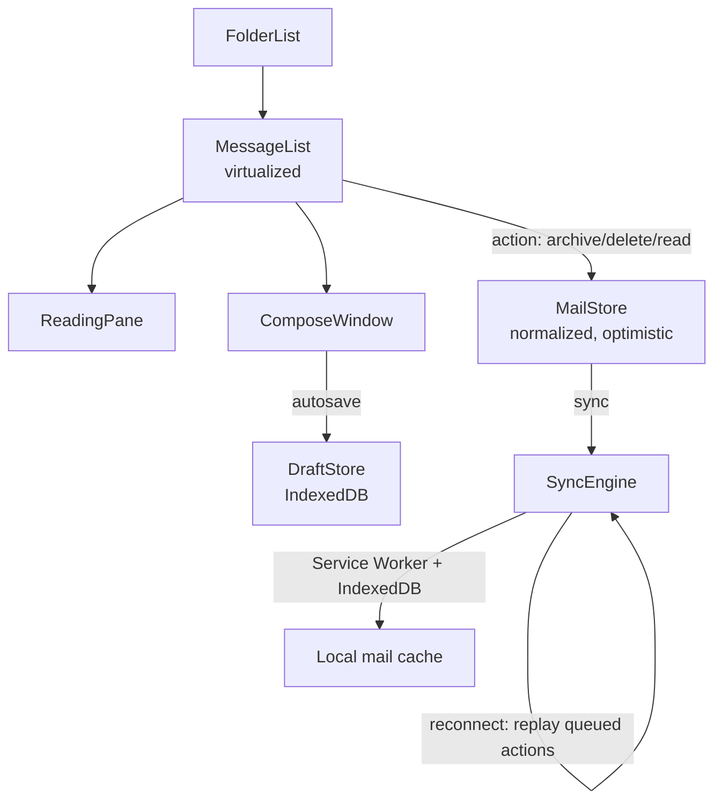
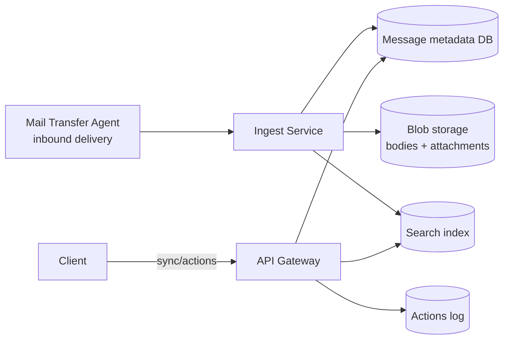

## Overview

- **Real-world analog:** Outlook, Gmail — desktop-grade webmail.
- **Difficulty:** Medium-Hard · **Asked at:** Microsoft, Google, GreatFrontEnd bank.
- The core challenge isn't rendering a list of emails — it's making a genuinely desktop-grade, keyboard-driven, offline-capable application run entirely in a browser tab, where "archive this" has to feel instant and survive the tab closing mid-sync.

## Clarifying Questions & Requirements

> **Ask these first:**
> 1. Full offline read/compose, or online-only with a brief reconnect-tolerant cache?
> 2. Is threading (grouping related messages into a conversation) in scope, or flat per-message display?
> 3. Search: client-side over a local cache, server-side over the full mailbox, or both depending on what's synced locally?
> 4. Multiple accounts in one client, or single-account scope for this pass?

| | In scope | Out of scope |
|---|---|---|
| **Functional** | Three-pane layout, threading, compose with drafts, archive/delete/mark-read, search, keyboard shortcuts | Full-text search ranking algorithms, spam/phishing classification, calendar integration |
| **Non-functional** | Offline-capable for recently synced mail; actions feel instant regardless of network state | Full historical mailbox available offline (a real product decision, not assumed by default) |

## ── FRONTEND TRACK (RADIO) ──

### R — Requirements

| | Requirement | Why it's not optional |
|---|---|---|
| **Functional** | Three-pane layout (folder list, message list, reading pane), threading, compose with autosaved drafts | This is the baseline shape users expect from "an email client," not an optional layout choice |
| **Functional** | Archive/delete/mark-read/mark-unread, all reversible via undo | Destructive-feeling actions without an undo path get avoided or second-guessed by users, which slows down the exact workflow the client is supposed to speed up |
| **Non-functional** | Every mailbox action (archive, delete, mark-read) completes in the UI in well under 100ms, regardless of server round-trip time | This is *the* defining feel of a good email client versus a sluggish one — it's almost entirely an optimistic-UI problem, not a network-speed problem |
| **Non-functional** | Works with degraded functionality when offline — reading cached mail and queuing actions, not a blank error screen | A huge fraction of real email usage happens on a laptop that's asleep, on a train, or between wifi networks |
| **Non-functional** | Fully operable via keyboard alone | Power users of email clients overwhelmingly rely on keyboard shortcuts (`j`/`k` to navigate, `e` to archive) — this isn't a nice-to-have accessibility add-on, it's core to the product's actual usage pattern |

### A — Architecture



- **`SyncEngine` is the piece that makes offline work, and it's the piece a shallow answer collapses into "use a Service Worker."** It owns: an initial/incremental sync of message metadata + bodies into IndexedDB, a queue of pending local actions (archive/delete/mark-read) taken while offline, and replay of that queue against the server on reconnect, reconciled against whatever the server's state actually is by then (a message could have been archived from another device in the meantime).
- **`MailStore` is normalized by message id**, the same reasoning as the chat question's `MessageStore` — a message's row in `MessageList` and its content in `ReadingPane`, and its membership in a thread, are all views over the *same* underlying object, so a mark-read action updates every view from one write.
- A sketch of the offline action queue, since "queue it and replay later" hides a real reconciliation problem:

```ts
type QueuedAction = { id: string; type: 'archive' | 'delete' | 'markRead'; messageId: string; queuedAt: number };

class SyncEngine {
  private queue: QueuedAction[] = [];

  applyLocally(action: QueuedAction) {
    this.queue.push(action);
    this.store.applyOptimistic(action); // UI reflects it immediately regardless of connectivity
    this.persistQueue();                // survive a tab close before reconnect
  }

  async replayQueue() {
    for (const action of this.queue) {
      try {
        await api.applyAction(action); // server reconciles against its own current state
        this.queue = this.queue.filter((a) => a.id !== action.id);
      } catch (err) {
        if (isConflict(err)) this.store.reconcileConflict(action, err.serverState);
        else throw err; // genuine failure — stop and surface it, don't silently drop actions
      }
    }
    this.persistQueue();
  }
}
```

### D — Data Model

| | Owner | Example |
|---|---|---|
| **Server state** | Full mailbox, message content, folder membership | Synced incrementally into the local cache |
| **Client state** | Compose draft in progress, selected message, queued offline actions, sync cursor | Draft is client state until explicitly sent; queued actions are client state until the server confirms them |

```ts
type Message = {
  id: string;
  threadId: string;
  folder: 'inbox' | 'archive' | 'trash' | 'drafts';
  isRead: boolean;
  syncedAt: number;          // when this message's local copy was last confirmed fresh
  pendingActions: string[];  // ids of queued actions not yet server-confirmed
};

type Draft = { id: string; to: string[]; subject: string; body: string; lastSavedAt: number };
```

> **Key insight:** `pendingActions` on a message is what lets the UI distinguish "archived, confirmed" from "archived, still syncing" — visually subtle (maybe a slightly dimmed state) but functionally important, because it's the difference between an action that's truly done and one that could still fail on reconnect and need to be reconciled.

### I — Interface / API

**Component API**

```
<MessageList messages={Message[]} onAction={(id, action: 'archive'|'delete'|'markRead') => void} />
<ReadingPane thread={Thread} />
<ComposeWindow draft={Draft} onSave={(d: Draft) => void} onSend={(d: Draft) => void} />
<KeyboardShortcutLayer onArchive={() => void} onNext={() => void} onPrev={() => void} />
```

**Network API** — the shared contract with the backend track below:

| Action | Transport | Shape |
|---|---|---|
| Incremental sync | `GET /mailbox/sync?since=<cursor>` | Returns changed messages since last cursor, plus a new cursor |
| Apply action | `POST /messages/:id/actions` | `{ type, actionId, clientAppliedAt }`, idempotent on `actionId` |
| Search | `GET /search?q=&cursor=` | Server-side full-text search, cursor-paginated |
| Send | `POST /messages/send` | `{ draftId, to, subject, body }` |

### O — Optimizations

**Performance**
- Virtualize the message list — a busy inbox can have tens of thousands of messages; only render the visible window.
- Sync incrementally (delta since last cursor), never a full-mailbox re-fetch on every app open — a full re-sync at scale is both slow and wasteful.
- Lazy-load message bodies and attachments only when a thread is opened, not for every row in the list.

**Accessibility**
- Every mailbox action has both a mouse affordance and a keyboard shortcut, and the shortcut layer is discoverable (a `?` shortcut showing a cheat sheet is a common, expected pattern in this product category).
- Focus moves predictably after an action — archiving the currently-open message moves focus/selection to the next message in the list, not to nowhere.

**Networking**
- Debounce draft autosave (a few seconds after the user stops typing, not on every keystroke) to avoid a `PATCH` per character.
- Batch action-sync requests when multiple actions queue up in a short window (e.g., a user rapidly archiving several messages) rather than firing one request per action.

**Resilience**
- The offline action queue (sketch above) persists to IndexedDB, not just in-memory state, so a tab closed while offline doesn't lose queued actions.
- A sync conflict (message archived locally, but already deleted server-side by another device) resolves deterministically and visibly — not a silent state where the two devices simply disagree forever.

### Frontend Deep Dives

**1. Reconciling an offline action against a server state that changed elsewhere.** A user archives a message on their laptop while offline; meanwhile, the same message gets deleted from their phone. On reconnect, replaying "archive message X" against a server where X is already deleted is a real conflict, not an error to bubble up unhandled. Fix: the server's action-apply endpoint returns the message's *current* server-side state alongside success/conflict, and the client's `reconcileConflict` step adopts whichever state actually "wins" by a defined rule (e.g., delete beats archive, since it's the more terminal state) — and, critically, tells the user what happened rather than silently overwriting their local view.

**2. Incremental sync correctness across a paused/backgrounded tab.** A laptop goes to sleep for six hours with the tab open; on wake, the sync cursor from before sleep might now point at data the server has since compacted/aged out. Fix: the sync endpoint recognizes a cursor too old to resume from and returns a "resync required" signal rather than silently returning nothing or erroring — the client falls back to a fresh full sync in that specific case, rather than assuming incremental sync always succeeds.

**3. Draft autosave without a lost-keystrokes race.** Autosave debounces at, say, 3 seconds after the last keystroke — but what if the user closes the tab within that window? Fix: `beforeunload` (or, more reliably, `visibilitychange` to `'hidden'`) triggers an immediate, non-debounced final save attempt, and the draft store's local IndexedDB copy is written synchronously on every keystroke (cheap, local-only), with the *server* sync remaining debounced — so a lost network save loses at most the sync round-trip, never the actual typed content, which always survives locally first.

### Frontend Bottlenecks & Tradeoffs

| Bottleneck | Mitigation | Tradeoff accepted |
|---|---|---|
| Full-mailbox sync on every app open | Incremental sync via a cursor | A "resync required" fallback path has to exist and be tested for the cursor-too-old case |
| One autosave request per keystroke | Debounce server sync; write to local IndexedDB synchronously on every keystroke as a cheap backstop | A few seconds of the very latest content lives only locally before it's synced server-side |
| Action queue replay ordering under a long offline period with many queued actions | Replay in original queued order, reconciling conflicts individually rather than batching blindly | A long offline session with many conflicting actions can take a moment to fully reconcile on reconnect, visibly to the user |

## ── BACKEND TRACK ──

### Requirements & Scope

- Durable mail storage, incremental sync for many client devices per account, idempotent action application, server-side full-text search.
- Must tolerate the same account's action arriving from multiple devices in any order, including out-of-order relative to each other.

### Scale & Estimation

| | Estimate |
|---|---|
| DAU | 300M |
| Avg messages/user | ~5,000 stored, ~30 received/day |
| Peak incoming mail/sec | ~300M × 30 / 86,400 × 4 (peak) ≈ **~420K messages/sec** globally (dominated by inbound delivery, not client actions) |
| Peak client action QPS (archive/delete/read) | Far lower than inbound mail volume — roughly ~50K QPS at peak, driven by active client sessions |
| Storage | ~300M users × 5,000 messages × ~50KB avg (with attachments factored differently) ≈ multi-petabyte scale, typically tiered (hot recent mail vs. cold archive storage) |

### API Design

```
GET  /mailbox/sync?since=<cursor>&limit=500  → {changes: [...], nextCursor}
POST /messages/:id/actions  {type, actionId, clientAppliedAt} → {message: currentServerState} | 409 conflict info
GET  /search?q=&cursor=
POST /messages/send  {draftId, to, subject, body}
```

- `actionId` (client-generated) is the idempotency key on every action — the same reasoning as the chat question's `clientId`, applied to mailbox actions instead of messages.
- The sync cursor is opaque to the client and encodes enough server-side position information to resume correctly, or to signal "too old, full resync needed."

### Data Model & Storage

```
messages
  id PK, account_id, thread_id, folder, is_read, body_ref (pointer to blob storage), received_at

threads
  id PK, account_id, subject, message_ids[]

actions_log
  id PK, account_id, message_id, action_id UNIQUE, type, applied_at

sync_state
  account_id, device_id, cursor, last_synced_at
```

| Choice | Why |
|---|---|
| **Message bodies stored as blob references, not inline in the row** | Message content (especially with attachments) is large and variably sized; keeping it out of the primary row keeps metadata queries (list view, folder counts) fast and cheap |
| **`actions_log` with `action_id UNIQUE`** | Makes every action idempotent by database constraint — a replayed action from a client that never got the original success response can't double-apply |
| **`sync_state` per (account, device)**, not one cursor per account | Different devices sync independently and can be at different points in history — a phone that's been offline for a week and a laptop synced five minutes ago both need their own correct resume point |

### High-Level Architecture



- **Inbound mail delivery (MTA → Ingest) is entirely decoupled from client sync/action traffic** — a spike in incoming mail (a mailing-list blast, a spam wave) never competes for the same request path a user's "archive this" click does.
- **Search is a separate index**, updated asynchronously from ingest, for the same reason as the e-commerce and travel questions: full-text search at this scale can't run live against the primary metadata store without degrading it.

### Deep Dives

**1. Idempotent, order-tolerant action application across devices.** Two devices for the same account can apply conflicting actions (archive vs. delete) close together in time, and network conditions mean the server doesn't necessarily receive them in the order the user actually performed them. Fix: `actions_log` records every action with a server-assigned timestamp; a deterministic conflict-resolution rule (e.g., the more terminal action wins — delete beats archive beats mark-read) resolves the final state regardless of arrival order, and every device's next sync response reflects that resolved state, converging all devices to the same answer even if they briefly disagreed.

**2. Incremental sync at 300M-account scale without per-account full scans.** A naive "give me everything changed since cursor X" implemented as a timestamp `WHERE` scan degrades badly at scale and doesn't compose well with sharding. Fix: sync state is modeled as a **change log** per account (an append-only sequence of change events, similar in spirit to the chat question's per-conversation `serverSeq`), and a sync request is simply "give me change-log entries after position X" — a cheap, indexed range read rather than a scan, and naturally shardable by account.

**3. Search index correctness after a delete/archive action.** A message deleted from the mailbox shouldn't keep appearing in search results. Fix: action application writes to the search index synchronously enough to bound staleness to a few seconds (via the same async-update pattern as the e-commerce catalog question), and search results carry a lightweight "still valid?" check against current message state before being shown, so even a brief index-lag window doesn't surface a genuinely deleted message as clickable.

### Bottlenecks & Tradeoffs

| Bottleneck | Mitigation | Tradeoff accepted |
|---|---|---|
| Inbound mail volume spikes (mailing lists, spam waves) competing with client sync traffic | Fully decoupled ingest and sync/action paths | Slightly more infrastructure to operate, in exchange for one never degrading the other |
| Timestamp-based sync scans at scale | Per-account append-only change log, position-based reads | Change log storage grows unboundedly unless compacted/archived periodically — a real operational concern, deliberately accepted rather than solved in this pass |
| Cross-device action conflicts | Deterministic resolution rule (most-terminal-action-wins) | A device's own locally-applied action can occasionally get overridden by a conflicting action from another device — surfaced to the user, not silently swallowed |

## The Shared Contract

- **Ownership boundary:** the client's local IndexedDB cache is a *read-through cache plus a pending-action queue*, never the source of truth — every action is provisional until the server's `actions_log` confirms it, and every device converges to whatever the server's resolved state is.
- **Idempotency:** every action carries a client-generated `actionId`; both tracks agree this is what makes replay-on-reconnect safe.
- **Pagination/sync:** sync is cursor-based and explicitly supports a "too old, full resync" response — both tracks agree this is a first-class, expected path, not an error case.
- **Error propagation:** a `409` conflict on an action includes the server's current state for that message, and the frontend's job is to reconcile and inform the user, not to retry blindly or discard the conflict silently.

## Interview Signals

| | Strong answer | Weak answer |
|---|---|---|
| **Frontend** | Designs the offline action queue with real conflict reconciliation, not just "queue and replay" | Assumes replay always succeeds and never discusses conflicts |
| **Backend** | Models sync as a per-account append-only change log rather than a timestamp scan | Reaches for `WHERE updated_at > cursor` without noticing it doesn't scale or shard cleanly |
| **Both** | Treats a cross-device action conflict as a designed, resolved outcome on both sides | Never considers that the same account has multiple devices acting concurrently |

**Common failure modes:** designing single-device sync and forgetting multi-device conflicts entirely; treating full-text search as a live query against the primary store; not distinguishing "queued locally" from "confirmed by the server" in the data model; skipping keyboard operability despite it being core to this product's actual usage pattern.

## Glossary Links

This question draws on: RADIO framework, optimistic UI, idempotency, offline queue, cursor-based pagination, consistency model — each linked on first mention above.

## Proposed Glossary Additions

- **Change log (append-only sync log)** — an append-only, per-entity sequence of change events used as the basis for incremental sync, avoiding timestamp-scan sync patterns that don't shard or scale well. Shares its core idea with `message-ordering`'s per-conversation `serverSeq` from the chat question; worth a dedicated entry once a second question reuses the same pattern.
