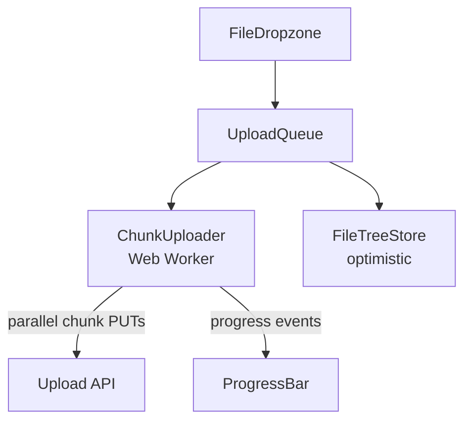
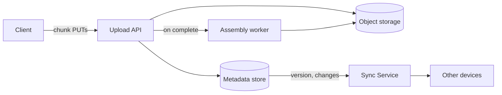

## Overview

- **Real-world analog:** Dropbox, Google Drive — large-file upload and cross-device sync.
- **Difficulty:** Medium-Hard · **Asked at:** Google, Dropbox-style companies, Amazon.
- **Backend counterpart:** [Distributed File Storage](/backend-interviews/c/distributed-file-storage) covers the block replication/erasure coding and metadata service behind durable storage at scale.
- The core challenge is uploading files large enough (and on connections unreliable enough) that a single request can't be trusted to complete — and doing so with resumability, real progress, and a file tree that stays consistent across devices syncing independently.

## Clarifying Questions & Requirements

> **Ask these first:**
> 1. Maximum expected file size? (Determines whether chunking is a nice-to-have or a hard requirement.)
> 2. Does upload need to resume across a full page reload, or only survive a transient network blip within the same session?
> 3. Single-device upload only, or does the file tree need to sync across multiple devices with possible concurrent edits?
> 4. Folder structure — flat files only, or nested folders with move/rename operations in scope?

| | In scope | Out of scope |
|---|---|---|
| **Functional** | Chunked resumable upload, drag-and-drop, folder tree, pause/resume, conflict handling on sync | File preview/rendering (PDF/image viewers), sharing permissions UI |
| **Non-functional** | An upload survives a network blip without restarting from zero; progress is accurate | Sub-second cross-device sync propagation (eventual, bounded-delay sync is an acceptable, stated target) |

## ── FRONTEND TRACK (RADIO) ──

### R — Requirements

| | Requirement | Why it's not optional |
|---|---|---|
| **Functional** | Drag-and-drop or file-picker upload, real progress per file, pause/resume, an optimistic file-tree update | A multi-GB upload that restarts from zero on any hiccup is a genuinely bad, common real-world failure |
| **Non-functional** | Uploading a large file doesn't block the UI thread or freeze the tab | Client-side chunking/hashing of a large file has to happen off the main thread |

### A — Architecture



- **Chunking and hashing happen in a Web Worker**, not the main thread — slicing and hashing a multi-GB file synchronously on the main thread would visibly freeze the UI; a worker keeps the tab responsive while the heavy lifting happens in the background.
- `UploadQueue` manages concurrency (a bounded number of parallel chunk uploads, not all chunks fired at once) and owns retry/backoff per chunk independently — one failed chunk shouldn't restart the whole file.

```ts
class ChunkUploader {
  private readonly chunkSize = 5 * 1024 * 1024; // 5MB
  private uploadedChunks = new Set<number>();     // survives pause/resume within a session

  async uploadFile(file: File, uploadId: string) {
    const totalChunks = Math.ceil(file.size / this.chunkSize);
    const pending = Array.from({ length: totalChunks }, (_, i) => i).filter(
      (i) => !this.uploadedChunks.has(i)
    );
    await withConcurrency(pending, 4, async (i) => {   // 4 parallel chunk uploads
      const chunk = file.slice(i * this.chunkSize, (i + 1) * this.chunkSize);
      await this.uploadChunk(uploadId, i, chunk);       // idempotent — safe to retry
      this.uploadedChunks.add(i);
      this.onProgress(this.uploadedChunks.size / totalChunks);
    });
  }
}
```

### D — Data Model

| | Owner | Example |
|---|---|---|
| **Server state** | Which chunks have been durably received, final file metadata once assembled | Reconciled via a resumability check on reconnect/reload |
| **Client state** | Which chunks *this session* has sent, pause/resume state, drag-hover UI state | `uploadedChunks` is a client-side optimization — the server's own record is authoritative on resume |

```ts
type UploadTask = {
  id: string;
  file: File;
  status: 'queued' | 'uploading' | 'paused' | 'complete' | 'error';
  progress: number;         // 0-1, derived from chunks confirmed, not chunks attempted
  uploadedChunkIndices: Set<number>;
};

type FileTreeNode = {
  id: string;
  name: string;
  type: 'file' | 'folder';
  parentId: string | null;
  status: 'synced' | 'pending' | 'conflict';
};
```

> **Key insight:** `progress` is derived from chunks the server has *confirmed*, not chunks the client has *attempted* — a chunk that's been sent but not yet acknowledged shouldn't count, or the progress bar can appear to complete and then stall waiting for acks, which reads as broken even though nothing actually failed.

### I — Interface / API

**Component API**

```
<FileDropzone onDrop={(files: File[]) => void} />
<UploadProgressList tasks={UploadTask[]} onPause={(id) => void} onResume={(id) => void} onCancel={(id) => void} />
<FileTree nodes={FileTreeNode[]} onMove={(nodeId, newParentId) => void} />
```

**Network API** — the shared contract with the backend track below:

| Action | Transport | Shape |
|---|---|---|
| Initiate upload | `POST /uploads` | `{ filename, size, chunkSize }` → `{ uploadId }` |
| Upload a chunk | `PUT /uploads/:id/chunks/:index` | Binary body; idempotent — retrying the same index is safe |
| Check upload status (resume) | `GET /uploads/:id/status` | → `{ receivedChunkIndices: number[] }` |
| Finalize | `POST /uploads/:id/complete` | Server assembles/verifies chunks, returns file metadata |

### O — Optimizations

**Performance**
- Chunking/hashing off the main thread via a Web Worker (above).
- Bounded parallelism for chunk uploads (e.g. 4 concurrent) — unbounded parallelism on a large file can actually reduce throughput by saturating the connection with too many competing streams.

**Accessibility**
- The drag-and-drop zone has an equivalent, fully keyboard-operable file-picker button — drag-and-drop alone excludes keyboard-only and switch-device users entirely.
- Upload progress and completion are announced via `aria-live`, debounced to meaningful milestones (start, 50%, complete/error), not per-chunk.

**Networking**
- Resume from the server's actual received-chunk list on reload/reconnect (`GET /uploads/:id/status`), never from the client's own possibly-stale in-memory record alone.

**Resilience**
- A failed chunk retries with backoff independently, without restarting sibling chunks or the whole file.
- An optimistic file-tree entry (drag a file into a folder before the move is confirmed) reverts cleanly on a rejected request, with a clear "move failed" affordance.

### Frontend Deep Dives

**1. Resuming after a full page reload, not just a network blip.** A network blip within the same session is easy — the in-memory `uploadedChunks` set already knows what's done. A full reload loses that memory entirely. The real fix is always resuming from the server's source of truth (`GET /uploads/:id/status`) on any (re)start, comparing it against the local file to determine which chunks still need sending — the client never assumes its own memory is authoritative across a reload.

**2. Parallel chunk uploads and out-of-order completion.** Uploading chunks 0-3 in parallel means chunk 2 can finish before chunk 1 — the UI's progress and the eventual "assemble" step both have to be indifferent to arrival order, tracking completed chunk *indices*, not a simple incrementing counter that assumes sequential completion.

**3. Optimistic file-tree operations (move/rename) with real conflict handling.** Moving a file in the tree updates the UI immediately, but the actual move can fail (target folder deleted concurrently by another device, permission change) — the tree needs a `conflict` status distinct from `pending`, and a specific resolution UI (not a silent revert that leaves the user confused about where their file actually is).

### Frontend Bottlenecks & Tradeoffs

| Bottleneck | Mitigation | Tradeoff accepted |
|---|---|---|
| Hashing/chunking a large file freezing the tab | Move the work to a Web Worker | Slightly more complex message-passing between worker and main thread |
| Too many parallel chunk uploads saturating the connection | Bounded concurrency (e.g. 4 at a time) | Marginally slower theoretical max throughput, in exchange for actually reliable throughput in practice |
| Trusting client-side memory for resume state | Always reconcile against server's received-chunk list | One extra round trip on resume, in exchange for correctness across reloads |

## ── BACKEND TRACK ──

### Requirements & Scope
- Accept chunked uploads durably and idempotently, track per-upload progress, assemble completed uploads, and support cross-device sync of the resulting file tree.

### Scale & Estimation

| | Estimate |
|---|---|
| Avg file size | 50MB (wide variance — some multi-GB) |
| Chunk size | 5MB typical |
| Concurrent active uploads (peak) | 500K |
| Storage growth | Multi-PB scale at real product size — object storage, not a traditional filesystem |

### API Design

```
POST /uploads                {filename, size, chunkSize} → {uploadId}
PUT  /uploads/:id/chunks/:index   (binary body)            → 200
GET  /uploads/:id/status                                   → {receivedChunkIndices}
POST /uploads/:id/complete                                  → {fileId, url}
```

- Chunk `PUT` is idempotent by design — retrying the same index with the same bytes is always safe, which is exactly what lets the frontend retry individual failed chunks freely without any special-casing.

### Data Model & Storage

```
uploads
  id              uuid PK
  filename        text
  total_size      bigint
  chunk_size      int
  status          enum('in_progress','complete','aborted')

upload_chunks
  upload_id       uuid, indexed
  chunk_index     int
  received_at     timestamp
  PRIMARY KEY (upload_id, chunk_index)

files
  id              uuid PK
  parent_id       uuid nullable
  name            text
  storage_key     text        -- pointer into object storage, not the file itself
  version         bigint       -- for sync conflict detection
```

| Choice | Why |
|---|---|
| Chunks land in object storage (S3-style), assembled on completion | Object storage is built for exactly this durability/scale profile; a traditional filesystem or relational blob column doesn't scale to this |
| `upload_chunks` tracks received chunks by index, not a single progress percentage | Lets `GET /uploads/:id/status` answer "which specific chunks are missing" for accurate client-side resume, not just "you're 60% done" |
| `version` on `files` for optimistic concurrency on sync | Two devices editing/moving the same file concurrently need a detectable conflict, not a silent last-write-wins overwrite |

### High-Level Architecture



- **Assembly is a background worker step**, not inline in the request path — combining chunks into a final object can take real time for a large file, and the client's `complete` call shouldn't block synchronously on it; the client polls or receives a completion event instead.

### Deep Dives

**1. Idempotent chunk handling under client retries.** A client retrying a chunk after a timeout (when the server actually received it, but the ack was lost) must not create a duplicate or corrupt the assembly — `upload_chunks` keyed by `(upload_id, chunk_index)` with an upsert makes a re-received chunk at the same index a no-op, not a duplicate.

**2. Cross-device sync conflict detection.** Two devices editing the same file's metadata (a rename) while offline, then both reconnecting, need a detectable conflict rather than one silently overwriting the other. A `version` field checked on write (optimistic concurrency — the write only succeeds if the version matches what the client last saw) surfaces the conflict explicitly, which the client then has to resolve (last-write-wins with user confirmation, or a real merge UI, depending on product requirements).

**3. Garbage-collecting abandoned partial uploads.** A user who starts an upload and never completes it (closes the tab, gives up) leaves orphaned chunks in object storage — a background sweep needs to identify and reclaim uploads with no activity past a bounded window, or storage cost grows unbounded from abandoned attempts.

### Bottlenecks & Tradeoffs

| Bottleneck | Mitigation | Tradeoff accepted |
|---|---|---|
| Assembling very large files synchronously in the request path | Background assembly worker, async completion signal | Slightly more complex completion flow (poll or event), in exchange for not holding a request open for a long assembly operation |
| Orphaned partial uploads accumulating storage cost | Scheduled garbage-collection sweep on stale, incomplete uploads | A bounded delay before abandoned uploads are reclaimed — an accepted cost of not being overly aggressive and reclaiming a genuinely-paused-but-valid upload |
| Concurrent metadata writes from multiple devices | Optimistic concurrency via `version` | Occasional conflicts surfaced to the user for resolution, rather than a silent, potentially data-losing overwrite |

## The Shared Contract

- **Chunk upload is idempotent by explicit design on both sides** — the frontend retries freely, the backend upserts by chunk index — this is the single agreement that makes resumability actually work end to end.
- **Ownership boundary:** the client owns which chunks it *has* sent this session (an optimization); the server owns which chunks it has *durably received* (the truth) — resume always reconciles against the server's record.
- **Completion is asynchronous:** the client doesn't assume `complete` finishes instantly; it polls or listens for a completion signal rather than blocking.

## Interview Signals

| | Strong answer | Weak answer |
|---|---|---|
| **Frontend** | Moves chunking/hashing off the main thread and resumes from server state, not client memory, on reload | Assumes a single upload request with no chunking, or trusts client-side progress state across reloads |
| **Backend** | Explains chunk idempotency and why assembly happens async | Treats upload as one big synchronous write with no resumability story |
| **Both** | Treats a failed/retried chunk as a normal, expected case, not an edge case | Designs only for the happy path where every chunk succeeds on the first try |

**Common failure modes:** no chunking at all for large files; trusting client memory as the source of truth for resume; synchronous assembly blocking the completion request; no conflict-detection story for cross-device sync.

## Glossary Links

This question draws on: Idempotency, RADIO framework, Optimistic UI, Consistency model — each linked on first mention above. See Proposed glossary additions for resumable upload.
