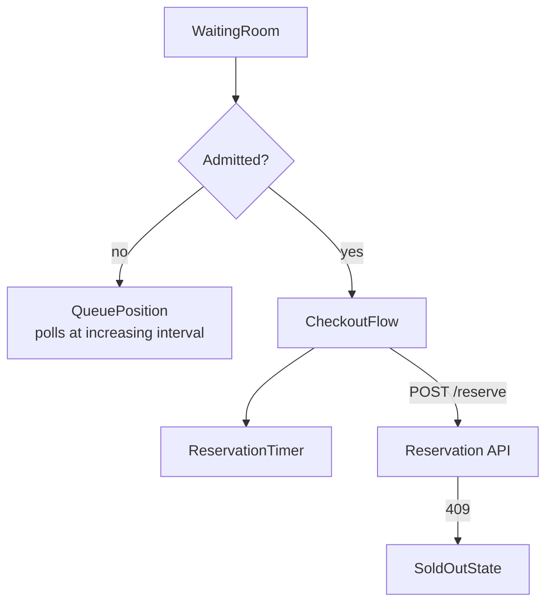
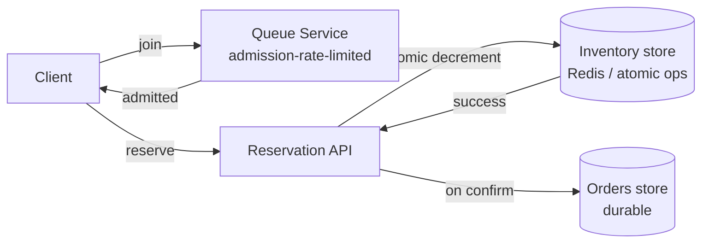

## Overview

- **Real-world analog:** Sneaker drops, concert ticket on-sales, Amazon Lightning Deals.
- **Difficulty:** Hard · **Asked at:** ticketing platforms, retail flash-sale products.
- The core challenge is contention at a scale that breaks the normal assumptions: 100,000 people can hit "buy" on 500 units in the same second. The frontend's job is to make that moment feel fair and honest; the actual oversell-prevention problem is entirely the backend's, and it is genuinely hard even there.

## Clarifying Questions & Requirements

> **Ask these first:**
> 1. Is there a scheduled drop time everyone knows in advance, or can demand spike unpredictably?
> 2. Is a virtual waiting room / queue acceptable UX, or does the product need to look like instant checkout?
> 3. One unit per customer, or can a single user buy multiple units of the same SKU?
> 4. What happens to someone mid-checkout when the item sells out — do they keep their spot in the flow, or get bumped immediately?

| | In scope | Out of scope |
|---|---|---|
| **Functional** | Queue/waiting-room UX, reserve-then-confirm purchase flow, sold-out and lost-the-race states, per-customer purchase limits | Payment processing internals, fraud/bot detection |
| **Non-functional** | Never oversell the SKU, regardless of concurrent traffic; the client never becomes the bottleneck for legitimate buyers | Sub-second queue admission at unlimited scale (a stated, reasonable simplification — the queue itself can take real time to drain) |

## ── FRONTEND TRACK (RADIO) ──

*(Lighter than the backend track, per this course's own depth-calibration rule — the hard problem is backend contention at extreme scale; the frontend's job is honest, low-noise reflection of a queue and a reservation it doesn't control.)*

### R — Requirements

| | Requirement | Why it's not optional |
|---|---|---|
| **Functional** | A queue-position indicator, a reserve-then-confirm purchase flow, clear sold-out/lost-the-race messaging | Users need to know *where they stand* — a spinner with no position is indistinguishable from a broken page during the highest-anxiety moment of the flow |
| **Non-functional** | The client must not amplify load on an already-saturated backend (no aggressive polling, no retry storms) | At this traffic profile, a poorly-behaved client is itself a denial-of-service risk against the service it's trying to use |

### A — Architecture



- The client never assumes it's "in" the sale until the server admits it — `WaitingRoom` is the actual entry point, not `CheckoutFlow`, even for users who arrive well before the drop and might get admitted almost instantly.
- Queue polling backs off as position drops slowly (long interval while position is in the thousands, shortening only once admission is plausibly imminent) rather than a fixed-interval poll that would be needlessly aggressive against a system already under peak load.

### D — Data Model

```ts
type QueueState = {
  status: 'waiting' | 'admitted' | 'expired';
  position: number | null;      // server-reported, approximate by design
  estimatedWaitMs: number | null;
};

type Reservation = {
  status: 'none' | 'pending' | 'confirmed' | 'lost';
  expiresAt: number | null;     // server TTL, display-only — same pattern as a seat hold
};
```

> **Key insight:** `position` is explicitly approximate, not a precise, guaranteed number — the backend is processing a queue under extreme, bursty load, and promising exact position would either be a lie or require expensive, contention-inducing bookkeping the queue exists specifically to avoid. Communicating "roughly 4,200 people ahead of you" is honest; a precise counter that jumps around unpredictably reads as broken even when it's technically accurate at each instant.

### I — Interface / API

**Component API**

```
<WaitingRoom queueState={QueueState} />
<ReservationTimer expiresAt={number} onExpire={() => void} />
<CheckoutFlow reservation={Reservation} onConfirm={(paymentToken) => void} />
```

**Network API** — the shared contract with the backend track below:

| Action | Transport | Shape |
|---|---|---|
| Join queue | `POST /queue/join` | → `{ queueToken }` |
| Poll queue position | `GET /queue/status?token=<queueToken>` | → `{ status, position, estimatedWaitMs }` |
| Reserve unit | `POST /reserve` (requires admission) | → `201 { reservationId, expiresAt }` or `409 SoldOut` |
| Confirm purchase | `POST /reserve/:id/confirm` | `{ paymentToken, idempotencyKey }` → `200` or `410 Gone` |

### O — Optimizations

**Networking**
- Adaptive polling interval for queue position — long while far back, shortening only as admission approaches — is the single highest-leverage frontend decision in this question; get it wrong and the client itself becomes part of the load problem.
- `idempotencyKey` on the confirm request (reusing this course's registered `Idempotency` term), generated once per checkout attempt and reused on any client-side retry, so a flaky connection during payment can't produce a duplicate charge.

**Resilience**
- A `409 SoldOut` at reservation time and a `410 Gone` at confirm time are distinct, specifically-messaged outcomes — "it sold out before you got here" and "your reservation expired" are different situations and read as confusing, generic errors if collapsed into one.
- Client-side button debounce on the reserve/confirm actions prevents a nervous double-click from generating duplicate requests, independent of and in addition to the idempotency key that protects against it server-side.

### Frontend Deep Dives

**1. Queue position that can't be trusted to update itself.** A naive countdown-style queue UI (position ticks down locally between polls) implies false precision and drifts from reality the moment actual processing speed changes. The fix: position is *only* ever updated from a server response, never interpolated client-side between polls — the UI shows the last known server value plus a soft "updating…" indicator during the gap, rather than a client-side estimate presented as if it were live.

**2. The reserve-then-confirm window racing the reservation TTL.** Exactly the same shape as a seat hold's payment-race problem: a user can begin checkout with seconds left on a reservation and have payment take longer than that. The frontend has to treat a `410 Gone` on confirm as a first-class, distinctly-messaged outcome ("your hold expired — rejoin the queue") rather than a generic payment failure, and should not silently retry a confirm call against an expired reservation, which would just produce a confusing repeated 410.

### Frontend Bottlenecks & Tradeoffs

| Bottleneck | Mitigation | Tradeoff accepted |
|---|---|---|
| Naive fixed-interval polling amplifying load at peak | Adaptive backoff tied to reported queue position | Position updates feel less "live" for users far back in the queue — acceptable, since precise real-time position that far back isn't actually meaningful |
| Users refreshing the page out of anxiety, re-joining the queue and losing their spot | Persist `queueToken` in `sessionStorage`, rejoin with the same token on reload rather than issuing a new one | A small amount of client-side state to manage, in exchange for not punishing normal user behavior (a reload) with a full queue restart |

## ── BACKEND TRACK ──

*(This is the deep half of this question.)*

### Requirements & Scope

- Never oversell a finite-inventory SKU under extreme, bursty concurrent demand; provide a queue mechanism that smooths admission rather than accepting unbounded concurrent checkout attempts against the same contended inventory.

### Scale & Estimation

| | Estimate |
|---|---|
| Concurrent buy attempts at drop time (peak) | 100K/sec against a single SKU |
| Units available | 500-5,000 typical for a genuine "drop" |
| Queue admission rate the checkout path can sustain | Bounded well below peak arrival rate — the queue exists specifically to absorb the gap |
| Read:write ratio | Overwhelmingly write-attempt-heavy at the exact moment of the drop — the opposite of most systems' steady-state profile |

### API Design

```
POST /queue/join                          → {queueToken}
GET  /queue/status?token=<t>              → {status, position, estimatedWaitMs}
POST /reserve            (requires admitted queueToken)  → 201 {reservationId, expiresAt} | 409 SoldOut
POST /reserve/:id/confirm {paymentToken, idempotencyKey} → 200 | 410 Gone
```

### Data Model & Storage

```
inventory
  sku_id        text PK
  available     int              -- decremented only via atomic reservation op
  reserved      int
  sold          int

reservations
  id            uuid PK
  sku_id        text
  user_id       uuid
  idempotency_key text UNIQUE
  status        enum('pending','confirmed','expired')
  expires_at    timestamp
```

| Choice | Why |
|---|---|
| **Atomic decrement on `inventory.available`, in Redis or an equivalent low-latency store, not a row-level lock on a relational table** | Under 100K/sec contention on one row, a relational row lock becomes the bottleneck itself — an atomic `DECRBY`-with-floor-check primitive (or a Lua script checking-and-decrementing in one op) is built for exactly this contention profile |
| **Queue admission decoupled from inventory decrement** | Admitting someone to the queue is cheap and doesn't touch contended inventory state at all — only the much smaller admitted-and-checking-out population ever reaches the actual atomic reservation operation, which is what keeps that operation's contention manageable |
| **`idempotency_key` as a real unique constraint**, not just an application-level check | A retried confirm request under a flaky connection has to be structurally incapable of creating two reservations — a database-level unique constraint is the actual enforcement, not just a check the application code remembers to do |

### High-Level Architecture



- The queue service's entire job is rate-limiting *admission* into the contended path — it is deliberately the layer that absorbs the 100K/sec arrival spike, so that the actual inventory-decrement operation downstream only ever sees a bounded, manageable rate of real attempts.

### Deep Dives

**1. The queue as a load-shedding valve, not a fairness mechanism first.** The queue's primary job is protecting the inventory-decrement path from a load spike it structurally cannot absorb directly — fairness (first-come-first-served ordering) is a real, desirable property, but a strict global FIFO queue under 100K/sec arrivals is itself a coordination bottleneck. A practical implementation approximates fairness (e.g., a randomized or lightly-time-bucketed admission order) rather than paying for a perfectly strict global order that would recreate the exact contention problem the queue exists to avoid.

> **Signature gotcha:** assuming the frontend can prevent oversell. It can't — it can only smooth the experience around a server truth. Every UI-level rate limit, debounce, or optimistic state is cooperative politeness, not enforcement.

**2. The atomic check-and-decrement that makes "never oversell" actually true.** Structurally identical to a seat-lock's atomic compare-and-set: `available` must be checked and decremented in a single indivisible operation (a Redis `DECRBY` with a floor guard, or an equivalent Lua script), never as a separate "read available, then write" pair, which has a race window where many concurrent requests can all read a positive value before any of them writes the decrement — the exact bug that produces a real oversell incident.

**3. Idempotent confirm under retried, duplicate requests.** A user's payment can appear to fail client-side (timeout, dropped connection) while it actually succeeded server-side, and a naive retry then double-charges. The `idempotency_key` (client-generated once per checkout attempt, persisted client-side across a retry) lets the server recognize "I've already processed this exact request" and return the original result instead of re-executing the confirm — this is the same idempotency-key pattern this course uses for chat's message sends, applied to payment confirmation instead.

### Bottlenecks & Tradeoffs

| Bottleneck | Mitigation | Tradeoff accepted |
|---|---|---|
| Inventory-decrement store becoming a single point of contention | Shard by SKU across multiple instances of the atomic store | Cross-SKU queries (rare in this flow) need fan-out; per-SKU contention is what actually matters during a drop, and sharding by SKU addresses exactly that |
| Strict global queue ordering as its own bottleneck | Approximate fairness (bucketed/randomized admission) instead of a perfectly strict FIFO | Occasional, small out-of-arrival-order admission — an acceptable cost against a hard scaling ceiling |
| A reservation that's never confirmed or explicitly abandoned | TTL-based expiry on `reservations`, returning inventory to `available` automatically | A short window where inventory looks unavailable when it's actually about to free up — the same accepted tradeoff a seat hold makes |

## The Shared Contract

- **Ownership boundary:** the frontend never decides whether a unit is available — it renders the queue and reservation state the backend reports, and reconciles honestly when a hopeful client-side guess turns out wrong. The same sharp, unambiguous split this course's seat-booking question uses.
- **Real-time transport:** polling, deliberately, not a WebSocket push — queue position for a population this large and this transient doesn't benefit from a persistent per-client connection the way a small, long-lived chat room does; adaptive-interval polling is cheaper to operate at this scale and easier to reason about under load.
- **Error propagation:** `409 SoldOut` (at reservation) and `410 Gone` (at confirm, expired reservation) are two distinct, specifically-handled outcomes, not one generic failure — "it sold out" and "you ran out of time" are different facts a user needs told to them differently.

## Interview Signals

| | Strong answer | Weak answer |
|---|---|---|
| **Frontend** | Explicitly separates queue admission from the reservation/confirm flow; treats adaptive polling as a load-citizenship concern, not just a UX one | Polls at a fixed, aggressive interval with no discussion of load impact |
| **Backend** | Names the specific atomic primitive that prevents oversell, and explains why the queue is decoupled from the contended inventory path | Treats the queue as pure UX theater with no real load-shedding function |
| **Both** | Treats "the frontend can't prevent oversell" as an explicit, stated design principle | Implies client-side rate limiting or debouncing is itself sufficient protection against overselling |

**Common failure modes:** designing the checkout form before addressing the contention problem at all; a naive check-then-decrement instead of an atomic primitive; a queue design that recreates the same contention bottleneck it's meant to solve; no answer for a retried payment confirmation.

## Glossary Links

This question draws on: Idempotency, Consistency model, Exponential backoff — each linked on first mention above. See Proposed glossary additions for two candidate new terms below.

## Proposed glossary additions

- **Load shedding** — deliberately rejecting, queueing, or delaying a fraction of incoming work to protect a system's capacity to serve the rest, rather than accepting everything and degrading uniformly. Central to this question's queue design; likely reusable in any future question involving extreme-spike traffic shaping. Not yet a registered term.
- **Atomic compare-and-set** (or "atomic check-and-decrement") — a single indivisible read-and-write operation (e.g. Redis's `SETNX`/`DECRBY` with a floor guard, or a Lua script) that eliminates the race window a separate read-then-write pair would have under concurrent access. This course's `seat-booking` question uses the identical concept without naming it as its own term — worth promoting to a real registry entry if a third question needs it, rather than duplicating the explanation a third time.
