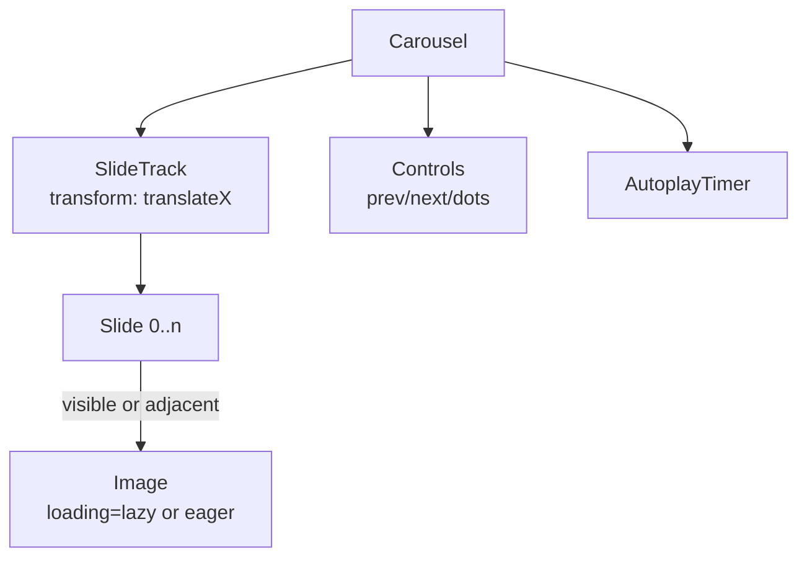

## Overview

- **Real-world analog:** Homepage hero sliders, product galleries.
- **Difficulty:** Medium · **Asked at:** Meta, Amazon, GreatFrontEnd bank.
- The core challenge is almost entirely frontend: smooth slide mechanics, not loading every image up front, and not breaking for touch, keyboard, or autoplay-interrupt users at the same time.

## Clarifying Questions & Requirements

> **Ask these first:**
> 1. How many slides, roughly — a handful of hero images, or potentially hundreds (a product gallery)?
> 2. Does it autoplay, and if so, must it pause on hover/focus (a real accessibility requirement, not optional polish)?
> 3. Touch/swipe support required, or pointer/keyboard only?
> 4. Is slide content always an image, or can it be arbitrary (video, a form, mixed media)?

| | In scope | Out of scope |
|---|---|---|
| **Functional** | Slide/snap navigation, autoplay with pause-on-interaction, touch/swipe, configurable slides-per-view | Video playback controls inside a slide, dynamic slide content fetched mid-scroll |
| **Non-functional** | No layout shift as images load; smooth 60fps transitions | Sub-frame-perfect physics-based swipe momentum matching native OS scroll exactly |

## ── FRONTEND TRACK (RADIO) ──

### R — Requirements

| | Requirement | Why it's not optional |
|---|---|---|
| **Functional** | Next/prev controls, dot/index indicators, snap-to-slide on drag release, autoplay | The baseline widget — but each of these has a real correctness detail (below) |
| **Non-functional** | Adjacent slides are preloaded before they're needed, but not *all* slides upfront | A 40-image gallery that eagerly loads everything defeats the purpose of lazy loading entirely |
| **Non-functional** | Autoplay pauses on hover *and* keyboard focus, and respects `prefers-reduced-motion` | This is a real, commonly-tested accessibility requirement, not a nice-to-have |

### A — Architecture



- The track moves via a single `transform: translateX(...)` on a flex/grid container — not by mounting/unmounting slide DOM nodes per transition, which would restart image decode/layout on every slide change.
- `AutoplayTimer` is a single interval owned by the carousel, paused (not destroyed) on hover/focus/drag-start and resumed on release — pausing state has to be idempotent, since hover and focus can both be true or false independently and in either order.

### D — Data Model

| | Owner | Example |
|---|---|---|
| **Client state** | Current index, drag offset while dragging, autoplay paused/running, loaded-image set | Entirely local — a carousel rarely has meaningful server state of its own |
| **Content state** | The slide list itself (images/captions) | Usually passed in as props from a parent that fetched it; the carousel doesn't own fetching |

```ts
type CarouselState = {
  index: number;
  dragOffsetPx: number;
  isDragging: boolean;
  autoplayPaused: boolean;
  loaded: Set<number>; // which slide indices have started loading
};
```

### I — Interface / API

```
<Carousel
  slides={Slide[]}
  slidesPerView={number}
  loop={boolean}
  autoplayIntervalMs={number | null}
  onSlideChange={(index: number) => void}
/>
```

There's no meaningful Network API for this component — it's configuration-driven, not a client/server contract. The one real network-adjacent concern is image loading strategy, covered in Optimizations.

### O — Optimizations

**Performance**
- Only the current slide plus one adjacent on each side load eagerly; everything further away loads lazily (`loading="lazy"` or an `IntersectionObserver`-driven load) — preloading the *entire* gallery up front is the single most common naive-implementation mistake.
- Use `srcset`/`sizes` so a phone doesn't download a desktop-resolution hero image.
- Animate via `transform`, never by animating `left`/`margin-left` — `transform` stays on the compositor thread and doesn't trigger layout on every frame.

**Accessibility**
- `aria-live="off"` on the slide track by default (a fast-changing carousel announcing every slide change is disruptive), with the *current* slide's content still reachable via normal keyboard/screen-reader navigation.
- Autoplay pauses on `:hover` and `:focus-within`, and is disabled entirely (or defaults to off) when `prefers-reduced-motion: reduce` is set — this specific check is a frequent, concrete interview signal.
- Prev/next controls are real `<button>`s with `aria-label`, not clickable `<div>`s.

**Resilience**
- A slide whose image fails to load shows a real fallback (placeholder + alt text), not a broken-image icon sitting in an otherwise-polished carousel.

### Frontend Deep Dives

**1. Drag/swipe without fighting the browser's native scroll.** A carousel needs to intercept horizontal drag gestures for slide navigation while *not* blocking the page's normal vertical scroll — a common bug locks the whole page from scrolling the moment a user's thumb touches the carousel. The fix is checking the drag vector's dominant axis on `touchmove`'s first meaningful delta (mostly horizontal → carousel handles it and calls `preventDefault()`; mostly vertical → let the browser scroll normally), not deciding on `touchstart` before any direction is known.

**2. Snap behavior without relying on `scroll-snap-*` alone.** CSS scroll-snap (`scroll-snap-type`/`scroll-snap-align`) handles a lot of this for free and is worth using where it's sufficient — but a carousel with programmatic controls (dot indicators, autoplay, `onSlideChange` callbacks) needs the *current index* as real JS state regardless, since CSS scroll-snap has no callback for "which slide is now active." The practical pattern: use scroll-snap for the drag/momentum feel, and an `IntersectionObserver` on each slide (or a scroll-position calculation) to keep the JS index in sync with what's actually visible.

**3. Looping without a visible jump.** "Infinite" loop carousels (last slide → first slide feels continuous) are usually implemented by cloning a slide or two at each end of the track, animating into the clone, then instantly (no-transition) snapping back to the real slide at the equivalent position — done wrong, this produces a visible flash/jump; done right, the snap-back happens in the same frame as the transition's end, before the next paint.

### Frontend Bottlenecks & Tradeoffs

| Bottleneck | Mitigation | Tradeoff accepted |
|---|---|---|
| Loading every slide's image upfront | Eager-load current + 1 adjacent, lazy-load the rest | A very fast flick through many slides in a row can briefly show a loading state on far-away slides |
| Animating with `left`/`margin` | Animate `transform` only | None real — this is a strict improvement with no real downside |
| True infinite loop | Clone-and-snap-back technique | Slightly more complex index bookkeeping (real index vs. clone index) |

## ── BACKEND TRACK ──

This component is almost entirely a frontend concern. There is no real-time transport, no complex data model, and no meaningful scale problem specific to *this* widget — the backend's only real job is serving the images themselves, which is a general asset-delivery concern shared by every image on the page, not something specific to a carousel.

### Requirements & Scope

- Serve slide images at appropriate resolutions for the requesting device; nothing carousel-specific beyond that.

### API Design

```
GET /images/:id?w=<width>&format=webp
```

A standard image CDN/resizing-service endpoint — the carousel is just one more consumer of it, using the same `srcset` mechanism any other responsive image on the page would use.

### Bottlenecks & Tradeoffs

| Bottleneck | Mitigation | Tradeoff accepted |
|---|---|---|
| Serving oversized images to small viewports | CDN-side resizing via `w`/`format` query params, `srcset` on the client | Slightly more CDN configuration upfront, in exchange for real bandwidth savings across every image on the site, not just the carousel |

## The Shared Contract

- **Transport:** plain HTTP image requests — no WebSocket/SSE, no real-time component to this question at all.
- **Ownership boundary:** the frontend owns slide mechanics, timing, and accessibility entirely; the backend's only responsibility is generic image delivery, shared with the rest of the site.

## Interview Signals

| | Strong answer | Weak answer |
|---|---|---|
| **Frontend** | Explicitly separates CSS scroll-snap's visual behavior from the JS index state needed for programmatic control | Assumes scroll-snap alone is a complete solution |
| **Frontend** | Names `prefers-reduced-motion` and pause-on-focus unprompted | Only mentions pause-on-hover, missing keyboard users entirely |
| **Backend** | Correctly and confidently says "there isn't much backend here" rather than inventing depth | Invents an unnecessary "carousel service" with no real justification |

**Common failure modes:** eagerly loading every slide's image; animating `left` instead of `transform`; forgetting keyboard-focus as a pause trigger for autoplay; treating this as a backend-heavy question when it structurally isn't one.

## Glossary Links

No existing glossary terms apply directly to this question's core mechanics (drag-axis detection, scroll-snap, clone-and-loop are carousel-specific implementation techniques, not general system-design vocabulary).

**Proposed glossary additions:** none — this question's hard problems are narrow, component-specific techniques rather than terms that recur across other questions in this bank.
