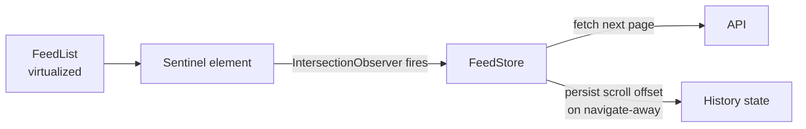

## Overview

- **Real-world analog:** any endless list — a social feed, a search-results page, a product catalog.
- **Difficulty:** Medium · **Asked at:** Meta, Twitter/X, commonly a focused sub-question rather than a standalone one.
- This is deliberately the narrowest question in this bank — the bank itself calls it "isolated." Treat it as a focused deep dive on the pagination/rendering mechanics, not a full application design; a bloated answer here is itself a signal of not knowing how to scope a question.

## Clarifying Questions & Requirements

> **Ask these first:**
> 1. Does the list need to support returning to a prior scroll position on back-navigation (browser back button)?
> 2. Is the underlying data append-only, or can items be inserted/removed while the user is scrolled deep into the list?

| | In scope | Out of scope |
|---|---|---|
| **Functional** | Cursor-paginated fetch, sentinel-triggered load-more, virtualized rendering, scroll restoration | The content of what's in the feed (ranking, personalization) — this question is about the scrolling mechanism, not feed content |
| **Non-functional** | Bounded memory regardless of how far a user scrolls; no visible pagination boundary/stutter | — |

## ── FRONTEND TRACK (RADIO) ──

### R — Requirements
- Load an initial page, fetch more automatically as the user nears the bottom, never grow unbounded DOM/memory usage, and restore scroll position if the user navigates away and back.

### A — Architecture



- A sentinel element (an empty div at the bottom of the rendered window) is observed via `IntersectionObserver`, not a scroll event listener — scroll listeners fire on every pixel and need manual throttling; an observer fires only on the actual visibility transition, which is both simpler and cheaper.

### D — Data Model

```ts
type FeedState = {
  itemsById: Record<string, FeedItem>;
  order: string[];
  nextCursor: string | null;   // null once the end of the feed is reached
  isLoadingMore: boolean;
};
```

### I — Interface / API

```
<FeedList items={FeedItem[]} onLoadMore={() => void} hasMore={boolean} />
```

| Action | Transport | Shape |
|---|---|---|
| Fetch page | `GET /feed?after=<cursor>&limit=20` | Cursor-based, not `?page=N` |

### O — Optimizations
- Virtualize the rendered DOM window regardless of how many items have been fetched — fetched-but-offscreen items stay in the data store, not the DOM.
- Show a skeleton loader for the next page while it's in flight, and a real, retry-able error state (not a silent stall) if the fetch fails.
- On back-navigation, restore both the fetched item list and the scroll offset from history state, rather than re-fetching from scratch and losing the user's place.

### Frontend Deep Dives

**1. Cursor beats offset pagination here specifically because the underlying data mutates while paginating.** Offset pagination (`?page=3`) assumes a stable ordering underneath; if new items are inserted at the top while a user is scrolling (a live feed), offset-based pages shift and produce skipped or duplicated items. A cursor (`?after=<id-or-timestamp>`) anchors to a specific item's position, which stays correct regardless of what's inserted elsewhere.

**2. Scroll restoration without re-fetching everything.** Simply re-running the initial fetch on back-navigation loses the user's exact scroll position and can show different content if the feed has since changed. The fix: persist the already-fetched item list and exact scroll offset in browser history state (or a client-side cache keyed by the navigation entry) on navigate-away, and restore both together on back-navigation — restoring only the scroll offset against a freshly-empty list doesn't work if there's nothing rendered yet to scroll to.

### Frontend Bottlenecks & Tradeoffs

| Bottleneck | Mitigation | Tradeoff accepted |
|---|---|---|
| Unbounded DOM growth as more pages load | Virtualize; keep only the visible window mounted | Slightly more complex list rendering, in exchange for genuinely bounded memory |
| Scroll listener firing on every pixel | `IntersectionObserver` on a sentinel instead | None meaningful — strictly better for this use case |

## ── BACKEND TRACK ──

*(Lighter track, matching this question's own "focused sub-question" framing — the interesting problems here are almost entirely frontend-side.)*

### Requirements & Scope
- Serve cursor-paginated pages of feed items efficiently, with stable results even as new items are written concurrently.

### Scale & Estimation

| | Estimate |
|---|---|
| Feed reads/sec (peak) | Scales with DAU × scroll depth — commonly the single highest-QPS read path in a social product |
| Page size | 15-30 items/request typical |

### API Design

```
GET /feed?after=<cursor>&limit=20 → { items: FeedItem[], nextCursor: string | null }
```

### Data Model & Storage
- Cursor is typically an opaque encoding of `(timestamp, id)` from the underlying sort order — not a raw offset — so pagination remains stable under concurrent inserts.

| Choice | Why |
|---|---|
| Cursor encodes the last-seen sort key, not a row offset | An offset shifts under concurrent writes; a sort-key cursor doesn't, since it anchors to a specific record rather than a position |

### Deep Dives

**1. Keeping cursor pagination stable under concurrent writes.** The cursor must encode enough of the sort order (e.g. `(rank_score, id)` composite) to deterministically resume from exactly where the last page left off, even if items with a higher rank were inserted after the cursor was issued — otherwise a naive `WHERE id > last_id` breaks the moment sort order isn't strictly insertion order.

### Bottlenecks & Tradeoffs

| Bottleneck | Mitigation | Tradeoff accepted |
|---|---|---|
| Deep pagination on a very active feed | Cursor anchored to sort key, not offset | Can't jump to an arbitrary page number — an accepted limitation of cursor pagination generally |

## The Shared Contract

- **Pagination style:** cursor-based end to end — the frontend never constructs or assumes offset semantics, and the backend never exposes an offset-based endpoint that would tempt it to.
- **Ownership boundary:** the backend owns cursor encoding/validity; the frontend treats the cursor as an opaque token it passes back, never parses or constructs itself.

## Interview Signals

| | Strong answer | Weak answer |
|---|---|---|
| **Frontend** | Uses `IntersectionObserver`, virtualizes, and explains cursor vs offset unprompted | Uses a scroll event listener with no throttling discussion, or offset pagination with no awareness of its failure mode |
| **Both** | Keeps the answer appropriately scoped — this is a focused mechanism question | Expands into a full feed-ranking/personalization design nobody asked for |

**Common failure modes:** over-scoping this into a full feed-design question; offset pagination with no discussion of its concurrent-write failure mode; scroll listeners instead of `IntersectionObserver`; unbounded DOM growth with no virtualization.

## Glossary Links

This question draws on: Cursor-based pagination, RADIO framework — each linked on first mention above. See Proposed glossary additions for IntersectionObserver.
